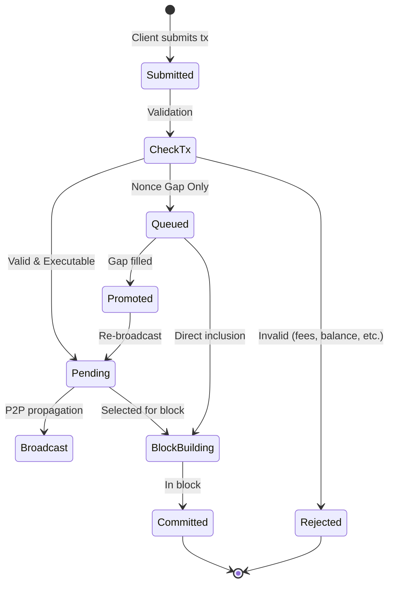

<Warning>
This mempool implementation is **experimental** and under active development. It is intended for testing and evaluation purposes. Use in production environments is **not recommended** without thorough testing and risk assessment.
Please [report issues](https://github.com/cosmos/evm/issues/new) and submit feedback to help improve stability.
</Warning>

## Overview

The EVM mempool is responsible for managing both EVM and Cosmos transactions in a unified pool, enabling Ethereum-compatible transaction flows including out-of-order transactions and nonce gap handling. It serves as a replacement for the default CometBFT FIFO mempool to support Ethereum tooling expectations while maintaining Cosmos SDK compatibility.

## Usage Examples

The EVM mempool enables seamless interaction with Ethereum tooling and deployment scripts that send multiple transactions in quick succession.

### Complex Contract Deployments

DeFi protocols like Uniswap deploy multiple interdependent contracts in rapid succession. With the EVM mempool, these deployment scripts work without modification:

```javascript
// Deploy Uniswap V3 contracts - sends many transactions at once
const factory = await UniswapV3Factory.deploy();
const router = await SwapRouter.deploy(factory.address, WETH);
const quoter = await Quoter.deploy(factory.address, WETH);
const multicall = await UniswapInterfaceMulticall.deploy();

// All transactions queue properly even if they arrive out of order
// The mempool handles nonce gaps automatically
```

### Batch Transaction Submission

```javascript
// Ethereum tooling sends multiple transactions
await wallet.sendTransaction({nonce: 100, ...}); // OK: Immediate execution
await wallet.sendTransaction({nonce: 101, ...}); // OK: Immediate execution
await wallet.sendTransaction({nonce: 103, ...}); // OK: Queued locally (gap)
await wallet.sendTransaction({nonce: 102, ...}); // OK: Fills gap, both execute
```

### Transaction Replacement

```javascript
// Speed up transaction with same nonce, higher fee
const tx1 = await wallet.sendTransaction({
  nonce: 100,
  gasPrice: parseUnits("20", "gwei")
});

// Replace with higher fee
const tx2 = await wallet.sendTransaction({
  nonce: 100, // Same nonce
  gasPrice: parseUnits("30", "gwei") // Higher fee
});
// tx1 is replaced by tx2
```

## Transaction Flow

### 1. Transaction Submission
Users or other nodes submit transactions to the chain via JSON-RPC or P2P.

### 2. CometBFT Reception
CometBFT receives the transactions and validates them in the app using CheckTx.

### 3. CheckTx Routing

The CheckTx handler processes transactions with special handling for nonce gaps ([source](https://github.com/cosmos/evm/blob/main/mempool/check_tx.go)):

**Success Path** - Valid transactions with correct nonces pass through to the Comet mempool for broadcast.

**Nonce Gap Detection** - Transactions with future nonces are intercepted and queued locally:
```go
// From mempool/check_tx.go
if err != nil {
    // detect if there is a nonce gap error (only returned for EVM transactions)
    if errors.Is(err, ErrNonceGap) {
        // send it to the mempool for further triage
        err := mempool.InsertInvalidNonce(request.Tx)
        if err != nil {
            return sdkerrors.ResponseCheckTxWithEvents(err, gInfo.GasWanted, gInfo.GasUsed, anteEvents, false), nil
        }
    }
    // anything else, return regular error
    return sdkerrors.ResponseCheckTxWithEvents(err, gInfo.GasWanted, gInfo.GasUsed, anteEvents, false), nil
}
```

**Other Failures** - Rejected and return error to client:
- **Insufficient fees**: Transactions with `GasFeeCap < BaseFee` fail with `ErrInsufficientFee`
- **Insufficient balance**: Transactions exceeding account balance
- **Invalid signature**: Malformed or invalid transaction signatures

Note: Only nonce gaps trigger local queuing. Fee-related failures result in immediate rejection.

### 4. Comet Mempool Addition
Successfully validated transactions are added to the Comet mempool (FIFO).

### 5. P2P Broadcast
Transactions in the Comet mempool are broadcast to other peers across the network.

### 6. Block Building
When a validator is selected to propose a block, ProcessProposal uses the mempool to build blocks:
- Sorts transactions by account (fee priority) and nonce
- Pulls from both local queue and public pool
- Replaces lower-fee duplicates with higher-fee versions

### 7. Automatic Promotion
The node periodically scans the local queue and promotes transactions when:
- Nonce gaps are filled (either in mempool or from on-chain state)
- Promoted transactions are re-broadcast to the network

## Transaction Lifecycle



## Architecture


The mempool uses a two-tiered system with local and public transaction pools.

### Problem Statement

CometBFT rejects transactions with:
- Nonce gaps (non-sequential nonces)
- Out-of-order batches (common in deployment scripts)

Ethereum tooling expects these transactions to queue rather than fail.

### Solution Architecture

To improve DevEx, a tiered approach was implemented: a local transaction pool handles queuing nonce-gapped transactions, upgrading transactions to CometBFT mempool which allows them to be gossipped to network peers and be included in blocks. This helps reduce network spam/DOS exposure while also enabling proper EVM transaction semantics.

The two-tiered approach:
- **Local queue**: Stores gapped transactions without network propagation, preventing invalid transaction gossip
- **Public mempool**: Contains only valid transactions, maintaining consensus integrity
- **Automatic promotion**: Moves transactions from local to public when gaps fill, ensuring inclusion once conditions are met


### Core Components

**CheckTx Handler**
Intercepts nonce gap errors during validation, routes gapped transactions to the local queue, and returns success to maintain compatibility with Ethereum tooling that expects queuing behavior. Only nonce gaps are intercepted - other validation failures (insufficient fees, balance, etc.) are rejected immediately.

**TxPool**
Direct port of Ethereum's transaction pool that manages both pending (executable) and queued (future) transactions. Handles promotion, eviction, and replacement according to Ethereum rules.

**LegacyPool**
Stores non-executable transactions with nonce gaps, tracks dependencies between transactions, and automatically promotes them when gaps are filled. The queue contains only transactions waiting for earlier nonces - not transactions with insufficient fees.

**ExperimentalEVMMempool**
Unified structure that manages both EVM and Cosmos transaction pools while providing a single interface for transaction insertion, selection, and removal.

### Transaction States

**Queued (Local Storage)**:
- **Nonce gaps**: Transactions with nonce > expected nonce
- These are stored locally and promoted when gaps fill

**Rejected (Immediate Failure)**:
- **Insufficient fees**: `GasFeeCap < BaseFee`
- **Insufficient balance**: Transaction cost exceeds account balance
- **Invalid signature**: Malformed or improperly signed transactions
- **Gas limit exceeded**: Transactions exceeding block gas limit

Only nonce-gapped transactions are intercepted and queued. All other validation failures result in immediate rejection with error returned to the client.
This combined approach preserves CometBFT's leading consensus mechanism while providing Ethereum's expected tx queuing behavior.

## API Reference

The mempool exposes Ethereum-compatible RPC methods for querying transaction pool state. See the [JSON-RPC Methods documentation](/docs/api-reference/ethereum-json-rpc/methods#txpool-methods) for detailed API reference:

- **`txpool_status`**: Get pending and queued transaction counts
- **`txpool_content`**: View all transactions in the pool
- **`txpool_contentFrom`**: View transactions from specific addresses
- **`txpool_inspect`**: Get human-readable transaction summaries

You can also explore these methods interactively using the [RPC Explorer](/docs/api-reference/ethereum-json-rpc/rpc-explorer).

## Integration

<Note>
For chain developers looking to integrate the mempool into their Cosmos SDK chain, see the [EVM Mempool Integration Guide](/documentation/integration/mempool-integration) for complete setup instructions.
</Note>

## State Management

The mempool maintains transaction state through the unified `ExperimentalEVMMempool` structure, which manages separate pools for EVM and Cosmos transactions while providing a single interface. This experimental implementation handles fee-based prioritization, nonce sequencing, and transaction verification through an integrated ante handler.

## Testing

The mempool behavior can be verified using the test scripts provided in the [cosmos/evm](https://github.com/cosmos/evm) repository. The [`tests/systemtests/Counter/script/SimpleSends.s.sol`](https://github.com/cosmos/evm/blob/main/tests/systemtests/Counter/script/SimpleSends.s.sol) script demonstrates typical Ethereum tooling behavior - it sends 10 sequential transactions in a batch, which naturally arrive out of order and create nonce gaps.