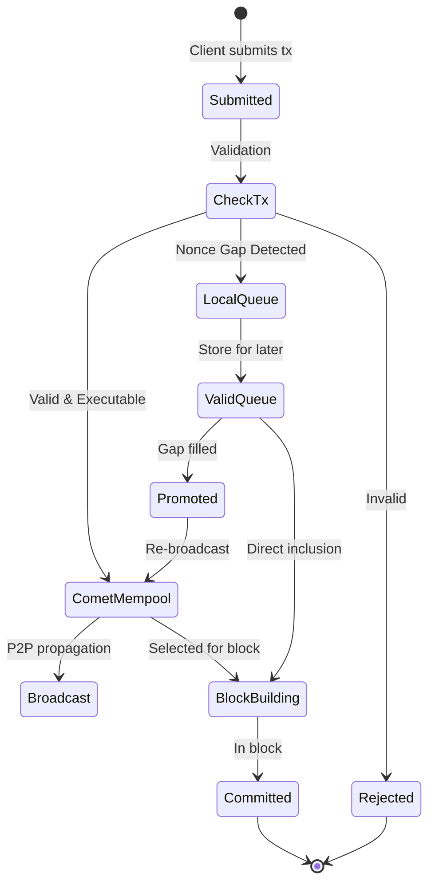

## Overview

The **app-side mempool** enables Ethereum tooling to work seamlessly with Cosmos consensus by introducing a two-tiered architecture that bridges the gap between Ethereum's transaction batching and Cosmos' sequential processing.

### The Problem

Standard CometBFT mempools reject transactions that don't meet immediate execution requirements:
- **Nonce gaps**: Transactions with non-sequential nonces are rejected
- **Out-of-order batches**: Common with Ethereum deployment scripts and tooling
- **Fee market changes**: Transactions becoming temporarily invalid due to base fee increases

This breaks compatibility with essential Ethereum tooling like Hardhat, Foundry, and deployment scripts that expect transactions to queue even when not immediately executable.

## Two-Tiered Architecture

The app-side mempool introduces a sophisticated routing system that maintains both local and public transaction pools:


### Transaction Flow Detail



### Key Components

1. **CheckTx Handler**
   - Intercepts nonce gap errors
   - Routes gapped transactions to local queue
   - Returns success to maintain Ethereum compatibility

2. **TxPool**
   - Port of Ethereum's transaction pool
   - Manages pending and queued transactions
   - Handles transaction promotion and eviction

3. **LegacyPool**
   - Stores non-executable transactions
   - Tracks nonce dependencies
   - Promotes transactions when gaps are filled

## Transaction Flow

The app-side mempool follows a 7-step transaction flow that handles both immediately executable and gapped-nonce transactions:

### Step 1: Transaction Submission
Users or other nodes submit transactions to the chain via JSON-RPC or P2P.

### Step 2: CometBFT Reception
CometBFT receives the transactions and validates them in the app using CheckTx.

### Step 3: CheckTx Routing
The CheckTx handler processes transactions with special handling for nonce gaps:

**Success Path**: Immediately executable transactions proceed to the Comet mempool
```go
// Transaction with correct nonce passes validation
if txNonce == accountNonce {
    // Proceed to Comet mempool for broadcast
    return success
}
```

**Special Failure Case**: Nonce gap transactions are routed to local queue
```go
if txNonce > accountNonce {
    // Detected nonce gap
    if errors.Is(err, ErrNonceGap) {
        // Route to local queue instead of rejecting
        err := mempool.InsertInvalidNonce(request.Tx)
        // Note: Must intercept error and return success to EVM client
        return interceptedSuccess
    }
}
```

**Other Failures**: Non-gap failures are discarded entirely

### Step 4: Comet Mempool Addition
Successfully validated transactions are added to the Comet mempool (FIFO).

### Step 5: P2P Broadcast
Transactions in the Comet mempool are broadcast to other peers across the network.

### Step 6: Block Building
When a validator is selected to propose a block, ProcessProposal uses the app-side mempool to build blocks:
- Sorts transactions by account (fee priority) and nonce
- Pulls from both local queue and public pool
- Replaces lower-fee duplicates with higher-fee versions

### Step 7: Automatic Promotion
The node periodically scans the local queue and promotes transactions to the executable mempool when:
- Nonce gaps are filled (either in mempool or from on-chain state)
- Promoted transactions are re-broadcast to the network

## RPC Methods

The txpool namespace provides full Ethereum-compatible RPC methods for querying mempool state. These methods are publicly exposed via the JSON-RPC interface on port 8545:

<AccordionGroup>

<Accordion title="txpool_content">
Returns all pending and queued transactions grouped by account.

**Request**
```json
{
  "jsonrpc": "2.0",
  "method": "txpool_content",
  "params": [],
  "id": 1
}
```

**Response**
```json
{
  "jsonrpc": "2.0",
  "id": 1,
  "result": {
    "pending": {
      "0x1234...": {
        "100": { /* transaction object */ },
        "101": { /* transaction object */ }
      }
    },
    "queued": {
      "0x5678...": {
        "103": { /* transaction object */ }
      }
    }
  }
}
```

**Description**
- `pending`: Transactions ready for inclusion in the next block
- `queued`: Valid transactions waiting for nonce gaps to be filled
</Accordion>

<Accordion title="txpool_contentFrom">
Returns transactions for a specific address.

**Request**
```json
{
  "jsonrpc": "2.0",
  "method": "txpool_contentFrom",
  "params": ["0x1234567890abcdef1234567890abcdef12345678"],
  "id": 1
}
```

**Response**
```json
{
  "jsonrpc": "2.0",
  "id": 1,
  "result": {
    "pending": {
      "100": { /* transaction object */ },
      "101": { /* transaction object */ }
    },
    "queued": {
      "103": { /* transaction object */ }
    }
  }
}
```

<Note>
This method is fully implemented and publicly exposed via the JSON-RPC API, but not yet documented in the OpenAPI specification.
</Note>
</Accordion>

<Accordion title="txpool_inspect">
Returns a human-readable summary of all transactions.

**Request**
```json
{
  "jsonrpc": "2.0",
  "method": "txpool_inspect",
  "params": [],
  "id": 1
}
```

**Response**
```json
{
  "jsonrpc": "2.0",
  "id": 1,
  "result": {
    "pending": {
      "0x1234...": {
        "100": "0x5678...: 1000 wei + 21000 gas × 20 gwei",
        "101": "contract creation: 0 wei + 100000 gas × 20 gwei"
      }
    },
    "queued": {
      "0x5678...": {
        "103": "0x9abc...: 2000 wei + 21000 gas × 25 gwei"
      }
    }
  }
}
```

**Format**: `<to>: <value> wei + <gas> gas × <gasPrice> wei`
</Accordion>

<Accordion title="txpool_status">
Returns transaction counts for pending and queued pools.

**Request**
```json
{
  "jsonrpc": "2.0",
  "method": "txpool_status",
  "params": [],
  "id": 1
}
```

**Response**
```json
{
  "jsonrpc": "2.0",
  "id": 1,
  "result": {
    "pending": "0x10",  // 16 pending transactions
    "queued": "0x5"     // 5 queued transactions
  }
}
```
</Accordion>

</AccordionGroup>

## Configuration

<Note>
For chain developers looking to integrate the app-side mempool into their Cosmos SDK chain, see the [EVM Integration Guide](/documentation/cosmos-sdk/integrate) for complete setup instructions.
</Note>

The mempool is initialized with the following configuration:

```go
type EVMMempoolConfig struct {
    TxPool        *txpool.TxPool
    CosmosPool    sdkmempool.ExtMempool
    AnteHandler   sdk.AnteHandler
    BroadcastTxFn func(txs []*ethtypes.Transaction) error
    BlockGasLimit uint64
}
```

### Key Parameters

- **Block Gas Limit**: Maximum gas per block (default: 100,000,000)
- **Queue Size**: Managed by TxPool configuration
- **Eviction Rules**: Time-based and fee-based eviction from Ethereum TxPool

## Behavior Examples

### Batch Transaction Submission

```javascript
// Ethereum tooling sends multiple transactions
await wallet.sendTransaction({nonce: 100, ...}); // ✓ Immediate execution
await wallet.sendTransaction({nonce: 101, ...}); // ✓ Immediate execution
await wallet.sendTransaction({nonce: 103, ...}); // ✓ Queued locally (gap)
await wallet.sendTransaction({nonce: 102, ...}); // ✓ Fills gap, both execute
```

### Transaction Replacement

```javascript
// Speed up transaction with same nonce, higher fee
const tx1 = await wallet.sendTransaction({
  nonce: 100,
  gasPrice: parseUnits("20", "gwei")
});

// Replace with higher fee
const tx2 = await wallet.sendTransaction({
  nonce: 100, // Same nonce
  gasPrice: parseUnits("30", "gwei") // Higher fee
});
// tx1 is replaced by tx2
```

## State Management

The mempool maintains transaction state through the unified `ExperimentalEVMMempool` structure, which manages separate pools for EVM and Cosmos transactions while providing a single interface. This experimental implementation handles fee-based prioritization, nonce sequencing, and transaction verification through an integrated ante handler.

## Testing

The app-side mempool behavior can be verified using the test scripts provided in the EVM repository. These tests validate nonce gap handling, transaction replacement, RPC method functionality, batch submission compatibility, and automatic transaction promotion.

## Transaction States

<Steps>
  <Step title="Pending">
    Executable transactions ready for block inclusion
  </Step>
  <Step title="Queued">
    Valid but non-executable (nonce gaps, future nonces)
  </Step>
  <Step title="Promoted">
    Automatically moved from queued→pending when gaps filled
  </Step>
  <Step title="Replaced">
    Same nonce with higher fee overwrites previous
  </Step>
</Steps>
