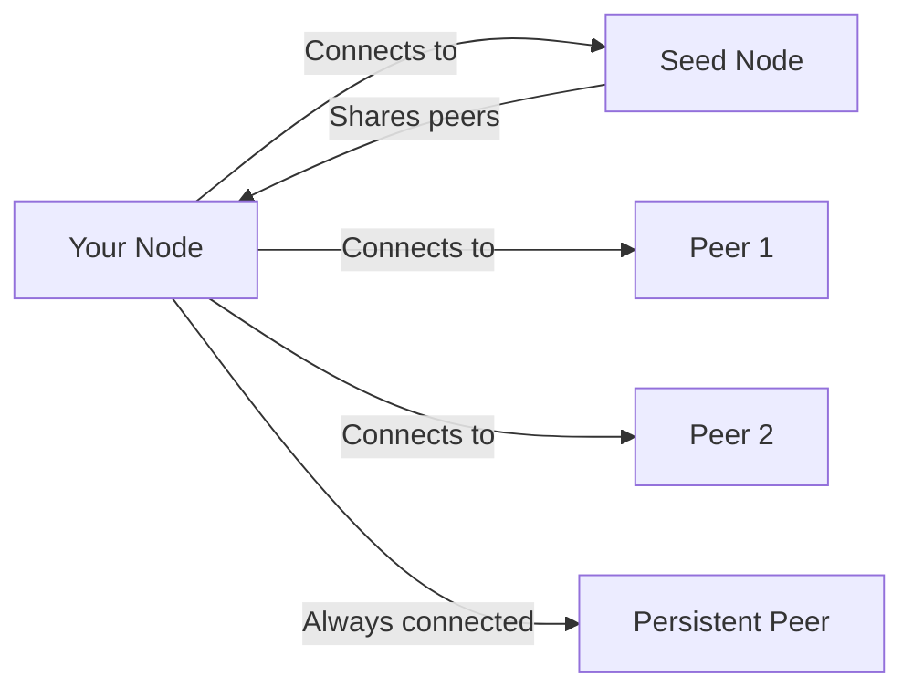
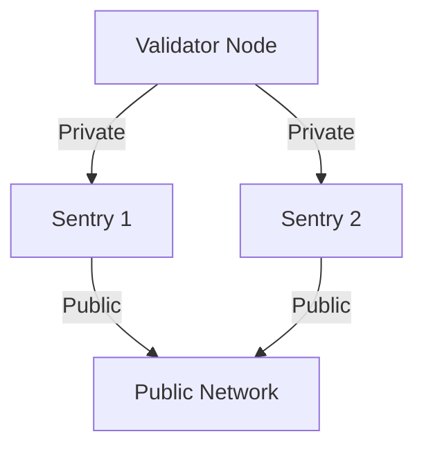

# Node Networking and Peers

This guide explains how Cosmos EVM nodes find and connect to each other, a crucial aspect for syncing your node with the network.

## Understanding Node Networking

### How Nodes Connect

Think of blockchain networking like a social network:
- **Your node** has a unique identity (node ID)
- **Other nodes** are potential friends (peers)
- **Seeds** are like mutual friends who introduce you to others
- **Persistent peers** are your close friends you always stay connected to



### Port Requirements

Your node uses several network ports:

| Port | Protocol | Purpose | Direction |
|------|----------|---------|-----------|
| **26656** | TCP | P2P communication | Inbound/Outbound |
| **26657** | TCP | RPC server | Inbound |
| **8545** | TCP | Ethereum JSON-RPC | Inbound |
| **8546** | TCP | Ethereum WebSocket | Inbound |
| **6060** | TCP | Metrics (optional) | Inbound |

## Finding Your Node Information

### Get Your Node ID

Every node has a unique identifier:

```bash
# Show your node ID
evmd tendermint show-node-id

# Example output:
# 3f472746f46e1b8c1d8e5216b961e56e0b3c4d56
```

### Get Your Node Address

To share with others so they can connect to you:

```bash
# Format: <node-id>@<ip>:<port>
echo "$(evmd tendermint show-node-id)@$(curl -s ifconfig.me):26656"

# Example output:
# 3f472746f46e1b8c1d8e5216b961e56e0b3c4d56@203.0.113.1:26656
```

## Configuring Network Connections

Edit `~/.evmd/config/config.toml`:

### 1. Seed Nodes

Seeds help you discover other peers:

```toml
# Comma separated list of seed nodes
seeds = "node-id-1@ip1:26656,node-id-2@ip2:26656"

# Example for testnet
seeds = "3f472746f46e1b8c1d8e5216b961e56e0b3c4d56@seed1.testnet.com:26656"
```

### 2. Persistent Peers

Nodes you always want to stay connected to:

```toml
# These connections are maintained even if the node restarts
persistent_peers = "node-id@ip:26656"

# Can specify multiple
persistent_peers = "id1@ip1:26656,id2@ip2:26656"
```

### 3. Connection Limits

Control how many peers you connect to:

```toml
# Maximum number of inbound peers
max_num_inbound_peers = 40

# Maximum number of outbound peers
max_num_outbound_peers = 10

# Unconditional peers (always accept connections from)
unconditional_peer_ids = "trusted-node-id-1,trusted-node-id-2"
```

## Joining Different Networks

### Local Development Network

For local testing (single node):

```toml
# No seeds or peers needed
seeds = ""
persistent_peers = ""

# Accept local connections only
laddr = "tcp://127.0.0.1:26656"
```

### Private Network

For a private network between known nodes:

```bash
# Node 1 (IP: 10.0.0.1)
persistent_peers = "node2-id@10.0.0.2:26656,node3-id@10.0.0.3:26656"

# Node 2 (IP: 10.0.0.2)
persistent_peers = "node1-id@10.0.0.1:26656,node3-id@10.0.0.3:26656"

# Node 3 (IP: 10.0.0.3)
persistent_peers = "node1-id@10.0.0.1:26656,node2-id@10.0.0.2:26656"
```

### Public Testnet

Example configuration for joining a public testnet:

```toml
# Use official seeds
seeds = "official-seed-1@seed1.testnet.com:26656,official-seed-2@seed2.testnet.com:26656"

# Optional: Add known good peers
persistent_peers = "validator1@val1.testnet.com:26656"

# Allow external connections
laddr = "tcp://0.0.0.0:26656"

# Advertise your public IP
external_address = "YOUR_PUBLIC_IP:26656"
```

## Firewall Configuration

### Open Required Ports

**Ubuntu/Debian with UFW:**
```bash
# P2P port
sudo ufw allow 26656/tcp

# RPC (if public)
sudo ufw allow 26657/tcp

# Ethereum RPC (if public)
sudo ufw allow 8545/tcp
sudo ufw allow 8546/tcp

# Enable firewall
sudo ufw enable
```

**Using iptables:**
```bash
# P2P port
sudo iptables -A INPUT -p tcp --dport 26656 -j ACCEPT

# Save rules
sudo netfilter-persistent save
```

### Cloud Provider Settings

**AWS Security Group:**
- Port 26656: TCP, Source 0.0.0.0/0 (P2P)
- Port 26657: TCP, Your IP only (RPC)
- Port 8545: TCP, Your IP only (Ethereum RPC)

**Google Cloud Firewall:**
```bash
gcloud compute firewall-rules create cosmos-p2p \
  --allow tcp:26656 \
  --source-ranges 0.0.0.0/0
```

## Monitoring Peer Connections

### Check Current Peers

```bash
# Get peer info
curl -s localhost:26657/net_info | jq .

# Count connected peers
curl -s localhost:26657/net_info | jq '.result.n_peers'

# List peer IDs
curl -s localhost:26657/net_info | jq '.result.peers[].node_info.id'
```

### Monitor Connection Health

```bash
# Watch peer count
watch -n 5 'curl -s localhost:26657/net_info | jq .result.n_peers'

# Check if syncing
curl -s localhost:26657/status | jq '.result.sync_info'
```

## Troubleshooting Connection Issues

### No Peers Connected

**Check seed configuration:**
```bash
# Verify seeds are set
grep "^seeds" ~/.evmd/config/config.toml

# Test seed connectivity
nc -zv seed.example.com 26656
```

**Verify firewall:**
```bash
# Check if port is open
sudo netstat -tulpn | grep 26656

# Test from outside
telnet YOUR_IP 26656
```

### Stuck at "Looking for peers"

1. **Check time sync:**
```bash
# Ensure system time is accurate
timedatectl status
sudo ntpdate -s time.nist.gov
```

2. **Increase peer limits:**
```toml
max_num_inbound_peers = 100
max_num_outbound_peers = 50
```

3. **Try different seeds:**
```bash
# Ask community for current seeds
# Update config.toml with fresh seeds
```

### Peers Disconnecting

**Common causes:**
- Network instability
- Different chain versions
- Genesis mismatch
- Time drift

**Solutions:**
```bash
# Check version compatibility
evmd version

# Verify genesis hash
sha256sum ~/.evmd/config/genesis.json

# Monitor logs
tail -f ~/.evmd/evmd.log | grep "peer"
```

## Advanced Networking

### State Sync Configuration

For faster initial sync:

```toml
[statesync]
enable = true
rpc_servers = "node1:26657,node2:26657"
trust_height = 1000000
trust_hash = "hash_from_trusted_source"
trust_period = "168h0m0s"
```

### Private Sentry Node Architecture

For validators:



Validator config:
```toml
# Only connect to sentries
persistent_peers = "sentry1-id@private-ip1:26656,sentry2-id@private-ip2:26656"
pex = false
addr_book_strict = false
```

### Using DNS Seeds

Instead of hardcoded IPs:

```toml
# DNS seeds resolve to multiple IPs
seeds = "seeds.testnet.com:26656"
```

## Network Discovery Protocol

Understanding how peer exchange works:

1. **Initial Connection**: Node connects to seeds
2. **Peer Exchange**: Seeds share other peer addresses
3. **Gossip Protocol**: Peers share blockchain data
4. **Address Book**: Node saves discovered peers in `addrbook.json`

```bash
# View address book
cat ~/.evmd/config/addrbook.json | jq '.addrs | length'

# Reset address book (if corrupted)
rm ~/.evmd/config/addrbook.json
evmd start  # Will recreate
```

## Best Practices

### For Node Operators

✅ **DO:**
- Keep your node updated
- Monitor peer connections
- Use multiple seeds
- Set reasonable peer limits
- Keep ports secured

❌ **DON'T:**
- Expose RPC ports publicly without authentication
- Use same node key on multiple machines
- Ignore version updates
- Set peer limits too low

### For Validators

✅ **DO:**
- Use sentry nodes
- Keep validator IP private
- Monitor peer quality
- Use persistent peers wisely

❌ **DON'T:**
- Expose validator directly to public
- Share node keys
- Ignore DDoS protection

## Quick Reference

```bash
# Show node info
evmd tendermint show-node-id
evmd status

# Network diagnostics
curl localhost:26657/net_info
curl localhost:26657/status

# Peer management
# Add persistent peer (requires restart)
sed -i 's/persistent_peers = ""/persistent_peers = "id@ip:port"/' ~/.evmd/config/config.toml

# Check connectivity
ping seed.example.com
nc -zv peer.example.com 26656
telnet peer.example.com 26656

# Firewall commands
sudo ufw allow 26656/tcp
sudo ufw status

# Monitor peers
watch 'curl -s localhost:26657/net_info | jq .result.n_peers'
```

## Getting Help

If you're having networking issues:

1. **Check the basics**: Firewall, ports, connectivity
2. **Verify configuration**: Seeds, peers, genesis file
3. **Ask the community**: Discord, Telegram with your node logs
4. **Share diagnostics**: 
   ```bash
   curl localhost:26657/status
   curl localhost:26657/net_info
   ```

Remember: Networking issues are common when starting out. The community has likely seen your issue before and can help!