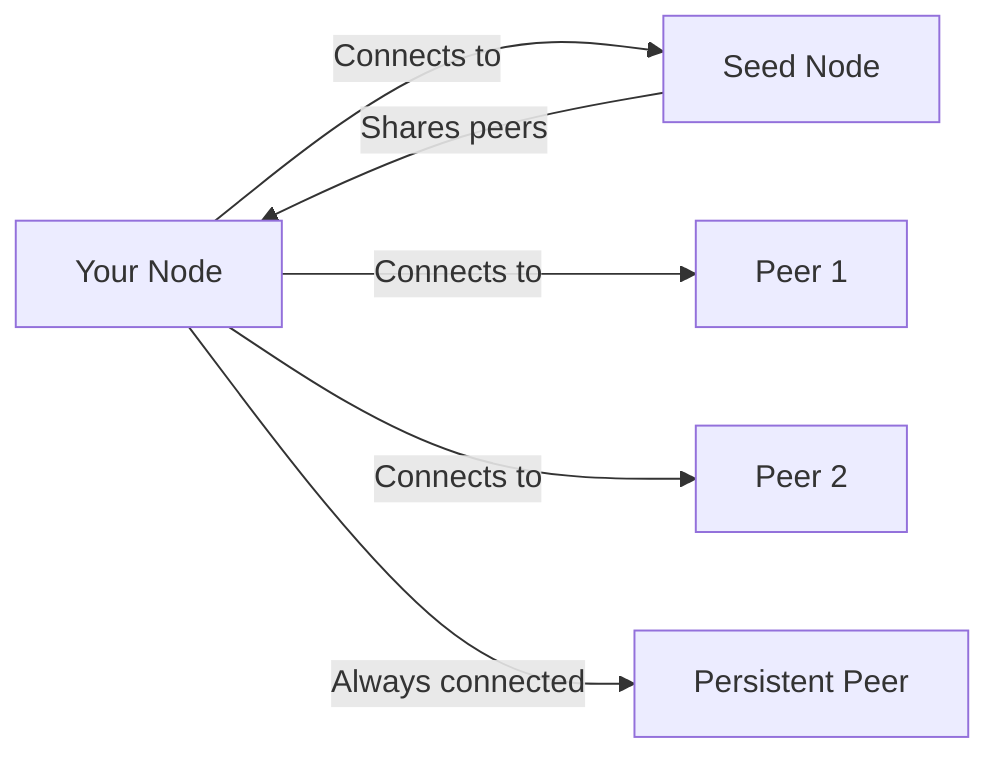
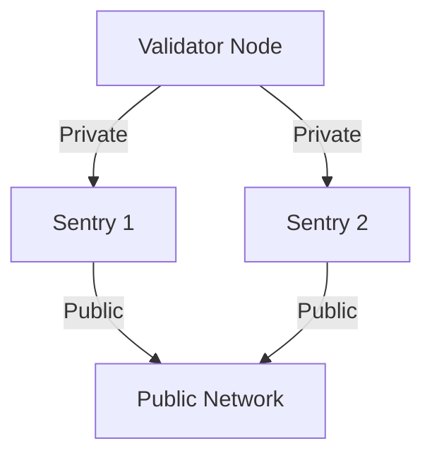

## Network Architecture



## Port Requirements

| Port | Protocol | Purpose | Direction |
|------|----------|---------|-----------|
| **26656** | TCP | P2P communication | Inbound/Outbound |
| **26657** | TCP | RPC server | Inbound |
| **8545** | TCP | Ethereum JSON-RPC | Inbound |
| **8546** | TCP | Ethereum WebSocket | Inbound |
| **6060** | TCP | Metrics (optional) | Inbound |

## Node Information

### Get Node ID

<CodeGroup>
```bash CLI
evmd tendermint show-node-id
# Output: 3f472746f46e1b8c1d8e5216b961e56e0b3c4d56
```

```bash CURL
curl -s localhost:26657/status | jq -r '.result.node_info.id'
# Output: 3f472746f46e1b8c1d8e5216b961e56e0b3c4d56
```
</CodeGroup>

### Get Node Address

<CodeGroup>
```bash CLI
echo "$(evmd tendermint show-node-id)@$(curl -s ifconfig.me):26656"
# Output: 3f472746f46e1b8c1d8e5216b961e56e0b3c4d56@203.0.113.1:26656
```

```bash CURL
echo "$(curl -s localhost:26657/status | jq -r '.result.node_info.id')@$(curl -s ifconfig.me):26656"
# Output: 3f472746f46e1b8c1d8e5216b961e56e0b3c4d56@203.0.113.1:26656
```
</CodeGroup>

## Network Configuration

Edit `~/.evmd/config/config.toml`:

### Seed Nodes

```toml
# Comma separated list
seeds = "node-id-1@ip1:26656,node-id-2@ip2:26656"
```

### Persistent Peers

```toml
# Always maintain these connections
persistent_peers = "node-id@ip:26656"
```

### Connection Limits

```toml
max_num_inbound_peers = 40
max_num_outbound_peers = 10
unconditional_peer_ids = "trusted-node-id-1,trusted-node-id-2"
```

## Network Types

### Local Development

```toml
seeds = ""
persistent_peers = ""
laddr = "tcp://127.0.0.1:26656"
```

### Private Network

```bash
# Node 1 (10.0.0.1)
persistent_peers = "node2-id@10.0.0.2:26656,node3-id@10.0.0.3:26656"

# Node 2 (10.0.0.2)
persistent_peers = "node1-id@10.0.0.1:26656,node3-id@10.0.0.3:26656"

# Node 3 (10.0.0.3)
persistent_peers = "node1-id@10.0.0.1:26656,node2-id@10.0.0.2:26656"
```

### Public Testnet

```toml
seeds = "seed1@seed1.testnet.com:26656,seed2@seed2.testnet.com:26656"
persistent_peers = "validator1@val1.testnet.com:26656"
laddr = "tcp://0.0.0.0:26656"
external_address = "YOUR_PUBLIC_IP:26656"
```

## Firewall Configuration

<Tabs>
  <Tab title="Linux (UFW)">
    ```bash
    # Allow P2P port
    sudo ufw allow 26656/tcp

    # Optional: Allow RPC ports if public
    sudo ufw allow 26657/tcp  # Tendermint RPC
    sudo ufw allow 8545/tcp   # Ethereum JSON-RPC
    sudo ufw allow 8546/tcp   # Ethereum WebSocket

    # Enable firewall
    sudo ufw enable

    # Check status
    sudo ufw status
    ```
  </Tab>

  <Tab title="Linux (iptables)">
    ```bash
    # Allow P2P port
    sudo iptables -A INPUT -p tcp --dport 26656 -j ACCEPT

    # Optional: Allow RPC ports
    sudo iptables -A INPUT -p tcp --dport 26657 -j ACCEPT
    sudo iptables -A INPUT -p tcp --dport 8545 -j ACCEPT
    sudo iptables -A INPUT -p tcp --dport 8546 -j ACCEPT

    # Save rules
    sudo netfilter-persistent save
    ```
  </Tab>

  <Tab title="AWS">
    **Security Group Settings:**

    | Port | Protocol | Source | Purpose |
    |------|----------|--------|---------|
    | 26656 | TCP | 0.0.0.0/0 | P2P (required) |
    | 26657 | TCP | Your IP | Tendermint RPC |
    | 8545 | TCP | Your IP | Ethereum RPC |
    | 8546 | TCP | Your IP | WebSocket RPC |

    Configure via AWS Console or CLI:
    ```bash
    aws ec2 authorize-security-group-ingress \
      --group-id sg-xxxxxx \
      --protocol tcp \
      --port 26656 \
      --cidr 0.0.0.0/0
    ```
  </Tab>

  <Tab title="Google Cloud">
    ```bash
    # Create firewall rule for P2P
    gcloud compute firewall-rules create cosmos-p2p \
      --allow tcp:26656 \
      --source-ranges 0.0.0.0/0

    # Optional: Create rules for RPC
    gcloud compute firewall-rules create cosmos-rpc \
      --allow tcp:26657,tcp:8545,tcp:8546 \
      --source-ranges YOUR_IP/32
    ```
  </Tab>
</Tabs>

## Monitoring Peers

### Get Peer Information

<CodeGroup>
```bash CLI
evmd status | jq '.SyncInfo'
```

```bash CURL
curl -s localhost:26657/net_info | jq '.result'
```
</CodeGroup>

### Count Connected Peers

<CodeGroup>
```bash CLI
evmd status | jq '.SyncInfo | length'
```

```bash CURL
curl -s localhost:26657/net_info | jq '.result.n_peers'
```
</CodeGroup>

### List Peer IDs

<CodeGroup>
```bash CLI
evmd query tendermint-validator-set | jq '.validators[].address'
```

```bash CURL
curl -s localhost:26657/net_info | jq -r '.result.peers[].node_info.id'
```
</CodeGroup>

### Check Sync Status

<CodeGroup>
```bash CLI
evmd status | jq '.SyncInfo'
```

```bash CURL
curl -s localhost:26657/status | jq '.result.sync_info'
```
</CodeGroup>

### Monitor Peer Count

<CodeGroup>
```bash Watch-CLI
watch -n 5 'evmd status | jq .SyncInfo.latest_block_height'
```

```bash Watch-CURL
watch -n 5 'curl -s localhost:26657/net_info | jq .result.n_peers'
```
</CodeGroup>

## Advanced Configuration

### State Sync

```toml
[statesync]
enable = true
rpc_servers = ""  # RPC servers for state sync
trust_height = 0  # Block height to trust
trust_hash = ""   # Block hash to trust
trust_period = "" # Trust period duration
```

### Sentry Node Architecture



Validator configuration:
```toml
persistent_peers = "sentry1-id@private-ip1:26656,sentry2-id@private-ip2:26656"
pex = false
addr_book_strict = false
```

### DNS Seeds

```toml
seeds = "seeds.testnet.com:26656"
```

## Peer Discovery

1. **Initial Connection**: Connect to seeds
2. **Peer Exchange**: Seeds share peer addresses
3. **Gossip Protocol**: Peers share blockchain data
4. **Address Book**: Save discovered peers in `addrbook.json`

### Address Book Management

```bash
# View address book size
cat ~/.evmd/config/addrbook.json | jq '.addrs | length'

# Reset address book
rm ~/.evmd/config/addrbook.json
```

## Security Notes

### Validators
- Sentry node architecture recommended
- Keep validator IP private
- Avoid direct public exposure

## Command Reference

### Node Information

<CodeGroup>
```bash CLI
# Get node ID
evmd tendermint show-node-id

# Get node status
evmd status
```

```bash CURL
# Get node ID
curl -s localhost:26657/status | jq -r '.result.node_info.id'

# Get node status
curl -s localhost:26657/status | jq '.result'
```
</CodeGroup>

### Network Diagnostics

<CodeGroup>
```bash CLI
# Check sync info
evmd status | jq '.SyncInfo'

# Get full status
evmd status

# Get version info
evmd version --long
```

```bash CURL
# Check peer info
curl -s localhost:26657/net_info | jq '.result'

# Check sync status
curl -s localhost:26657/status | jq '.result.sync_info'

# Consensus state
curl -s localhost:26657/consensus_state | jq '.result'
```
</CodeGroup>

### Combined Diagnostics

```bash
# Generate full diagnostic report
echo "=== Node Status ==="
curl -s localhost:26657/status | jq '.result.sync_info'
echo "\n=== Network Info ==="
curl -s localhost:26657/net_info | jq '.result | {n_peers, listening, peers: [.peers[].node_info.moniker]}'
echo "\n=== Node Info ==="
curl -s localhost:26657/status | jq '.result.node_info'
```

## Utilities

### Connectivity Testing

```bash
# Test DNS resolution
ping seed.example.com

# Test port connectivity
nc -zv peer.example.com 26656

# Alternative port test
telnet peer.example.com 26656
```

### Configuration Updates

<CodeGroup>
```bash Linux
# Update persistent peers
sed -i 's/persistent_peers = ""/persistent_peers = "id@ip:port"/' ~/.evmd/config/config.toml

# Update seeds
sed -i 's/seeds = ""/seeds = "id@ip:port"/' ~/.evmd/config/config.toml
```

```bash macOS
# Update persistent peers
sed -i '' 's/persistent_peers = ""/persistent_peers = "id@ip:port"/' ~/.evmd/config/config.toml

# Update seeds
sed -i '' 's/seeds = ""/seeds = "id@ip:port"/' ~/.evmd/config/config.toml
```
</CodeGroup>