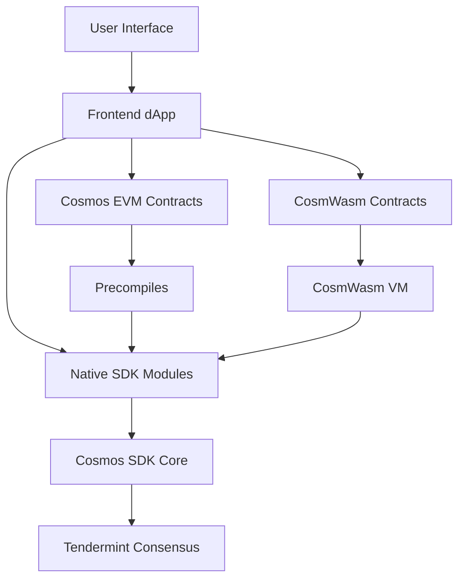

The Cosmos ecosystem offers three distinct approaches for building blockchain applications. Understanding their tradeoffs is crucial for making informed architectural decisions.

## Quick Comparison Matrix

| Aspect | Cosmos EVM | Native Cosmos SDK | CosmWasm |
|--------|------------|-------------------|----------|
| **Language** | Solidity, Vyper | Go | Rust, JavaScript (CosmJS) |
| **Performance** | EVM overhead | Highest performance | Near-native performance |
| **Developer Pool** | Large (Ethereum devs) | Smaller (Go devs) | Growing (Rust devs) |
| **Tooling Maturity** | Mature (Hardhat, Foundry) | Custom tools | Evolving tools |
| **Flexibility** | EVM constraints | Unlimited | High flexibility |
| **Gas Efficiency** | Moderate | Highest | High |
| **Interoperability** | EVM + IBC | Native IBC | Native IBC |
| **Upgradability** | Contract upgrades | Governance upgrades | Built-in migration |
| **Security Model** | Solidity patterns | Custom validation | Rust safety + validation |

## Detailed Comparisons

### Performance Characteristics

<CardGroup cols={3}>
  <Card title="Native Cosmos SDK" icon="rocket">
    **Highest Performance**

    - Direct state access
    - No VM overhead
    - Optimized Go execution
    - Custom data structures

    **Use Case:** High-frequency trading, complex consensus logic
  </Card>

  <Card title="CosmWasm" icon="zap">
    **Near-Native Performance**

    - WebAssembly execution
    - Minimal runtime overhead
    - Rust's zero-cost abstractions
    - Cached compilation

    **Use Case:** Complex DeFi protocols, sophisticated applications
  </Card>

  <Card title="Cosmos EVM" icon="code">
    **Good Performance**

    - EVM interpretation overhead
    - Gas metering costs
    - Precompile optimizations
    - Familiar optimization patterns

    **Use Case:** Ethereum migrations, familiar development
  </Card>
</CardGroup>

### Development Experience

#### Native Cosmos SDK Development

**Advantages:**
- Maximum flexibility and performance
- Direct access to all Cosmos SDK features
- Custom consensus and governance logic
- Tight integration with chain operations

**Challenges:**
- Steep learning curve for Go and Cosmos SDK
- More complex testing and deployment
- Requires deep blockchain knowledge
- Limited reusability across chains

**Example Module Structure:**
```go
// x/mymodule/keeper/keeper.go
type Keeper struct {
    storeKey   sdk.StoreKey
    cdc        codec.Codec
    bankKeeper types.BankKeeper
}

func (k Keeper) ProcessCustomLogic(ctx sdk.Context, msg *types.MsgCustom) (*types.MsgCustomResponse, error) {
    // Direct state access - maximum performance
    store := ctx.KVStore(k.storeKey)

    // Custom validation logic
    if err := k.validateCustomLogic(ctx, msg); err != nil {
        return nil, err
    }

    // Execute business logic with full SDK access
    result := k.executeBusinessLogic(ctx, msg)

    return &types.MsgCustomResponse{Result: result}, nil
}
```

#### CosmWasm Development

**Advantages:**
- High performance with Rust safety
- Portable across Cosmos chains
- Built-in upgrade mechanisms
- Growing ecosystem and tooling

**Challenges:**
- Rust learning curve for some developers
- Limited tooling compared to Ethereum
- Smaller developer community
- Different security patterns than Solidity

**Example Contract:**
```rust
use cosmwasm_std::{
    entry_point, to_binary, Binary, Deps, DepsMut, Env,
    MessageInfo, Response, StdResult,
};

#[entry_point]
pub fn execute(
    deps: DepsMut,
    env: Env,
    info: MessageInfo,
    msg: ExecuteMsg,
) -> Result<Response, ContractError> {
    match msg {
        ExecuteMsg::CustomFunction { params } => {
            execute_custom_function(deps, env, info, params)
        }
    }
}

fn execute_custom_function(
    deps: DepsMut,
    _env: Env,
    info: MessageInfo,
    params: CustomParams,
) -> Result<Response, ContractError> {
    // Rust safety and performance
    // Native IBC integration
    // Built-in state management

    Ok(Response::new()
        .add_attribute("action", "custom_function")
        .add_attribute("sender", info.sender))
}
```

#### Cosmos EVM Development

**Advantages:**
- Familiar Solidity development
- Mature tooling ecosystem
- Large developer community
- Easy Ethereum contract migration

**Challenges:**
- EVM performance limitations
- Gas optimization complexity
- Learning precompile patterns
- Limited to EVM capabilities

**Example Contract:**
```solidity
// SPDX-License-Identifier: MIT
pragma solidity ^0.8.24;

interface IStaking {
    function delegate(address validator, uint256 amount) external returns (bool);
}

contract CosmosEVMExample {
    IStaking constant STAKING = IStaking(0x0000000000000000000000000000000000000800);

    function customFunction(address validator) external payable {
        // Familiar Solidity patterns
        require(msg.value > 0, "Must send tokens");

        // Access to Cosmos SDK through precompiles
        bool success = STAKING.delegate(validator, msg.value);
        require(success, "Delegation failed");

        // EVM-native features
        emit FunctionExecuted(msg.sender, validator, msg.value);
    }

    event FunctionExecuted(address indexed user, address indexed validator, uint256 amount);
}
```

## Use Case Decision Framework

### Choose Native Cosmos SDK When:

<AccordionGroup>
  <Accordion title="Performance is Critical">
    **Examples:**
    - High-frequency trading platforms
    - Custom consensus mechanisms
    - Complex validator logic
    - Low-latency applications

    **Why Native SDK:**
    - Zero VM overhead
    - Direct state access
    - Custom optimizations possible
  </Accordion>

  <Accordion title="Deep Chain Integration Needed">
    **Examples:**
    - Custom governance mechanisms
    - Novel consensus algorithms
    - Chain-specific optimizations
    - Protocol-level features

    **Why Native SDK:**
    - Full access to all SDK features
    - Custom ABCI applications
    - Direct tendermint integration
  </Accordion>

  <Accordion title="Unique Requirements">
    **Examples:**
    - Novel cryptographic primitives
    - Custom state management
    - Specialized data structures
    - Protocol research

    **Why Native SDK:**
    - Unlimited flexibility
    - No VM constraints
    - Direct dependency management
  </Accordion>
</AccordionGroup>

### Choose CosmWasm When:

<AccordionGroup>
  <Accordion title="Multi-Chain Deployment">
    **Examples:**
    - Cross-chain DeFi protocols
    - Portable NFT standards
    - Universal governance systems
    - Cross-ecosystem bridges

    **Why CosmWasm:**
    - Deploy once, run anywhere
    - Consistent behavior across chains
    - Built-in migration support
  </Accordion>

  <Accordion title="Complex Smart Contract Logic">
    **Examples:**
    - Advanced DeFi protocols
    - Complex governance systems
    - Sophisticated token economics
    - Cross-contract interactions

    **Why CosmWasm:**
    - Rust safety guarantees
    - High performance execution
    - Rich standard library
  </Accordion>

  <Accordion title="Rapid Development Cycles">
    **Examples:**
    - Prototype applications
    - Iterative product development
    - Experimental features
    - Community-driven projects

    **Why CosmWasm:**
    - Built-in upgrade mechanisms
    - No chain upgrades required
    - Flexible deployment model
  </Accordion>
</AccordionGroup>

### Choose Cosmos EVM When:

<AccordionGroup>
  <Accordion title="Ethereum Migration">
    **Examples:**
    - Existing Solidity contracts
    - Ethereum DeFi protocols
    - Established codebases
    - Team with Solidity expertise

    **Why Cosmos EVM:**
    - Minimal code changes required
    - Familiar development environment
    - Existing audit history
  </Accordion>

  <Accordion title="Hybrid Functionality Needed">
    **Examples:**
    - EVM contracts with IBC
    - Staking-aware applications
    - Cross-chain DeFi
    - Ethereum + Cosmos bridges

    **Why Cosmos EVM:**
    - Best of both ecosystems
    - Precompile access to Cosmos features
    - EVM tooling compatibility
  </Accordion>

  <Accordion title="Developer Accessibility">
    **Examples:**
    - Large development teams
    - Outsourced development
    - Community contributions
    - Educational projects

    **Why Cosmos EVM:**
    - Largest developer pool
    - Mature tooling ecosystem
    - Extensive resources and tutorials
  </Accordion>
</AccordionGroup>

## Migration Considerations

### From Ethereum to Cosmos EVM

**Straightforward Migration:**
```solidity
// Original Ethereum contract works unchanged
contract UniswapV2Pair {
    function swap(uint amount0Out, uint amount1Out, address to, bytes calldata data) external {
        // Exact same implementation
    }
}
```

**Enhanced with Cosmos Features:**
```solidity
contract EnhancedDEX {
    IIBCTransfer constant IBC = IIBCTransfer(0x0000000000000000000000000000000000000802);

    function swapAndBridge(
        address tokenOut,
        uint amountOut,
        string calldata targetChain,
        string calldata recipient
    ) external {
        // Execute swap (existing logic)
        _executeSwap(tokenOut, amountOut);

        // Bridge to another chain (new capability)
        IBC.transfer(getChannel(targetChain), recipient, amountOut);
    }
}
```

### From Native SDK to CosmWasm

**Go Module to Rust Contract:**
```rust
// Native SDK keeper logic becomes CosmWasm contract
#[cw_serde]
pub struct ExecuteMsg {
    Transfer { recipient: String, amount: Uint128 },
    Stake { validator: String, amount: Uint128 },
}

pub fn execute(
    deps: DepsMut,
    env: Env,
    info: MessageInfo,
    msg: ExecuteMsg,
) -> Result<Response, ContractError> {
    match msg {
        ExecuteMsg::Transfer { recipient, amount } => {
            // Similar logic to SDK keeper, but in Rust
            execute_transfer(deps, info, recipient, amount)
        }
        ExecuteMsg::Stake { validator, amount } => {
            // Leverage existing SDK staking module
            let stake_msg = StakingMsg::Delegate {
                validator,
                amount: coin(amount.u128(), "stake"),
            };
            Ok(Response::new().add_message(stake_msg))
        }
    }
}
```

### Hybrid Approaches

**Multi-Technology Stack:**


**Example Use Cases:**
- **Core Logic:** Native SDK (performance)
- **Business Logic:** CosmWasm (flexibility)
- **User Interface:** Cosmos EVM (accessibility)

## Performance Benchmarks

### Gas Cost Comparison

| Operation | Native SDK | CosmWasm | Cosmos EVM |
|-----------|------------|----------|------------|
| **Simple Transfer** | 20,000 | 25,000 | 21,000 |
| **Complex Logic** | 50,000 | 75,000 | 150,000 |
| **State Read** | 1,000 | 1,500 | 2,000 |
| **State Write** | 5,000 | 7,500 | 20,000 |
| **Cross-Contract Call** | N/A | 10,000 | 25,000 |

### Development Time Estimates

| Task | Native SDK | CosmWasm | Cosmos EVM |
|------|------------|----------|------------|
| **Simple Token** | 2-3 weeks | 1 week | 2-3 days |
| **DeFi Protocol** | 6-8 weeks | 3-4 weeks | 1-2 weeks |
| **Cross-Chain App** | 4-6 weeks | 2-3 weeks | 1-2 weeks |
| **Testing & Audit** | 4-6 weeks | 2-3 weeks | 1-2 weeks |

## Next Steps

Based on your decision, explore the relevant documentation:

<CardGroup cols={3}>
  <Card title="Continue with Cosmos EVM" href="/docs/evm/developers/advanced-patterns">
    Explore advanced patterns and cross-chain capabilities
  </Card>

  <Card title="Learn Native SDK" href="/docs/sdk/index">
    Dive into native Cosmos SDK module development
  </Card>

  <Card title="Explore CosmWasm" href="https://book.cosmwasm.com">
    Learn Rust-based smart contract development
  </Card>
</CardGroup>
