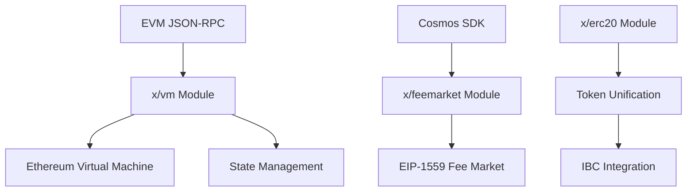

# Reference & API Documentation

Complete technical reference for Cosmos EVM development and operations.

## Core Modules

Based on the official documentation, Cosmos EVM consists of these main modules:

<CardGroup cols={3}>
  <Card title="x/vm Module" icon="cpu">
    Core EVM implementation providing Ethereum compatibility
  </Card>
  <Card title="x/feemarket Module" icon="credit-card">
    EIP-1559 fee market mechanism for transaction handling
  </Card>
  <Card title="x/erc20 Module" icon="coins">
    Interoperability between Cosmos SDK coins and ERC-20 tokens
  </Card>
</CardGroup>

---

## Module Parameters

Both the VM and FeeMarket modules maintain configurable parameters that can be updated through governance proposals.

### x/vm Module Parameters

According to the technical documentation, VM module parameters include:

- **EVM denomination**: Base denomination used for EVM operations
- **Extra EIPs enabled**: Additional Ethereum Improvement Proposals activated
- **Chain configuration**: Fork schedule and chain-specific settings
- **Active precompiled contracts**: Custom precompiled contracts available

### x/feemarket Module Parameters

FeeMarket module parameters include:

- **Base fee change denominator**: Controls base fee adjustment rate
- **Elasticity multiplier**: Gas limit elasticity configuration
- **Min gas price**: Minimum gas price threshold
- **Min gas multiplier**: Minimum gas multiplier for fee calculation

<Note>
**Parameter Updates**: All parameters can be modified through on-chain governance proposals, allowing chain operators to adjust behavior as needed.
</Note>

---

## JSON-RPC Support

Cosmos EVM provides JSON-RPC compatibility for Ethereum tooling integration:

### Supported Features

- **Full Ethereum JSON-RPC compatibility**: Standard Ethereum API endpoints
- **MetaMask compatibility**: Seamless wallet integration
- **Block explorer support**: Compatible with standard block explorers
- **Development tools**: Works with Hardhat, Remix, and other EVM tools

### Configuration

The JSON-RPC server provides:
- Full control over exposed namespaces
- Custom timeouts for EVM calls and HTTP requests
- Maximum block gas configuration
- Connection limits and other performance settings

---

## Architecture Overview

### System Design

Cosmos EVM integrates with the Cosmos SDK framework through a modular architecture:



### Transaction Flow

The system handles both EVM and Cosmos transaction types through integrated processing:

1. **EVM Transactions**: Processed through the EVM module with Ethereum compatibility
2. **Cosmos Transactions**: Standard Cosmos SDK transaction processing
3. **Cross-chain Operations**: IBC integration for cross-chain communication

---

## EVM Extensions

Cosmos EVM provides extensions to access Cosmos SDK functionality from within the EVM:

### Precompiled Contracts

Custom precompiled contracts enable:
- Access to Cosmos SDK module functionality
- Native IBC operations from Solidity
- Staking and governance interactions
- Custom chain-specific features

### IBC Integration

Native IBC support provides:
- Cross-chain token transfers
- Cross-chain smart contract interactions
- Access to the broader Cosmos ecosystem
- Elimination of bridge security risks

---

## Token Unification

The ERC-20 module enables unified token representation:

### Single Token Representation v2

Features include:
- Unified IBC coins and ERC-20 tokens
- Elimination of liquidity fragmentation
- Seamless user experience across token types
- Automatic conversion between formats

### Benefits

- **One Balance**: Users see unified balances across all tools
- **No Wrapping**: Direct use of native tokens in EVM
- **Cross-chain Ready**: Native IBC compatibility

---

## Testing and Development

### Local Development

The official repository provides testing infrastructure:

```bash
# Unit testing
make test-unit

# Coverage testing
make test-unit-cover

# Solidity contract testing
make test-solidity

# Benchmark testing
make benchmark

# Fuzz testing
make test-fuzz
```

### Local Node Setup

For development and testing:

```bash
# Run local development node
./local_node.sh
```

This script sets up a local `evmd` chain for development purposes.

---

## Build System

The project uses a comprehensive Makefile for build management:

### Common Commands

- **Build**: Standard Go build process
- **Test**: Comprehensive testing suite
- **Lint**: Code quality checks
- **Format**: Code formatting standards
- **Contracts**: Solidity contract compilation
- **Proto**: Protocol buffer generation

---

## Configuration Examples

### Basic Chain Configuration

For new chains integrating Cosmos EVM:

- **Chain ID Format**: Supports EVM-compatible chain ID formats
- **Denomination**: Configurable base denomination
- **Decimals**: Flexible decimal precision (new chains can use 18 decimals)
- **Consensus**: Standard Cosmos SDK consensus mechanism

### Customization Options

Available customizations include:
- **Permissioned EVM**: Access control for smart contract deployment
- **Custom precompiles**: Chain-specific functionality
- **Fee market settings**: Tailored fee structures
- **JSON-RPC configuration**: API endpoint customization

---

## Security Considerations

### Audit Status

<Warning>
**Important**: Cosmos EVM is undergoing changes in preparation for a new audit. The first v1 release is targeted for late Q2. While the original evmOS repo is used in production on several chains, this repository will be marked as stable after the audit is completed.
</Warning>

### Best Practices

- **Parameter Management**: Use governance for parameter updates
- **Testing**: Comprehensive testing before production deployment
- **Monitoring**: Monitor both EVM and Cosmos metrics
- **Upgrades**: Follow official upgrade procedures

---

## Community Resources

<CardGroup cols={2}>
  <Card title="GitHub Repository" href="https://github.com/cosmos/evm" icon="github">
    Access source code, issues, and contributions
  </Card>
  <Card title="Technical Support" icon="message-circle">
    Slack: #cosmos-tech channel in Cosmos Network Slack
  </Card>
</CardGroup>

---

*For the most up-to-date technical specifications and API details, refer to the [official GitHub repository](https://github.com/cosmos/evm) and watch for upcoming documentation releases from the Interchain Labs team.*