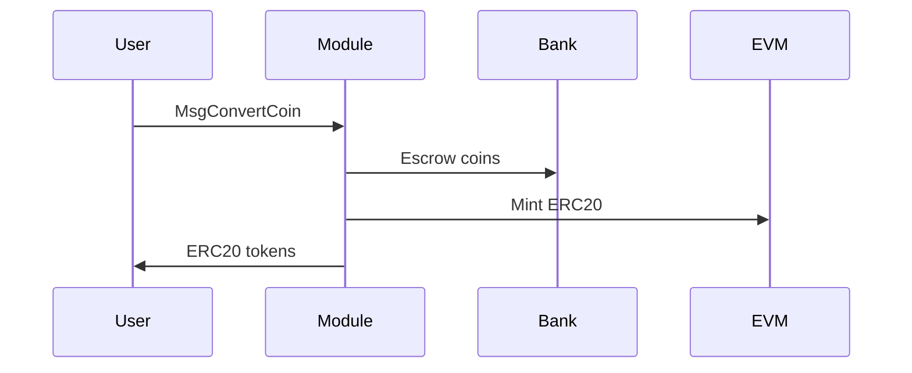
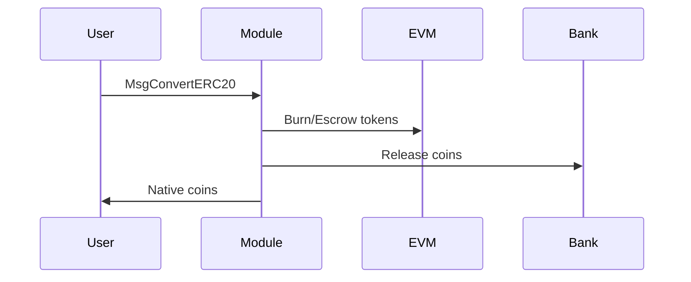

The `x/erc20` module from [cosmos/evm](https://github.com/cosmos/evm) enables bidirectional conversion between Cosmos SDK coins and ERC20 tokens within the EVM runtime.

<Note>
  For conceptual understanding of Single Token Representation v2, see [Single Token Representation](/docs/next/documentation/concepts/single-token-representation).
</Note>

## Parameters

The module parameters control token conversion and registration ([source](https://github.com/cosmos/evm/blob/v0.4.1/proto/cosmos/evm/erc20/v1/genesis.proto)):

| Parameter | Type | Default | Description |
|-----------|------|---------|-------------|
| `enable_erc20` | bool | `true` | Enable token conversions globally |
| `permissionless_registration` | bool | `false` | Allow anyone to register ERC20 tokens |

### Parameter Details

<Expandable title="enable_erc20">
Master switch for token conversions:
- `true`: All conversions enabled (default)
- `false`: Disables all conversions, registration still works
- Use for emergency pause or maintenance
</Expandable>

<Expandable title="permissionless_registration">
Controls who can register new ERC20 tokens:
- `false`: Only governance can register (default, recommended)
- `true`: Anyone can register via MsgRegisterERC20
- Permissionless risks: spam tokens, malicious contracts
</Expandable>

## State

The module maintains token pair mappings and allowances ([source](https://github.com/cosmos/evm/blob/v0.4.1/x/erc20/types/keys.go)):

| Object | Key | Value | Description |
|--------|-----|-------|-------------|
| `TokenPair` | `0x01 + ID` | `TokenPair` | Token pair configuration |
| `TokenPairByERC20` | `0x02 + address` | `ID` | Lookup by ERC20 address |
| `TokenPairByDenom` | `0x03 + denom` | `ID` | Lookup by denomination |
| `Allowance` | `0x04 + hash` | `Allowance` | ERC20 allowances |
| `NativePrecompiles` | `0x05 + address` | `bool` | Native precompile registry |
| `DynamicPrecompiles` | `0x06 + address` | `bool` | Dynamic precompile registry |

### Token Pair Structure

```go
type TokenPair struct {
    Erc20Address  string  // Hex address of ERC20 contract
    Denom         string  // Cosmos coin denomination
    Enabled       bool    // Conversion enable status
    ContractOwner Owner   // OWNER_MODULE or OWNER_EXTERNAL
}
```

## Token Pair Registration

### Registration Methods

1. **Automatic Registration (IBC Tokens)**
   - IBC tokens (denoms starting with "ibc/") are automatically registered on first receipt
   - No governance proposal or user action required
   - Creates ERC20 precompile at deterministic address

2. **Permissionless Registration (ERC20 Contracts)**
   - When `permissionless_registration` parameter is `true`
   - Any user can register existing ERC20 contracts via `MsgRegisterERC20`
   - Useful for integrating existing ERC20 tokens

3. **Governance Registration**
   - Always available regardless of parameter settings
   - Can register any ERC20 contract or create new token pairs
   - Required when `permissionless_registration` is `false`

## Messages

### MsgRegisterERC20

Register existing ERC20 contracts for conversion ([source](https://github.com/cosmos/evm/blob/v0.4.1/proto/cosmos/evm/erc20/v1/tx.proto#L104-L118)):

```protobuf
message MsgRegisterERC20 {
    string signer = 1;
    repeated string erc20addresses = 2;
}
```

**Requirements:**
- `permissionless_registration` enabled OR sender is governance authority
- Valid ERC20 contract at address
- Contract not already registered
- Contract implements standard ERC20 interface

### MsgConvertCoin

Convert Cosmos coins to ERC20 tokens:

```protobuf
message MsgConvertCoin {
    Coin coin = 1;      // Amount and denom to convert
    string receiver = 2; // Hex address to receive ERC20
    string sender = 3;   // Bech32 address of sender
}
```

**Validation:**
- Token pair exists and enabled
- Sender has sufficient balance
- Valid receiver address

### MsgConvertERC20

Convert ERC20 tokens to Cosmos coins:

```protobuf
message MsgConvertERC20 {
    string contract_address = 1;  // ERC20 contract
    string amount = 2;            // Amount to convert
    string receiver = 3;          // Bech32 address
    string sender = 4;            // Hex address of sender
}
```

**Validation:**
- Token pair exists and enabled
- Sender has sufficient ERC20 balance
- Valid receiver address

### MsgToggleConversion

Enable/disable conversions for a token pair (governance only):

```protobuf
message MsgToggleConversion {
    string authority = 1;  // Must be governance account
    string token = 2;      // Address or denom
}
```

### MsgUpdateParams

Update module parameters (governance only):

```protobuf
message MsgUpdateParams {
    string authority = 1;  // Must be governance account
    Params params = 2;     // New parameters
}
```

## Conversion Flows

### Native Coin → ERC20



**Steps:**
1. Validate token pair enabled
2. Transfer coins to module account
3. Mint equivalent ERC20 to receiver
4. Emit conversion event

### ERC20 → Native Coin



**Steps:**
1. Validate token pair enabled
2. For module-owned: burn ERC20
3. For external: transfer to module
4. Release native coins from escrow
5. Emit conversion event

## Precompile System

### Native Precompiles

Automatically created for Cosmos coins at deterministic addresses:

```go
// Address derivation
address = keccak256("erc20|<denom>")[:20]
```

**Interface:**
```solidity
interface IERC20 {
    function totalSupply() external view returns (uint256);
    function balanceOf(address account) external view returns (uint256);
    function transfer(address recipient, uint256 amount) external returns (bool);
    function allowance(address owner, address spender) external view returns (uint256);
    function approve(address spender, uint256 amount) external returns (bool);
    function transferFrom(address sender, address recipient, uint256 amount) external returns (bool);
}
```

### Dynamic Precompiles (WERC20)

Optional wrapped interface for registered tokens:

```solidity
interface IWERC20 is IERC20 {
    function deposit() external payable;
    function withdraw(uint256 amount) external;
}
```

## IBC Integration

### IBC Middleware v1

Standard IBC transfer integration ([source](https://github.com/cosmos/evm/blob/v0.4.1/x/erc20/ibc_middleware.go)):

<Expandable title="View IBC middleware integration code">
```go
// Automatic registration and conversion on receive
OnRecvPacket(packet) {
    // Auto-register new IBC tokens (with "ibc/" prefix)
    if !tokenPairExists && hasPrefix(denom, "ibc/") {
        RegisterERC20Extension(denom)
    }

    // Auto-convert to ERC20 for Ethereum addresses
    if isEthereumAddress(receiver) {
        convertToERC20(voucher, receiver)
    }
}

// Automatic conversion on acknowledgment
OnAcknowledgementPacket(packet, ack) {
    if wasConverted {
        convertBackToCosmos(refund)
    }
}
```
</Expandable>

**Automatic Registration:**
- IBC tokens (denoms starting with "ibc/") are automatically registered on first receipt
- Factory tokens (denoms starting with "factory/") are skipped
- Native chain tokens require explicit registration

### IBC Middleware v2

Enhanced IBC v2 support ([source](https://github.com/cosmos/evm/blob/v0.4.1/x/erc20/v2/ibc_middleware.go)):

- New packet format support
- Improved error handling
- Multi-hop awareness
- Backward compatibility

## Events

### Registration Events

| Event | Attributes | When Emitted |
|-------|------------|--------------|
| `register_erc20` | `erc20_address`, `cosmos_coin` | Token pair registered |
| `toggle_token_conversion` | `erc20_address`, `cosmos_coin` | Conversion toggled |

### Conversion Events

| Event | Attributes | When Emitted |
|-------|------------|--------------|
| `convert_coin` | `sender`, `receiver`, `amount`, `cosmos_coin`, `erc20_token` | Coin → ERC20 |
| `convert_erc20` | `sender`, `receiver`, `amount`, `cosmos_coin`, `erc20_token` | ERC20 → Coin |

### IBC Events

| Event | Attributes | When Emitted |
|-------|------------|--------------|
| `ibc_transfer_conversion` | `sender`, `receiver`, `denom`, `amount` | Auto-conversion during IBC |

## Queries

### gRPC

```protobuf
service Query {
    // Get module parameters
    rpc Params(QueryParamsRequest) returns (QueryParamsResponse);

    // Get all token pairs
    rpc TokenPairs(QueryTokenPairsRequest) returns (QueryTokenPairsResponse);

    // Get specific token pair
    rpc TokenPair(QueryTokenPairRequest) returns (QueryTokenPairResponse);
}
```

### CLI

<CodeGroup>

```bash Query-Params
# Query module parameters
evmd query erc20 params
```

```bash Query-Token-Pairs
# Query all registered token pairs
evmd query erc20 token-pairs

# Query specific token pair
evmd query erc20 token-pair uatom
evmd query erc20 token-pair 0x80b5a32e4f032b2a058b4f29ec95eefeeb87adcd
```

```bash Convert-Tokens
# Convert Cosmos coin to ERC20
evmd tx erc20 convert-coin 100uatom 0xReceiverAddress --from mykey

# Convert ERC20 to Cosmos coin
evmd tx erc20 convert-erc20 0xTokenAddress 100000000000000000000 cosmos1receiver --from mykey
```

```bash Register-Token
# Register ERC20 token (if permissionless)
evmd tx erc20 register-erc20 0xContractAddress --from mykey

# Via governance (if permissioned)
evmd tx gov submit-proposal register-erc20-proposal.json --from mykey
```

</CodeGroup>

## Integration Examples

### DeFi Protocol Integration

```javascript
// Using precompiled ERC20 interface for IBC tokens
const ibcToken = new ethers.Contract(
    "0x80b5a32e4f032b2a058b4f29ec95eefeeb87adcd", // Precompile address
    ERC20_ABI,
    signer
);

// Standard ERC20 operations work seamlessly
await ibcToken.approve(dexRouter, amount);
await dexRouter.swapExactTokensForTokens(...);
```

### Automatic IBC Conversion

```javascript
// IBC transfer automatically converts to ERC20
const packet = {
    sender: "cosmos1...",
    receiver: "0x...",  // EVM address triggers conversion
    token: { denom: "uatom", amount: "1000000" }
};
// Token arrives as ERC20 in receiver's EVM account
```

### Manual Conversion Flow

```javascript
// Convert native to ERC20
await client.signAndBroadcast(address, [
    {
        typeUrl: "/cosmos.evm.erc20.v1.MsgConvertCoin",
        value: {
            coin: { denom: "uatom", amount: "1000000" },
            receiver: "0xEthereumAddress",
            sender: "cosmos1..."
        }
    }
]);
```

## Best Practices

### Chain Integration

1. **Token Registration Review**
   - Audit contracts before registration
   - Verify standard compliance
   - Check for malicious behavior

2. **Precompile Configuration**
   - Enable precompiles for frequently used tokens
   - Monitor gas consumption
   - Set appropriate gas costs

3. **IBC Setup**
   - Configure middleware stack correctly
   - Test auto-conversion flows
   - Monitor conversion events

### Security Considerations

1. **Contract Validation**
   ```solidity
   // Verify standard interface
   IERC20(token).totalSupply();
   IERC20(token).balanceOf(address(this));
   ```

2. **Event Monitoring**
   - Track conversion events
   - Monitor for unusual patterns
   - Alert on large conversions

3. **Emergency Response**
   - Disable conversions via governance
   - Toggle specific token pairs
   - Have incident response plan

## Troubleshooting

### Common Issues

| Issue | Cause | Solution |
|-------|-------|----------|
| "token pair not found" | Token not registered | Register via governance |
| "token pair disabled" | Conversions toggled off | Enable via governance |
| "insufficient balance" | Low balance for conversion | Check balance in correct format |
| "invalid recipient" | Wrong address format | Use hex for EVM, bech32 for Cosmos |
| "module disabled" | enable_erc20 = false | Enable via governance |

### Debug Commands

```bash
# Check if token is registered
evmd query erc20 token-pair uatom

# Check module parameters
evmd query erc20 params

# Check account balance (both formats)
evmd query bank balances cosmos1...
evmd query vm balance 0x...
```

## References

### Source Code
- [ERC20 Module](https://github.com/cosmos/evm/tree/v0.4.1/x/erc20) - Module implementation
- [Precompiles](https://github.com/cosmos/evm/tree/v0.4.1/precompiles/erc20) - ERC20 precompile contracts
- [IBC Middleware](https://github.com/cosmos/evm/tree/v0.4.1/x/erc20/ibc_middleware.go) - IBC integration
- [Proto Definitions](https://github.com/cosmos/evm/tree/v0.4.1/proto/cosmos/evm/erc20/v1) - API specifications

### Related Documentation
- [Single Token Representation](/docs/next/documentation/concepts/single-token-representation) - Conceptual overview
- [VM Module](/docs/next/documentation/cosmos-sdk/modules/vm) - EVM execution environment
- [Bank Module](https://docs.cosmos.network/main/modules/bank) - Native token management