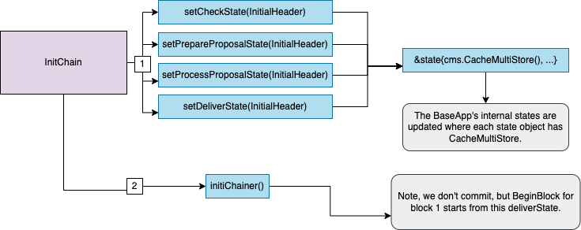
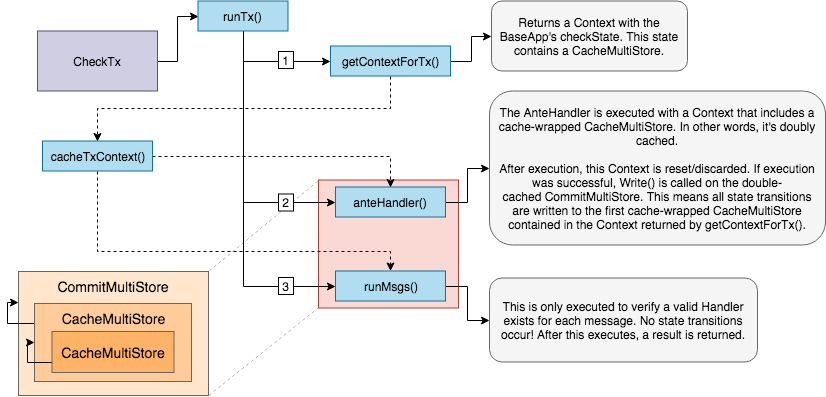
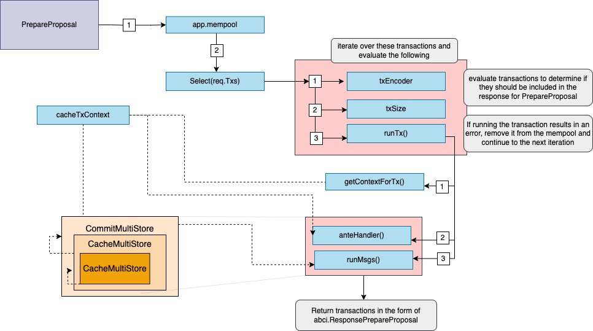
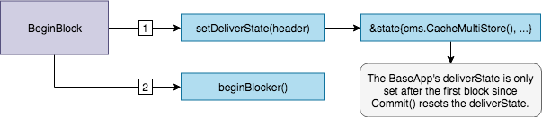
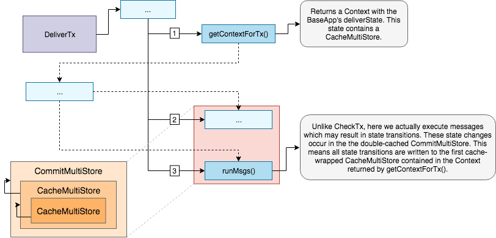
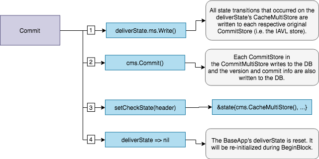

<Note>
**Synopsis**
This document describes `BaseApp`, the abstraction that implements the core functionalities of a Cosmos SDK application.
</Note>

<Note>

### Pre-requisite Readings

* [Anatomy of a Cosmos SDK application](/docs/sdk/v0.47/beginner/overview-app)
* [Lifecycle of a Cosmos SDK transaction](/docs/sdk/v0.47/beginner/tx-lifecycle)

</Note>

## Introduction

`BaseApp` is a base type that implements the core of a Cosmos SDK application, namely:

* The [Application Blockchain Interface](#main-abci-10-messages), for the state-machine to communicate with the underlying consensus engine (e.g. CometBFT).
* [Service Routers](#service-routers), to route messages and queries to the appropriate module.
* Different [states](#state-updates), as the state-machine can have different volatile states updated based on the ABCI message received.

The goal of `BaseApp` is to provide the fundamental layer of a Cosmos SDK application
that developers can easily extend to build their own custom application. Usually,
developers will create a custom type for their application, like so:

```go
type App struct {
  // reference to a BaseApp
  *baseapp.BaseApp

  // list of application store keys

  // list of application keepers

  // module manager
}
```

Extending the application with `BaseApp` gives the former access to all of `BaseApp`'s methods.
This allows developers to compose their custom application with the modules they want, while not
having to concern themselves with the hard work of implementing the ABCI, the service routers and state
management logic.

## Type Definition

The `BaseApp` type holds many important parameters for any Cosmos SDK based application.

```go expandable
package baseapp

import (
    
	"errors"
    "fmt"
    "sort"
    "strings"
    "github.com/cosmos/gogoproto/proto"
	abci "github.com/tendermint/tendermint/abci/types"
    "github.com/tendermint/tendermint/crypto/tmhash"
    "github.com/tendermint/tendermint/libs/log"
	tmproto "github.com/tendermint/tendermint/proto/tendermint/types"
	dbm "github.com/tendermint/tm-db"
    "golang.org/x/exp/maps"

	codectypes "github.com/cosmos/cosmos-sdk/codec/types"
    "github.com/cosmos/cosmos-sdk/snapshots"
    "github.com/cosmos/cosmos-sdk/store"
    "github.com/cosmos/cosmos-sdk/store/rootmulti"
	storetypes "github.com/cosmos/cosmos-sdk/store/types"
	sdk "github.com/cosmos/cosmos-sdk/types"
	sdkerrors "github.com/cosmos/cosmos-sdk/types/errors"
    "github.com/cosmos/cosmos-sdk/types/mempool"
)

const (
	runTxModeCheck    runTxMode = iota // Check a transaction
	runTxModeReCheck                   // Recheck a (pending)

transaction after a commit
	runTxModeSimulate                  // Simulate a transaction
	runTxModeDeliver                   // Deliver a transaction
	runTxPrepareProposal
	runTxProcessProposal
)

var _ abci.Application = (*BaseApp)(nil)

type (
	// Enum mode for app.runTx
	runTxMode uint8

	// StoreLoader defines a customizable function to control how we load the CommitMultiStore
	// from disk. This is useful for state migration, when loading a datastore written with
	// an older version of the software. In particular, if a module changed the substore key name
	// (or removed a substore)

between two versions of the software.
	StoreLoader func(ms sdk.CommitMultiStore)

error
)

// BaseApp reflects the ABCI application implementation.
type BaseApp struct { //nolint: maligned
	// initialized on creation
	logger            log.Logger
	name              string               // application name from abci.Info
	db                dbm.DB               // common DB backend
	cms               sdk.CommitMultiStore // Main (uncached)

state
	qms               sdk.MultiStore       // Optional alternative multistore for querying only.
	storeLoader       StoreLoader          // function to handle store loading, may be overridden with SetStoreLoader()

grpcQueryRouter   *GRPCQueryRouter     // router for redirecting gRPC query calls
	msgServiceRouter  *MsgServiceRouter    // router for redirecting Msg service messages
	interfaceRegistry codectypes.InterfaceRegistry
	txDecoder         sdk.TxDecoder // unmarshal []byte into sdk.Tx
	txEncoder         sdk.TxEncoder // marshal sdk.Tx into []byte

	mempool         mempool.Mempool            // application side mempool
	anteHandler     sdk.AnteHandler            // ante handler for fee and auth
	postHandler     sdk.AnteHandler            // post handler, optional, e.g. for tips
	initChainer     sdk.InitChainer            // initialize state with validators and state blob
	beginBlocker    sdk.BeginBlocker           // logic to run before any txs
	processProposal sdk.ProcessProposalHandler // the handler which runs on ABCI ProcessProposal
	prepareProposal sdk.PrepareProposalHandler // the handler which runs on ABCI PrepareProposal
	endBlocker      sdk.EndBlocker             // logic to run after all txs, and to determine valset changes
	addrPeerFilter  sdk.PeerFilter             // filter peers by address and port
	idPeerFilter    sdk.PeerFilter             // filter peers by node ID
	fauxMerkleMode  bool                       // if true, IAVL MountStores uses MountStoresDB for simulation speed.

	// manages snapshots, i.e. dumps of app state at certain intervals
	snapshotManager *snapshots.Manager

	// volatile states:
	//
	// checkState is set on InitChain and reset on Commit
	// deliverState is set on InitChain and BeginBlock and set to nil on Commit
	checkState           *state // for CheckTx
	deliverState         *state // for DeliverTx
	processProposalState *state // for ProcessProposal
	prepareProposalState *state // for PrepareProposal

	// an inter-block write-through cache provided to the context during deliverState
	interBlockCache sdk.MultiStorePersistentCache

	// absent validators from begin block
	voteInfos []abci.VoteInfo

	// paramStore is used to query for ABCI consensus parameters from an
	// application parameter store.
	paramStore ParamStore

	// The minimum gas prices a validator is willing to accept for processing a
	// transaction. This is mainly used for DoS and spam prevention.
	minGasPrices sdk.DecCoins

	// initialHeight is the initial height at which we start the baseapp
	initialHeight int64

	// flag for sealing options and parameters to a BaseApp
	sealed bool

	// block height at which to halt the chain and gracefully shutdown
	haltHeight uint64

	// minimum block time (in Unix seconds)

at which to halt the chain and gracefully shutdown
	haltTime uint64

	// minRetainBlocks defines the minimum block height offset from the current
	// block being committed, such that all blocks past this offset are pruned
	// from Tendermint. It is used as part of the process of determining the
	// ResponseCommit.RetainHeight value during ABCI Commit. A value of 0 indicates
	// that no blocks should be pruned.
	//
	// Note: Tendermint block pruning is dependant on this parameter in conunction
	// with the unbonding (safety threshold)

period, state pruning and state sync
	// snapshot parameters to determine the correct minimum value of
	// ResponseCommit.RetainHeight.
	minRetainBlocks uint64

	// application's version string
	version string

	// application's protocol version that increments on every upgrade
	// if BaseApp is passed to the upgrade keeper's NewKeeper method.
	appVersion uint64

	// recovery handler for app.runTx method
	runTxRecoveryMiddleware recoveryMiddleware

	// trace set will return full stack traces for errors in ABCI Log field
	trace bool

	// indexEvents defines the set of events in the form {
    eventType
}.{
    attributeKey
},
	// which informs Tendermint what to index. If empty, all events will be indexed.
	indexEvents map[string]struct{
}

	// abciListeners for hooking into the ABCI message processing of the BaseApp
	// and exposing the requests and responses to external consumers
	abciListeners []ABCIListener
}

// NewBaseApp returns a reference to an initialized BaseApp. It accepts a
// variadic number of option functions, which act on the BaseApp to set
// configuration choices.
//
// NOTE: The db is used to store the version number for now.
func NewBaseApp(
	name string, logger log.Logger, db dbm.DB, txDecoder sdk.TxDecoder, options ...func(*BaseApp),
) *BaseApp {
    app := &BaseApp{
    logger:           logger,
		name:             name,
		db:               db,
		cms:              store.NewCommitMultiStore(db),
		storeLoader:      DefaultStoreLoader,
		grpcQueryRouter:  NewGRPCQueryRouter(),
		msgServiceRouter: NewMsgServiceRouter(),
		txDecoder:        txDecoder,
		fauxMerkleMode:   false,
}
    for _, option := range options {
    option(app)
}
    if app.mempool == nil {
    app.SetMempool(mempool.NoOpMempool{
})
}
    if app.processProposal == nil {
    app.SetProcessProposal(app.DefaultProcessProposal())
}
    if app.prepareProposal == nil {
    app.SetPrepareProposal(app.DefaultPrepareProposal())
}
    if app.interBlockCache != nil {
    app.cms.SetInterBlockCache(app.interBlockCache)
}

app.runTxRecoveryMiddleware = newDefaultRecoveryMiddleware()

return app
}

// Name returns the name of the BaseApp.
func (app *BaseApp)

Name()

string {
    return app.name
}

// AppVersion returns the application's protocol version.
func (app *BaseApp)

AppVersion()

uint64 {
    return app.appVersion
}

// Version returns the application's version string.
func (app *BaseApp)

Version()

string {
    return app.version
}

// Logger returns the logger of the BaseApp.
func (app *BaseApp)

Logger()

log.Logger {
    return app.logger
}

// Trace returns the boolean value for logging error stack traces.
func (app *BaseApp)

Trace()

bool {
    return app.trace
}

// MsgServiceRouter returns the MsgServiceRouter of a BaseApp.
func (app *BaseApp)

MsgServiceRouter() *MsgServiceRouter {
    return app.msgServiceRouter
}

// SetMsgServiceRouter sets the MsgServiceRouter of a BaseApp.
func (app *BaseApp)

SetMsgServiceRouter(msgServiceRouter *MsgServiceRouter) {
    app.msgServiceRouter = msgServiceRouter
}

// MountStores mounts all IAVL or DB stores to the provided keys in the BaseApp
// multistore.
func (app *BaseApp)

MountStores(keys ...storetypes.StoreKey) {
    for _, key := range keys {
    switch key.(type) {
    case *storetypes.KVStoreKey:
    if !app.fauxMerkleMode {
    app.MountStore(key, storetypes.StoreTypeIAVL)
}

else {
				// StoreTypeDB doesn't do anything upon commit, and it doesn't
				// retain history, but it's useful for faster simulation.
				app.MountStore(key, storetypes.StoreTypeDB)
}
    case *storetypes.TransientStoreKey:
			app.MountStore(key, storetypes.StoreTypeTransient)
    case *storetypes.MemoryStoreKey:
			app.MountStore(key, storetypes.StoreTypeMemory)

default:
			panic(fmt.Sprintf("Unrecognized store key type :%T", key))
}
	
}
}

// MountKVStores mounts all IAVL or DB stores to the provided keys in the
// BaseApp multistore.
func (app *BaseApp)

MountKVStores(keys map[string]*storetypes.KVStoreKey) {
    for _, key := range keys {
    if !app.fauxMerkleMode {
    app.MountStore(key, storetypes.StoreTypeIAVL)
}

else {
			// StoreTypeDB doesn't do anything upon commit, and it doesn't
			// retain history, but it's useful for faster simulation.
			app.MountStore(key, storetypes.StoreTypeDB)
}
	
}
}

// MountTransientStores mounts all transient stores to the provided keys in
// the BaseApp multistore.
func (app *BaseApp)

MountTransientStores(keys map[string]*storetypes.TransientStoreKey) {
    for _, key := range keys {
    app.MountStore(key, storetypes.StoreTypeTransient)
}
}

// MountMemoryStores mounts all in-memory KVStores with the BaseApp's internal
// commit multi-store.
func (app *BaseApp)

MountMemoryStores(keys map[string]*storetypes.MemoryStoreKey) {
    skeys := maps.Keys(keys)

sort.Strings(skeys)
    for _, key := range skeys {
    memKey := keys[key]
		app.MountStore(memKey, storetypes.StoreTypeMemory)
}
}

// MountStore mounts a store to the provided key in the BaseApp multistore,
// using the default DB.
func (app *BaseApp)

MountStore(key storetypes.StoreKey, typ storetypes.StoreType) {
    app.cms.MountStoreWithDB(key, typ, nil)
}

// LoadLatestVersion loads the latest application version. It will panic if
// called more than once on a running BaseApp.
func (app *BaseApp)

LoadLatestVersion()

error {
    err := app.storeLoader(app.cms)
    if err != nil {
    return fmt.Errorf("failed to load latest version: %w", err)
}

return app.Init()
}

// DefaultStoreLoader will be used by default and loads the latest version
func DefaultStoreLoader(ms sdk.CommitMultiStore)

error {
    return ms.LoadLatestVersion()
}

// CommitMultiStore returns the root multi-store.
// App constructor can use this to access the `cms`.
// UNSAFE: must not be used during the abci life cycle.
func (app *BaseApp)

CommitMultiStore()

sdk.CommitMultiStore {
    return app.cms
}

// SnapshotManager returns the snapshot manager.
// application use this to register extra extension snapshotters.
func (app *BaseApp)

SnapshotManager() *snapshots.Manager {
    return app.snapshotManager
}

// LoadVersion loads the BaseApp application version. It will panic if called
// more than once on a running baseapp.
func (app *BaseApp)

LoadVersion(version int64)

error {
    app.logger.Info("NOTICE: this could take a long time to migrate IAVL store to fastnode if you enable Fast Node.\n")
    err := app.cms.LoadVersion(version)
    if err != nil {
    return fmt.Errorf("failed to load version %d: %w", version, err)
}

return app.Init()
}

// LastCommitID returns the last CommitID of the multistore.
func (app *BaseApp)

LastCommitID()

storetypes.CommitID {
    return app.cms.LastCommitID()
}

// LastBlockHeight returns the last committed block height.
func (app *BaseApp)

LastBlockHeight()

int64 {
    return app.cms.LastCommitID().Version
}

// Init initializes the app. It seals the app, preventing any
// further modifications. In addition, it validates the app against
// the earlier provided settings. Returns an error if validation fails.
// nil otherwise. Panics if the app is already sealed.
func (app *BaseApp)

Init()

error {
    if app.sealed {
    panic("cannot call initFromMainStore: baseapp already sealed")
}
    emptyHeader := tmproto.Header{
}

	// needed for the export command which inits from store but never calls initchain
	app.setState(runTxModeCheck, emptyHeader)

	// needed for ABCI Replay Blocks mode which calls Prepare/Process proposal (InitChain is not called)

app.setState(runTxPrepareProposal, emptyHeader)

app.setState(runTxProcessProposal, emptyHeader)

app.Seal()

rms, ok := app.cms.(*rootmulti.Store)
    if !ok {
    return fmt.Errorf("invalid commit multi-store; expected %T, got: %T", &rootmulti.Store{
}, app.cms)
}

return rms.GetPruning().Validate()
}

func (app *BaseApp)

setMinGasPrices(gasPrices sdk.DecCoins) {
    app.minGasPrices = gasPrices
}

func (app *BaseApp)

setHaltHeight(haltHeight uint64) {
    app.haltHeight = haltHeight
}

func (app *BaseApp)

setHaltTime(haltTime uint64) {
    app.haltTime = haltTime
}

func (app *BaseApp)

setMinRetainBlocks(minRetainBlocks uint64) {
    app.minRetainBlocks = minRetainBlocks
}

func (app *BaseApp)

setInterBlockCache(cache sdk.MultiStorePersistentCache) {
    app.interBlockCache = cache
}

func (app *BaseApp)

setTrace(trace bool) {
    app.trace = trace
}

func (app *BaseApp)

setIndexEvents(ie []string) {
    app.indexEvents = make(map[string]struct{
})
    for _, e := range ie {
    app.indexEvents[e] = struct{
}{
}
	
}
}

// Seal seals a BaseApp. It prohibits any further modifications to a BaseApp.
func (app *BaseApp)

Seal() {
    app.sealed = true
}

// IsSealed returns true if the BaseApp is sealed and false otherwise.
func (app *BaseApp)

IsSealed()

bool {
    return app.sealed
}

// setState sets the BaseApp's state for the corresponding mode with a branched
// multi-store (i.e. a CacheMultiStore)

and a new Context with the same
// multi-store branch, and provided header.
func (app *BaseApp)

setState(mode runTxMode, header tmproto.Header) {
    ms := app.cms.CacheMultiStore()
    baseState := &state{
    ms:  ms,
		ctx: sdk.NewContext(ms, header, false, app.logger),
}
    switch mode {
    case runTxModeCheck:
		// Minimum gas prices are also set. It is set on InitChain and reset on Commit.
		baseState.ctx = baseState.ctx.WithIsCheckTx(true).WithMinGasPrices(app.minGasPrices)

app.checkState = baseState
    case runTxModeDeliver:
		// It is set on InitChain and BeginBlock and set to nil on Commit.
		app.deliverState = baseState
    case runTxPrepareProposal:
		// It is set on InitChain and Commit.
		app.prepareProposalState = baseState
    case runTxProcessProposal:
		// It is set on InitChain and Commit.
		app.processProposalState = baseState
	default:
		panic(fmt.Sprintf("invalid runTxMode for setState: %d", mode))
}
}

// GetConsensusParams returns the current consensus parameters from the BaseApp's
// ParamStore. If the BaseApp has no ParamStore defined, nil is returned.
func (app *BaseApp)

GetConsensusParams(ctx sdk.Context) *tmproto.ConsensusParams {
    if app.paramStore == nil {
    return nil
}

cp, err := app.paramStore.Get(ctx)
    if err != nil {
    panic(err)
}

return cp
}

// StoreConsensusParams sets the consensus parameters to the baseapp's param store.
func (app *BaseApp)

StoreConsensusParams(ctx sdk.Context, cp *tmproto.ConsensusParams) {
    if app.paramStore == nil {
    panic("cannot store consensus params with no params store set")
}
    if cp == nil {
    return
}

app.paramStore.Set(ctx, cp)
	// We're explicitly not storing the Tendermint app_version in the param store. It's
	// stored instead in the x/upgrade store, with its own bump logic.
}

// AddRunTxRecoveryHandler adds custom app.runTx method panic handlers.
func (app *BaseApp)

AddRunTxRecoveryHandler(handlers ...RecoveryHandler) {
    for _, h := range handlers {
    app.runTxRecoveryMiddleware = newRecoveryMiddleware(h, app.runTxRecoveryMiddleware)
}
}

// GetMaximumBlockGas gets the maximum gas from the consensus params. It panics
// if maximum block gas is less than negative one and returns zero if negative
// one.
func (app *BaseApp)

GetMaximumBlockGas(ctx sdk.Context)

uint64 {
    cp := app.GetConsensusParams(ctx)
    if cp == nil || cp.Block == nil {
    return 0
}
    maxGas := cp.Block.MaxGas
    switch {
    case maxGas < -1:
		panic(fmt.Sprintf("invalid maximum block gas: %d", maxGas))
    case maxGas == -1:
		return 0

	default:
		return uint64(maxGas)
}
}

func (app *BaseApp)

validateHeight(req abci.RequestBeginBlock)

error {
    if req.Header.Height < 1 {
    return fmt.Errorf("invalid height: %d", req.Header.Height)
}

	// expectedHeight holds the expected height to validate.
	var expectedHeight int64
    if app.LastBlockHeight() == 0 && app.initialHeight > 1 {
		// In this case, we're validating the first block of the chain (no
		// previous commit). The height we're expecting is the initial height.
		expectedHeight = app.initialHeight
}

else {
		// This case can mean two things:
		// - either there was already a previous commit in the store, in which
		// case we increment the version from there,
		// - or there was no previous commit, and initial version was not set,
		// in which case we start at version 1.
		expectedHeight = app.LastBlockHeight() + 1
}
    if req.Header.Height != expectedHeight {
    return fmt.Errorf("invalid height: %d; expected: %d", req.Header.Height, expectedHeight)
}

return nil
}

// validateBasicTxMsgs executes basic validator calls for messages.
func validateBasicTxMsgs(msgs []sdk.Msg)

error {
    if len(msgs) == 0 {
    return sdkerrors.Wrap(sdkerrors.ErrInvalidRequest, "must contain at least one message")
}
    for _, msg := range msgs {
    err := msg.ValidateBasic()
    if err != nil {
    return err
}
	
}

return nil
}

// Returns the application's deliverState if app is in runTxModeDeliver,
// prepareProposalState if app is in runTxPrepareProposal, processProposalState
// if app is in runTxProcessProposal, and checkState otherwise.
func (app *BaseApp)

getState(mode runTxMode) *state {
    switch mode {
    case runTxModeDeliver:
		return app.deliverState
    case runTxPrepareProposal:
		return app.prepareProposalState
    case runTxProcessProposal:
		return app.processProposalState
	default:
		return app.checkState
}
}

// retrieve the context for the tx w/ txBytes and other memoized values.
func (app *BaseApp)

getContextForTx(mode runTxMode, txBytes []byte)

sdk.Context {
    modeState := app.getState(mode)
    if modeState == nil {
    panic(fmt.Sprintf("state is nil for mode %v", mode))
}
    ctx := modeState.ctx.
		WithTxBytes(txBytes).
		WithVoteInfos(app.voteInfos)

ctx = ctx.WithConsensusParams(app.GetConsensusParams(ctx))
    if mode == runTxModeReCheck {
    ctx = ctx.WithIsReCheckTx(true)
}
    if mode == runTxModeSimulate {
    ctx, _ = ctx.CacheContext()
}

return ctx
}

// cacheTxContext returns a new context based off of the provided context with
// a branched multi-store.
func (app *BaseApp)

cacheTxContext(ctx sdk.Context, txBytes []byte) (sdk.Context, sdk.CacheMultiStore) {
    ms := ctx.MultiStore()
	// TODO: https://github.com/cosmos/cosmos-sdk/issues/2824
    msCache := ms.CacheMultiStore()
    if msCache.TracingEnabled() {
    msCache = msCache.SetTracingContext(
			sdk.TraceContext(
				map[string]interface{
}{
					"txHash": fmt.Sprintf("%X", tmhash.Sum(txBytes)),
},
			),
		).(sdk.CacheMultiStore)
}

return ctx.WithMultiStore(msCache), msCache
}

// runTx processes a transaction within a given execution mode, encoded transaction
// bytes, and the decoded transaction itself. All state transitions occur through
// a cached Context depending on the mode provided. State only gets persisted
// if all messages get executed successfully and the execution mode is DeliverTx.
// Note, gas execution info is always returned. A reference to a Result is
// returned if the tx does not run out of gas and if all the messages are valid
// and execute successfully. An error is returned otherwise.
func (app *BaseApp)

runTx(mode runTxMode, txBytes []byte) (gInfo sdk.GasInfo, result *sdk.Result, anteEvents []abci.Event, priority int64, err error) {
	// NOTE: GasWanted should be returned by the AnteHandler. GasUsed is
	// determined by the GasMeter. We need access to the context to get the gas
	// meter, so we initialize upfront.
	var gasWanted uint64
    ctx := app.getContextForTx(mode, txBytes)
    ms := ctx.MultiStore()

	// only run the tx if there is block gas remaining
    if mode == runTxModeDeliver && ctx.BlockGasMeter().IsOutOfGas() {
    return gInfo, nil, nil, 0, sdkerrors.Wrap(sdkerrors.ErrOutOfGas, "no block gas left to run tx")
}

defer func() {
    if r := recover(); r != nil {
    recoveryMW := newOutOfGasRecoveryMiddleware(gasWanted, ctx, app.runTxRecoveryMiddleware)

err, result = processRecovery(r, recoveryMW), nil
}

gInfo = sdk.GasInfo{
    GasWanted: gasWanted,
    GasUsed: ctx.GasMeter().GasConsumed()
}
	
}()
    blockGasConsumed := false
	// consumeBlockGas makes sure block gas is consumed at most once. It must happen after
	// tx processing, and must be executed even if tx processing fails. Hence, we use trick with `defer`
    consumeBlockGas := func() {
    if !blockGasConsumed {
    blockGasConsumed = true
			ctx.BlockGasMeter().ConsumeGas(
				ctx.GasMeter().GasConsumedToLimit(), "block gas meter",
			)
}
	
}

	// If BlockGasMeter()

panics it will be caught by the above recover and will
	// return an error - in any case BlockGasMeter will consume gas past the limit.
	//
	// NOTE: This must exist in a separate defer function for the above recovery
	// to recover from this one.
    if mode == runTxModeDeliver {
    defer consumeBlockGas()
}

tx, err := app.txDecoder(txBytes)
    if err != nil {
    return sdk.GasInfo{
}, nil, nil, 0, err
}
    msgs := tx.GetMsgs()
    if err := validateBasicTxMsgs(msgs); err != nil {
    return sdk.GasInfo{
}, nil, nil, 0, err
}
    if app.anteHandler != nil {
    var (
			anteCtx sdk.Context
			msCache sdk.CacheMultiStore
		)

		// Branch context before AnteHandler call in case it aborts.
		// This is required for both CheckTx and DeliverTx.
		// Ref: https://github.com/cosmos/cosmos-sdk/issues/2772
		//
		// NOTE: Alternatively, we could require that AnteHandler ensures that
		// writes do not happen if aborted/failed.  This may have some
		// performance benefits, but it'll be more difficult to get right.
		anteCtx, msCache = app.cacheTxContext(ctx, txBytes)

anteCtx = anteCtx.WithEventManager(sdk.NewEventManager())

newCtx, err := app.anteHandler(anteCtx, tx, mode == runTxModeSimulate)
    if !newCtx.IsZero() {
			// At this point, newCtx.MultiStore()

is a store branch, or something else
			// replaced by the AnteHandler. We want the original multistore.
			//
			// Also, in the case of the tx aborting, we need to track gas consumed via
			// the instantiated gas meter in the AnteHandler, so we update the context
			// prior to returning.
			ctx = newCtx.WithMultiStore(ms)
}
    events := ctx.EventManager().Events()

		// GasMeter expected to be set in AnteHandler
		gasWanted = ctx.GasMeter().Limit()
    if err != nil {
    return gInfo, nil, nil, 0, err
}

priority = ctx.Priority()

msCache.Write()

anteEvents = events.ToABCIEvents()
}
    if mode == runTxModeCheck {
    err = app.mempool.Insert(ctx, tx)
    if err != nil {
    return gInfo, nil, anteEvents, priority, err
}
	
}

else if mode == runTxModeDeliver {
    err = app.mempool.Remove(tx)
    if err != nil && !errors.Is(err, mempool.ErrTxNotFound) {
    return gInfo, nil, anteEvents, priority,
				fmt.Errorf("failed to remove tx from mempool: %w", err)
}
	
}

	// Create a new Context based off of the existing Context with a MultiStore branch
	// in case message processing fails. At this point, the MultiStore
	// is a branch of a branch.
	runMsgCtx, msCache := app.cacheTxContext(ctx, txBytes)

	// Attempt to execute all messages and only update state if all messages pass
	// and we're in DeliverTx. Note, runMsgs will never return a reference to a
	// Result if any single message fails or does not have a registered Handler.
	result, err = app.runMsgs(runMsgCtx, msgs, mode)
    if err == nil {

		// Run optional postHandlers.
		//
		// Note: If the postHandler fails, we also revert the runMsgs state.
    if app.postHandler != nil {
			// The runMsgCtx context currently contains events emitted by the ante handler.
			// We clear this to correctly order events without duplicates.
			// Note that the state is still preserved.
    postCtx := runMsgCtx.WithEventManager(sdk.NewEventManager())

newCtx, err := app.postHandler(postCtx, tx, mode == runTxModeSimulate)
    if err != nil {
    return gInfo, nil, anteEvents, priority, err
}

result.Events = append(result.Events, newCtx.EventManager().ABCIEvents()...)
}
    if mode == runTxModeDeliver {
			// When block gas exceeds, it'll panic and won't commit the cached store.
			consumeBlockGas()

msCache.Write()
}
    if len(anteEvents) > 0 && (mode == runTxModeDeliver || mode == runTxModeSimulate) {
			// append the events in the order of occurrence
			result.Events = append(anteEvents, result.Events...)
}
	
}

return gInfo, result, anteEvents, priority, err
}

// runMsgs iterates through a list of messages and executes them with the provided
// Context and execution mode. Messages will only be executed during simulation
// and DeliverTx. An error is returned if any single message fails or if a
// Handler does not exist for a given message route. Otherwise, a reference to a
// Result is returned. The caller must not commit state if an error is returned.
func (app *BaseApp)

runMsgs(ctx sdk.Context, msgs []sdk.Msg, mode runTxMode) (*sdk.Result, error) {
    msgLogs := make(sdk.ABCIMessageLogs, 0, len(msgs))
    events := sdk.EmptyEvents()

var msgResponses []*codectypes.Any

	// NOTE: GasWanted is determined by the AnteHandler and GasUsed by the GasMeter.
    for i, msg := range msgs {
    if mode != runTxModeDeliver && mode != runTxModeSimulate {
    break
}
    handler := app.msgServiceRouter.Handler(msg)
    if handler == nil {
    return nil, sdkerrors.Wrapf(sdkerrors.ErrUnknownRequest, "can't route message %+v", msg)
}

		// ADR 031 request type routing
		msgResult, err := handler(ctx, msg)
    if err != nil {
    return nil, sdkerrors.Wrapf(err, "failed to execute message; message index: %d", i)
}

		// create message events
    msgEvents := createEvents(msgResult.GetEvents(), msg)

		// append message events, data and logs
		//
		// Note: Each message result's data must be length-prefixed in order to
		// separate each result.
		events = events.AppendEvents(msgEvents)

		// Each individual sdk.Result that went through the MsgServiceRouter
		// (which should represent 99% of the Msgs now, since everyone should
		// be using protobuf Msgs)

has exactly one Msg response, set inside
		// `WrapServiceResult`. We take that Msg response, and aggregate it
		// into an array.
    if len(msgResult.MsgResponses) > 0 {
    msgResponse := msgResult.MsgResponses[0]
    if msgResponse == nil {
    return nil, sdkerrors.ErrLogic.Wrapf("got nil Msg response at index %d for msg %s", i, sdk.MsgTypeURL(msg))
}

msgResponses = append(msgResponses, msgResponse)
}

msgLogs = append(msgLogs, sdk.NewABCIMessageLog(uint32(i), msgResult.Log, msgEvents))
}

data, err := makeABCIData(msgResponses)
    if err != nil {
    return nil, sdkerrors.Wrap(err, "failed to marshal tx data")
}

return &sdk.Result{
    Data:         data,
    Log:          strings.TrimSpace(msgLogs.String()),
    Events:       events.ToABCIEvents(),
    MsgResponses: msgResponses,
}, nil
}

// makeABCIData generates the Data field to be sent to ABCI Check/DeliverTx.
func makeABCIData(msgResponses []*codectypes.Any) ([]byte, error) {
    return proto.Marshal(&sdk.TxMsgData{
    MsgResponses: msgResponses
})
}

func createEvents(events sdk.Events, msg sdk.Msg)

sdk.Events {
    eventMsgName := sdk.MsgTypeURL(msg)
    msgEvent := sdk.NewEvent(sdk.EventTypeMessage, sdk.NewAttribute(sdk.AttributeKeyAction, eventMsgName))

	// we set the signer attribute as the sender
    if len(msg.GetSigners()) > 0 && !msg.GetSigners()[0].Empty() {
    msgEvent = msgEvent.AppendAttributes(sdk.NewAttribute(sdk.AttributeKeySender, msg.GetSigners()[0].String()))
}

	// verify that events have no module attribute set
    if _, found := events.GetAttributes(sdk.AttributeKeyModule); !found {
		// here we assume that routes module name is the second element of the route
		// e.g. "cosmos.bank.v1beta1.MsgSend" => "bank"
    moduleName := strings.Split(eventMsgName, ".")
    if len(moduleName) > 1 {
    msgEvent = msgEvent.AppendAttributes(sdk.NewAttribute(sdk.AttributeKeyModule, moduleName[1]))
}
	
}

return sdk.Events{
    msgEvent
}.AppendEvents(events)
}

// DefaultPrepareProposal returns the default implementation for processing an
// ABCI proposal. The application's mempool is enumerated and all valid
// transactions are added to the proposal. Transactions are valid if they:
//
// 1)

Successfully encode to bytes.
// 2)

Are valid (i.e. pass runTx, AnteHandler only).
//
// Enumeration is halted once RequestPrepareProposal.MaxBytes of transactions is
// reached or the mempool is exhausted.
//
// Note:
//
// - Step (2)

is identical to the validation step performed in
// DefaultProcessProposal. It is very important that the same validation logic
// is used in both steps, and applications must ensure that this is the case in
// non-default handlers.
//
// - If no mempool is set or if the mempool is a no-op mempool, the transactions
// requested from Tendermint will simply be returned, which, by default, are in
// FIFO order.
func (app *BaseApp)

DefaultPrepareProposal()

sdk.PrepareProposalHandler {
    return func(ctx sdk.Context, req abci.RequestPrepareProposal)

abci.ResponsePrepareProposal {
		// If the mempool is nil or a no-op mempool, we simply return the transactions
		// requested from Tendermint, which, by default, should be in FIFO order.
		_, isNoOp := app.mempool.(mempool.NoOpMempool)
    if app.mempool == nil || isNoOp {
    return abci.ResponsePrepareProposal{
    Txs: req.Txs
}
	
}

var (
			txsBytes  [][]byte
			byteCount int64
		)
    iterator := app.mempool.Select(ctx, req.Txs)
    for iterator != nil {
    memTx := iterator.Tx()

bz, err := app.txEncoder(memTx)
    if err != nil {
    panic(err)
}
    txSize := int64(len(bz))

			// NOTE: Since runTx was already executed in CheckTx, which calls
			// mempool.Insert, ideally everything in the pool should be valid. But
			// some mempool implementations may insert invalid txs, so we check again.
			_, _, _, _, err = app.runTx(runTxPrepareProposal, bz)
    if err != nil {
    err := app.mempool.Remove(memTx)
    if err != nil && !errors.Is(err, mempool.ErrTxNotFound) {
    panic(err)
}

iterator = iterator.Next()

continue
}

else if byteCount += txSize; byteCount <= req.MaxTxBytes {
    txsBytes = append(txsBytes, bz)
}

else {
    break
}

iterator = iterator.Next()
}

return abci.ResponsePrepareProposal{
    Txs: txsBytes
}
	
}
}

// DefaultProcessProposal returns the default implementation for processing an ABCI proposal.
// Every transaction in the proposal must pass 2 conditions:
//
// 1. The transaction bytes must decode to a valid transaction.
// 2. The transaction must be valid (i.e. pass runTx, AnteHandler only)
//
// If any transaction fails to pass either condition, the proposal is rejected.  Note that step (2)

is identical to the
// validation step performed in DefaultPrepareProposal.  It is very important that the same validation logic is used
// in both steps, and applications must ensure that this is the case in non-default handlers.
func (app *BaseApp)

DefaultProcessProposal()

sdk.ProcessProposalHandler {
    return func(ctx sdk.Context, req abci.RequestProcessProposal)

abci.ResponseProcessProposal {
    for _, txBytes := range req.Txs {
			_, err := app.txDecoder(txBytes)
    if err != nil {
    return abci.ResponseProcessProposal{
    Status: abci.ResponseProcessProposal_REJECT
}
	
}

			_, _, _, _, err = app.runTx(runTxProcessProposal, txBytes)
    if err != nil {
    return abci.ResponseProcessProposal{
    Status: abci.ResponseProcessProposal_REJECT
}
	
}
	
}

return abci.ResponseProcessProposal{
    Status: abci.ResponseProcessProposal_ACCEPT
}
	
}
}

// NoOpPrepareProposal defines a no-op PrepareProposal handler. It will always
// return the transactions sent by the client's request.
func NoOpPrepareProposal()

sdk.PrepareProposalHandler {
    return func(_ sdk.Context, req abci.RequestPrepareProposal)

abci.ResponsePrepareProposal {
    return abci.ResponsePrepareProposal{
    Txs: req.Txs
}
	
}
}

// NoOpProcessProposal defines a no-op ProcessProposal Handler. It will always
// return ACCEPT.
func NoOpProcessProposal()

sdk.ProcessProposalHandler {
    return func(_ sdk.Context, _ abci.RequestProcessProposal)

abci.ResponseProcessProposal {
    return abci.ResponseProcessProposal{
    Status: abci.ResponseProcessProposal_ACCEPT
}
	
}
}
```

Let us go through the most important components.

> **Note**: Not all parameters are described, only the most important ones. Refer to the
> type definition for the full list.

First, the important parameters that are initialized during the bootstrapping of the application:

* [`CommitMultiStore`](store#commitmultistore): This is the main store of the application,
  which holds the canonical state that is committed at the [end of each block](#commit). This store
  is **not** cached, meaning it is not used to update the application's volatile (un-committed) states.
  The `CommitMultiStore` is a multi-store, meaning a store of stores. Each module of the application
  uses one or multiple `KVStores` in the multi-store to persist their subset of the state.
* Database: The `db` is used by the `CommitMultiStore` to handle data persistence.
* [`Msg` Service Router](#msg-service-router): The `msgServiceRouter` facilitates the routing of `sdk.Msg` requests to the appropriate
  module `Msg` service for processing. Here a `sdk.Msg` refers to the transaction component that needs to be
  processed by a service in order to update the application state, and not to ABCI message which implements
  the interface between the application and the underlying consensus engine.
* [gRPC Query Router](#grpc-query-router): The `grpcQueryRouter` facilitates the routing of gRPC queries to the
  appropriate module for it to be processed. These queries are not ABCI messages themselves, but they
  are relayed to the relevant module's gRPC `Query` service.
* [`TxDecoder`](https://pkg.go.dev/github.com/cosmos/cosmos-sdk/types#TxDecoder): It is used to decode
  raw transaction bytes relayed by the underlying CometBFT engine.
* [`AnteHandler`](#antehandler): This handler is used to handle signature verification, fee payment,
  and other pre-message execution checks when a transaction is received. It's executed during
  [`CheckTx/RecheckTx`](#checktx) and [`DeliverTx`](#delivertx).
* [`InitChainer`](/docs/sdk/v0.47/beginner/overview-app#initchainer),
  [`BeginBlocker` and `EndBlocker`](/docs/sdk/v0.47/beginner/overview-app#beginblocker-and-endblocker): These are
  the functions executed when the application receives the `InitChain`, `BeginBlock` and `EndBlock`
  ABCI messages from the underlying CometBFT engine.

Then, parameters used to define [volatile states](#state-updates) (i.e. cached states):

* `checkState`: This state is updated during [`CheckTx`](#checktx), and reset on [`Commit`](#commit).
* `deliverState`: This state is updated during [`DeliverTx`](#delivertx), and set to `nil` on
  [`Commit`](#commit) and gets re-initialized on BeginBlock.
* `processProposalState`: This state is updated during [`ProcessProposal`](#process-proposal).
* `prepareProposalState`: This state is updated during [`PrepareProposal`](#prepare-proposal).

Finally, a few more important parameters:

* `voteInfos`: This parameter carries the list of validators whose precommit is missing, either
  because they did not vote or because the proposer did not include their vote. This information is
  carried by the and can be used by the application for various things like
  punishing absent validators.
* `minGasPrices`: This parameter defines the minimum gas prices accepted by the node. This is a
  **local** parameter, meaning each full-node can set a different `minGasPrices`. It is used in the
  `AnteHandler` during [`CheckTx`](#checktx), mainly as a spam protection mechanism. The transaction
  enters the [mempool](https://github.com/cometbft/cometbft/blob/v0.37.x/spec/abci/abci++_basic_concepts.md#mempool-methods)
  only if the gas prices of the transaction are greater than one of the minimum gas price in
  `minGasPrices` (e.g. if `minGasPrices == 1uatom,1photon`, the `gas-price` of the transaction must be
  greater than `1uatom` OR `1photon`).
* `appVersion`: Version of the application. It is set in the
  [application's constructor function](/docs/sdk/v0.47/beginner/overview-app#constructor-function).

## Constructor

```go
func NewBaseApp(
  name string, logger log.Logger, db dbm.DB, txDecoder sdk.TxDecoder, options ...func(*BaseApp),
) *BaseApp {

  // ...
}
```

The `BaseApp` constructor function is pretty straightforward. The only thing worth noting is the
possibility to provide additional [`options`](https://github.com/cosmos/cosmos-sdk/blob/v0.47.0-rc1/baseapp/options.go)
to the `BaseApp`, which will execute them in order. The `options` are generally `setter` functions
for important parameters, like `SetPruning()` to set pruning options or `SetMinGasPrices()` to set
the node's `min-gas-prices`.

Naturally, developers can add additional `options` based on their application's needs.

## State Updates

The `BaseApp` maintains four primary volatile states and a root or main state. The main state
is the canonical state of the application and the volatile states, `checkState`, `deliverState`, `prepareProposalState`, `processPreposalState`,
are used to handle state transitions in-between the main state made during [`Commit`](#commit).

Internally, there is only a single `CommitMultiStore` which we refer to as the main or root state.
From this root state, we derive four volatile states by using a mechanism called *store branching* (performed by `CacheWrap` function).
The types can be illustrated as follows:


### InitChain State Updates

During `InitChain`, the four volatile states, `checkState`, `prepareProposalState`, `processProposalState`
and `deliverState` are set by branching the root `CommitMultiStore`. Any subsequent reads and writes happen
on branched versions of the `CommitMultiStore`.
To avoid unnecessary roundtrip to the main state, all reads to the branched store are cached.



### CheckTx State Updates

During `CheckTx`, the `checkState`, which is based off of the last committed state from the root
store, is used for any reads and writes. Here we only execute the `AnteHandler` and verify a service router
exists for every message in the transaction. Note, when we execute the `AnteHandler`, we branch
the already branched `checkState`.
This has the side effect that if the `AnteHandler` fails, the state transitions won't be reflected in the `checkState`
\-- i.e. `checkState` is only updated on success.



### PrepareProposal State Updates

During `PrepareProposal`, the `prepareProposalState` is set by branching the root `CommitMultiStore`.
The `prepareProposalState` is used for any reads and writes that occur during the `PrepareProposal` phase.
The function uses the `Select()` method of the mempool to iterate over the transactions. `runTx` is then called,
which encodes and validates each transaction and from there the `AnteHandler` is executed.
If successful, valid transactions are returned inclusive of the events, tags, and data generated
during the execution of the proposal.
The described behavior is that of the default handler, applications have the flexibility to define their own
[custom mempool handlers](https://docs.cosmos.network/main/building-apps/app-mempool#custom-mempool-handlers).



### ProcessProposal State Updates

During `ProcessProposal`, the `processProposalState` is set based off of the last committed state
from the root store and is used to process a signed proposal received from a validator.
In this state, `runTx` is called and the `AnteHandler` is executed and the context used in this state is built with information
from the header and the main state, including the minimum gas prices, which are also set.
Again we want to highlight that the described behavior is that of the default handler and applications have the flexibility to define their own
[custom mempool handlers](https://docs.cosmos.network/main/building-apps/app-mempool#custom-mempool-handlers).


### BeginBlock State Updates

During `BeginBlock`, the `deliverState` is set for use in subsequent `DeliverTx` ABCI messages. The
`deliverState` is based off of the last committed state from the root store and is branched.
Note, the `deliverState` is set to `nil` on [`Commit`](#commit).



### DeliverTx State Updates

The state flow for `DeliverTx` is nearly identical to `CheckTx` except state transitions occur on
the `deliverState` and messages in a transaction are executed. Similarly to `CheckTx`, state transitions
occur on a doubly branched state -- `deliverState`. Successful message execution results in
writes being committed to `deliverState`. Note, if message execution fails, state transitions from
the AnteHandler are persisted.



### Commit State Updates

During `Commit` all the state transitions that occurred in the `deliverState` are finally written to
the root `CommitMultiStore` which in turn is committed to disk and results in a new application
root hash. These state transitions are now considered final. Finally, the `checkState` is set to the
newly committed state and `deliverState` is set to `nil` to be reset on `BeginBlock`.



## ParamStore

During `InitChain`, the `RequestInitChain` provides `ConsensusParams` which contains parameters
related to block execution such as maximum gas and size in addition to evidence parameters. If these
parameters are non-nil, they are set in the BaseApp's `ParamStore`. Behind the scenes, the `ParamStore`
is managed by an `x/consensus_params` module. This allows the parameters to be tweaked via
on-chain governance.

## Service Routers

When messages and queries are received by the application, they must be routed to the appropriate module in order to be processed. Routing is done via `BaseApp`, which holds a `msgServiceRouter` for messages, and a `grpcQueryRouter` for queries.

### `Msg` Service Router

[`sdk.Msg`s](/docs/sdk/v0.47//build/building-modules/messages-and-queries#messages) need to be routed after they are extracted from transactions, which are sent from the underlying CometBFT engine via the [`CheckTx`](#checktx) and [`DeliverTx`](#delivertx) ABCI messages. To do so, `BaseApp` holds a `msgServiceRouter` which maps fully-qualified service methods (`string`, defined in each module's Protobuf  `Msg` service) to the appropriate module's `MsgServer` implementation.

The [default `msgServiceRouter` included in `BaseApp`](https://github.com/cosmos/cosmos-sdk/blob/v0.47.0-rc1/baseapp/msg_service_router.go) is stateless. However, some applications may want to make use of more stateful routing mechanisms such as allowing governance to disable certain routes or point them to new modules for upgrade purposes. For this reason, the `sdk.Context` is also passed into each [route handler inside `msgServiceRouter`](https://github.com/cosmos/cosmos-sdk/blob/v0.47.0-rc1/baseapp/msg_service_router.go#L31-L32). For a stateless router that doesn't want to make use of this, you can just ignore the `ctx`.

The application's `msgServiceRouter` is initialized with all the routes using the application's [module manager](/docs/sdk/v0.47//build/building-modules/module-manager#manager) (via the `RegisterServices` method), which itself is initialized with all the application's modules in the application's [constructor](/docs/sdk/v0.47/beginner/overview-app#constructor-function).

### gRPC Query Router

Similar to `sdk.Msg`s, [`queries`](/docs/sdk/v0.47//build/building-modules/messages-and-queries#queries) need to be routed to the appropriate module's [`Query` service](/docs/sdk/v0.47//build/building-modules/query-services). To do so, `BaseApp` holds a `grpcQueryRouter`, which maps modules' fully-qualified service methods (`string`, defined in their Protobuf `Query` gRPC) to their `QueryServer` implementation. The `grpcQueryRouter` is called during the initial stages of query processing, which can be either by directly sending a gRPC query to the gRPC endpoint, or via the [`Query` ABCI message](#query) on the CometBFT RPC endpoint.

Just like the `msgServiceRouter`, the `grpcQueryRouter` is initialized with all the query routes using the application's [module manager](/docs/sdk/v0.47//build/building-modules/module-manager) (via the `RegisterServices` method), which itself is initialized with all the application's modules in the application's [constructor](/docs/sdk/v0.47/beginner/overview-app#app-constructor).

## Main ABCI 1.0 Messages

The [Application-Blockchain Interface](https://github.com/cometbft/cometbft/blob/v0.37.x/spec/abci/abci++_basic_concepts.md) (ABCI) is a generic interface that connects a state-machine with a consensus engine to form a functional full-node. It can be wrapped in any language, and needs to be implemented by each application-specific blockchain built on top of an ABCI-compatible consensus engine like CometBFT.

The consensus engine handles two main tasks:

* The networking logic, which mainly consists in gossiping block parts, transactions and consensus votes.
* The consensus logic, which results in the deterministic ordering of transactions in the form of blocks.

It is **not** the role of the consensus engine to define the state or the validity of transactions. Generally, transactions are handled by the consensus engine in the form of `[]bytes`, and relayed to the application via the ABCI to be decoded and processed. At keys moments in the networking and consensus processes (e.g. beginning of a block, commit of a block, reception of an unconfirmed transaction, ...), the consensus engine emits ABCI messages for the state-machine to act on.

Developers building on top of the Cosmos SDK need not implement the ABCI themselves, as `BaseApp` comes with a built-in implementation of the interface. Let us go through the main ABCI messages that `BaseApp` implements:

* [`Prepare Proposal`](#prepare-proposal)
* [`Process Proposal`](#process-proposal)
* [`CheckTx`](#checktx)
* [`DeliverTx`](#delivertx)

### Prepare Proposal

The `PrepareProposal` function is part of the new methods introduced in Application Blockchain Interface (ABCI++) in CometBFT and is an important part of the application's overall governance system. In the Cosmos SDK, it allows the application to have more fine-grained control over the transactions that are processed, and ensures that only valid transactions are committed to the blockchain.

Here is how the `PrepareProposal` function can be implemented:

1. Extract the `sdk.Msg`s from the transaction.
2. Perform *stateful* checks by calling `Validate()` on each of the `sdk.Msg`'s. This is done after *stateless* checks as *stateful* checks are more computationally expensive. If `Validate()` fails, `PrepareProposal` returns before running further checks, which saves resources.
3. Perform any additional checks that are specific to the application, such as checking account balances, or ensuring that certain conditions are met before a transaction is proposed.hey are processed by the consensus engine, if necessary.
4. Return the updated transactions to be processed by the consensus engine

Note that, unlike `CheckTx()`, `PrepareProposal` process `sdk.Msg`s, so it can directly update the state. However, unlike `DeliverTx()`, it does not commit the state updates. It's important to exercise caution when using `PrepareProposal` as incorrect coding could affect the overall liveness of the network.

It's important to note that `PrepareProposal` complements the `ProcessProposal` method which is executed after this method. The combination of these two methods means that it is possible to guarantee that no invalid transactions are ever committed. Furthermore, such a setup can give rise to other interesting use cases such as Oracles, threshold decryption and more.

`PrepareProposal` returns a response to the underlying consensus engine of type [`abci.ResponseCheckTx`](https://github.com/cometbft/cometbft/blob/v0.37.x/spec/abci/abci++_methods.md#processproposal). The response contains:

* `Code (uint32)`: Response Code. `0` if successful.
* `Data ([]byte)`: Result bytes, if any.
* `Log (string):` The output of the application's logger. May be non-deterministic.
* `Info (string):` Additional information. May be non-deterministic.

### Process Proposal

The `ProcessProposal` function is called by the BaseApp as part of the ABCI message flow, and is executed during the `BeginBlock` phase of the consensus process. The purpose of this function is to give more control to the application for block validation, allowing it to check all transactions in a proposed block before the validator sends the prevote for the block. It allows a validator to perform application-dependent work in a proposed block, enabling features such as immediate block execution, and allows the Application to reject invalid blocks.

The `ProcessProposal` function performs several key tasks, including:

1. Validating the proposed block by checking all transactions in it.
2. Checking the proposed block against the current state of the application, to ensure that it is valid and that it can be executed.
3. Updating the application's state based on the proposal, if it is valid and passes all checks.
4. Returning a response to CometBFT indicating the result of the proposal processing.

The `ProcessProposal` is an important part of the application's overall governance system. It is used to manage the network's parameters and other key aspects of its operation. It also ensures that the coherence property is adhered to i.e. all honest validators must accept a proposal by an honest proposer.

It's important to note that `ProcessProposal` complements the `PrepareProposal` method which enables the application to have more fine-grained transaction control by allowing it to reorder, drop, delay, modify, and even add transactions as they see necessary. The combination of these two methods means that it is possible to guarantee that no invalid transactions are ever committed. Furthermore, such a setup can give rise to other interesting use cases such as Oracles, threshold decryption and more.

CometBFT calls it when it receives a proposal and the CometBFT algorithm has not locked on a value. The Application cannot modify the proposal at this point but can reject it if it is invalid. If that is the case, CometBFT will prevote `nil` on the proposal, which has strong liveness implications for CometBFT. As a general rule, the Application SHOULD accept a prepared proposal passed via `ProcessProposal`, even if a part of the proposal is invalid (e.g., an invalid transaction); the Application can ignore the invalid part of the prepared proposal at block execution time.

However, developers must exercise greater caution when using these methods. Incorrectly coding these methods could affect liveness as CometBFT is unable to receive 2/3 valid precommits to finalize a block.

`ProcessProposal` returns a response to the underlying consensus engine of type [`abci.ResponseCheckTx`](https://github.com/cometbft/cometbft/blob/v0.37.x/spec/abci/abci++_methods.md#processproposal). The response contains:

* `Code (uint32)`: Response Code. `0` if successful.
* `Data ([]byte)`: Result bytes, if any.
* `Log (string):` The output of the application's logger. May be non-deterministic.
* `Info (string):` Additional information. May be non-deterministic.

### CheckTx

`CheckTx` is sent by the underlying consensus engine when a new unconfirmed (i.e. not yet included in a valid block)
transaction is received by a full-node. The role of `CheckTx` is to guard the full-node's mempool
(where unconfirmed transactions are stored until they are included in a block) from spam transactions.
Unconfirmed transactions are relayed to peers only if they pass `CheckTx`.

`CheckTx()` can perform both *stateful* and *stateless* checks, but developers should strive to
make the checks **lightweight** because gas fees are not charged for the resources (CPU, data load...) used during the `CheckTx`.

In the Cosmos SDK, after [decoding transactions](encoding), `CheckTx()` is implemented
to do the following checks:

1. Extract the `sdk.Msg`s from the transaction.
2. **Optionally** perform *stateless* checks by calling `ValidateBasic()` on each of the `sdk.Msg`s. This is done
   first, as *stateless* checks are less computationally expensive than *stateful* checks. If
   `ValidateBasic()` fail, `CheckTx` returns before running *stateful* checks, which saves resources.
   This check is still performed for messages that have not yet migrated to the new message validation mechanism defined in [RFC 001](https://docs.cosmos.network/main/rfc/rfc-001-tx-validation) and still have a `ValidateBasic()` method.
3. Perform non-module related *stateful* checks on the [account](/docs/sdk/v0.47/beginner/accounts). This step is mainly about checking
   that the `sdk.Msg` signatures are valid, that enough fees are provided and that the sending account
   has enough funds to pay for said fees. Note that no precise [`gas`](/docs/sdk/v0.47/beginner/gas-fees) counting occurs here,
   as `sdk.Msg`s are not processed. Usually, the [`AnteHandler`](/docs/sdk/v0.47/beginner/gas-fees#antehandler) will check that the `gas` provided
   with the transaction is superior to a minimum reference gas amount based on the raw transaction size,
   in order to avoid spam with transactions that provide 0 gas.

`CheckTx` does **not** process `sdk.Msg`s -  they only need to be processed when the canonical state need to be updated, which happens during `DeliverTx`.

Steps 2. and 3. are performed by the [`AnteHandler`](/docs/sdk/v0.47/beginner/gas-fees#antehandler) in the [`RunTx()`](#runtx)
function, which `CheckTx()` calls with the `runTxModeCheck` mode. During each step of `CheckTx()`, a
special [volatile state](#state-updates) called `checkState` is updated. This state is used to keep
track of the temporary changes triggered by the `CheckTx()` calls of each transaction without modifying
the [main canonical state](#state-updates). For example, when a transaction goes through `CheckTx()`, the
transaction's fees are deducted from the sender's account in `checkState`. If a second transaction is
received from the same account before the first is processed, and the account has consumed all its
funds in `checkState` during the first transaction, the second transaction will fail `CheckTx`() and
be rejected. In any case, the sender's account will not actually pay the fees until the transaction
is actually included in a block, because `checkState` never gets committed to the main state. The
`checkState` is reset to the latest state of the main state each time a blocks gets [committed](#commit).

`CheckTx` returns a response to the underlying consensus engine of type [`abci.ResponseCheckTx`](https://github.com/cometbft/cometbft/blob/v0.37.x/spec/abci/abci++_methods.md#checktx).
The response contains:

* `Code (uint32)`: Response Code. `0` if successful.
* `Data ([]byte)`: Result bytes, if any.
* `Log (string):` The output of the application's logger. May be non-deterministic.
* `Info (string):` Additional information. May be non-deterministic.
* `GasWanted (int64)`: Amount of gas requested for transaction. It is provided by users when they generate the transaction.
* `GasUsed (int64)`: Amount of gas consumed by transaction. During `CheckTx`, this value is computed by multiplying the standard cost of a transaction byte by the size of the raw transaction. Next is an example:

```go expandable
package ante

import (
    
	"github.com/cosmos/cosmos-sdk/codec/legacy"
    "github.com/cosmos/cosmos-sdk/crypto/keys/multisig"
	cryptotypes "github.com/cosmos/cosmos-sdk/crypto/types"
	sdk "github.com/cosmos/cosmos-sdk/types"
	sdkerrors "github.com/cosmos/cosmos-sdk/types/errors"
    "github.com/cosmos/cosmos-sdk/types/tx/signing"
    "github.com/cosmos/cosmos-sdk/x/auth/migrations/legacytx"
	authsigning "github.com/cosmos/cosmos-sdk/x/auth/signing"
)

// ValidateBasicDecorator will call tx.ValidateBasic and return any non-nil error.
// If ValidateBasic passes, decorator calls next AnteHandler in chain. Note,
// ValidateBasicDecorator decorator will not get executed on ReCheckTx since it
// is not dependent on application state.
type ValidateBasicDecorator struct{
}

func NewValidateBasicDecorator()

ValidateBasicDecorator {
    return ValidateBasicDecorator{
}
}

func (vbd ValidateBasicDecorator)

AnteHandle(ctx sdk.Context, tx sdk.Tx, simulate bool, next sdk.AnteHandler) (sdk.Context, error) {
	// no need to validate basic on recheck tx, call next antehandler
    if ctx.IsReCheckTx() {
    return next(ctx, tx, simulate)
}
    if err := tx.ValidateBasic(); err != nil {
    return ctx, err
}

return next(ctx, tx, simulate)
}

// ValidateMemoDecorator will validate memo given the parameters passed in
// If memo is too large decorator returns with error, otherwise call next AnteHandler
// CONTRACT: Tx must implement TxWithMemo interface
type ValidateMemoDecorator struct {
    ak AccountKeeper
}

func NewValidateMemoDecorator(ak AccountKeeper)

ValidateMemoDecorator {
    return ValidateMemoDecorator{
    ak: ak,
}
}

func (vmd ValidateMemoDecorator)

AnteHandle(ctx sdk.Context, tx sdk.Tx, simulate bool, next sdk.AnteHandler) (sdk.Context, error) {
    memoTx, ok := tx.(sdk.TxWithMemo)
    if !ok {
    return ctx, sdkerrors.Wrap(sdkerrors.ErrTxDecode, "invalid transaction type")
}
    memoLength := len(memoTx.GetMemo())
    if memoLength > 0 {
    params := vmd.ak.GetParams(ctx)
    if uint64(memoLength) > params.MaxMemoCharacters {
    return ctx, sdkerrors.Wrapf(sdkerrors.ErrMemoTooLarge,
				"maximum number of characters is %d but received %d characters",
				params.MaxMemoCharacters, memoLength,
			)
}
	
}

return next(ctx, tx, simulate)
}

// ConsumeTxSizeGasDecorator will take in parameters and consume gas proportional
// to the size of tx before calling next AnteHandler. Note, the gas costs will be
// slightly over estimated due to the fact that any given signing account may need
// to be retrieved from state.
//
// CONTRACT: If simulate=true, then signatures must either be completely filled
// in or empty.
// CONTRACT: To use this decorator, signatures of transaction must be represented
// as legacytx.StdSignature otherwise simulate mode will incorrectly estimate gas cost.
type ConsumeTxSizeGasDecorator struct {
    ak AccountKeeper
}

func NewConsumeGasForTxSizeDecorator(ak AccountKeeper)

ConsumeTxSizeGasDecorator {
    return ConsumeTxSizeGasDecorator{
    ak: ak,
}
}

func (cgts ConsumeTxSizeGasDecorator)

AnteHandle(ctx sdk.Context, tx sdk.Tx, simulate bool, next sdk.AnteHandler) (sdk.Context, error) {
    sigTx, ok := tx.(authsigning.SigVerifiableTx)
    if !ok {
    return ctx, sdkerrors.Wrap(sdkerrors.ErrTxDecode, "invalid tx type")
}
    params := cgts.ak.GetParams(ctx)

ctx.GasMeter().ConsumeGas(params.TxSizeCostPerByte*sdk.Gas(len(ctx.TxBytes())), "txSize")

	// simulate gas cost for signatures in simulate mode
    if simulate {
		// in simulate mode, each element should be a nil signature
		sigs, err := sigTx.GetSignaturesV2()
    if err != nil {
    return ctx, err
}
    n := len(sigs)
    for i, signer := range sigTx.GetSigners() {
			// if signature is already filled in, no need to simulate gas cost
    if i < n && !isIncompleteSignature(sigs[i].Data) {
    continue
}

var pubkey cryptotypes.PubKey
    acc := cgts.ak.GetAccount(ctx, signer)

			// use placeholder simSecp256k1Pubkey if sig is nil
    if acc == nil || acc.GetPubKey() == nil {
    pubkey = simSecp256k1Pubkey
}

else {
    pubkey = acc.GetPubKey()
}

			// use stdsignature to mock the size of a full signature
    simSig := legacytx.StdSignature{ //nolint:staticcheck // this will be removed when proto is ready
				Signature: simSecp256k1Sig[:],
    PubKey:    pubkey,
}
    sigBz := legacy.Cdc.MustMarshal(simSig)
    cost := sdk.Gas(len(sigBz) + 6)

			// If the pubkey is a multi-signature pubkey, then we estimate for the maximum
			// number of signers.
    if _, ok := pubkey.(*multisig.LegacyAminoPubKey); ok {
    cost *= params.TxSigLimit
}

ctx.GasMeter().ConsumeGas(params.TxSizeCostPerByte*cost, "txSize")
}
	
}

return next(ctx, tx, simulate)
}

// isIncompleteSignature tests whether SignatureData is fully filled in for simulation purposes
func isIncompleteSignature(data signing.SignatureData)

bool {
    if data == nil {
    return true
}
    switch data := data.(type) {
    case *signing.SingleSignatureData:
		return len(data.Signature) == 0
    case *signing.MultiSignatureData:
    if len(data.Signatures) == 0 {
    return true
}
    for _, s := range data.Signatures {
    if isIncompleteSignature(s) {
    return true
}
	
}
	
}

return false
}

type (
	// TxTimeoutHeightDecorator defines an AnteHandler decorator that checks for a
	// tx height timeout.
	TxTimeoutHeightDecorator struct{
}

	// TxWithTimeoutHeight defines the interface a tx must implement in order for
	// TxHeightTimeoutDecorator to process the tx.
	TxWithTimeoutHeight interface {
    sdk.Tx

		GetTimeoutHeight()

uint64
}
)

// TxTimeoutHeightDecorator defines an AnteHandler decorator that checks for a
// tx height timeout.
func NewTxTimeoutHeightDecorator()

TxTimeoutHeightDecorator {
    return TxTimeoutHeightDecorator{
}
}

// AnteHandle implements an AnteHandler decorator for the TxHeightTimeoutDecorator
// type where the current block height is checked against the tx's height timeout.
// If a height timeout is provided (non-zero)

and is less than the current block
// height, then an error is returned.
func (txh TxTimeoutHeightDecorator)

AnteHandle(ctx sdk.Context, tx sdk.Tx, simulate bool, next sdk.AnteHandler) (sdk.Context, error) {
    timeoutTx, ok := tx.(TxWithTimeoutHeight)
    if !ok {
    return ctx, sdkerrors.Wrap(sdkerrors.ErrTxDecode, "expected tx to implement TxWithTimeoutHeight")
}
    timeoutHeight := timeoutTx.GetTimeoutHeight()
    if timeoutHeight > 0 && uint64(ctx.BlockHeight()) > timeoutHeight {
    return ctx, sdkerrors.Wrapf(
			sdkerrors.ErrTxTimeoutHeight, "block height: %d, timeout height: %d", ctx.BlockHeight(), timeoutHeight,
		)
}

return next(ctx, tx, simulate)
}
```

* `Events ([]cmn.KVPair)`: Key-Value tags for filtering and indexing transactions (eg. by account). See [`event`s](events) for more.
* `Codespace (string)`: Namespace for the Code.

#### RecheckTx

After `Commit`, `CheckTx` is run again on all transactions that remain in the node's local mempool
excluding the transactions that are included in the block. To prevent the mempool from rechecking all transactions
every time a block is committed, the configuration option `mempool.recheck=false` can be set. As of
Tendermint v0.32.1, an additional `Type` parameter is made available to the `CheckTx` function that
indicates whether an incoming transaction is new (`CheckTxType_New`), or a recheck (`CheckTxType_Recheck`).
This allows certain checks like signature verification can be skipped during `CheckTxType_Recheck`.

### DeliverTx

When the underlying consensus engine receives a block proposal, each transaction in the block needs to be processed by the application. To that end, the underlying consensus engine sends a `DeliverTx` message to the application for each transaction in a sequential order.

Before the first transaction of a given block is processed, a [volatile state](#state-updates) called `deliverState` is initialized during [`BeginBlock`](#beginblock). This state is updated each time a transaction is processed via `DeliverTx`, and committed to the [main state](#state-updates) when the block is [committed](#commit), after what it is set to `nil`.

`DeliverTx` performs the **exact same steps as `CheckTx`**, with a little caveat at step 3 and the addition of a fifth step:

1. The `AnteHandler` does **not** check that the transaction's `gas-prices` is sufficient. That is because the `min-gas-prices` value `gas-prices` is checked against is local to the node, and therefore what is enough for one full-node might not be for another. This means that the proposer can potentially include transactions for free, although they are not incentivised to do so, as they earn a bonus on the total fee of the block they propose.
2. For each `sdk.Msg` in the transaction, route to the appropriate module's Protobuf [`Msg` service](/docs/sdk/v0.47//build/building-modules/msg-services). Additional *stateful* checks are performed, and the branched multistore held in `deliverState`'s `context` is updated by the module's `keeper`. If the `Msg` service returns successfully, the branched multistore held in `context` is written to `deliverState` `CacheMultiStore`.

During the additional fifth step outlined in (2), each read/write to the store increases the value of `GasConsumed`. You can find the default cost of each operation:

```go expandable
package types

import (
    
	"fmt"
    "math"
)

// Gas consumption descriptors.
const (
	GasIterNextCostFlatDesc = "IterNextFlat"
	GasValuePerByteDesc     = "ValuePerByte"
	GasWritePerByteDesc     = "WritePerByte"
	GasReadPerByteDesc      = "ReadPerByte"
	GasWriteCostFlatDesc    = "WriteFlat"
	GasReadCostFlatDesc     = "ReadFlat"
	GasHasDesc              = "Has"
	GasDeleteDesc           = "Delete"
)

// Gas measured by the SDK
type Gas = uint64

// ErrorNegativeGasConsumed defines an error thrown when the amount of gas refunded results in a
// negative gas consumed amount.
type ErrorNegativeGasConsumed struct {
    Descriptor string
}

// ErrorOutOfGas defines an error thrown when an action results in out of gas.
type ErrorOutOfGas struct {
    Descriptor string
}

// ErrorGasOverflow defines an error thrown when an action results gas consumption
// unsigned integer overflow.
type ErrorGasOverflow struct {
    Descriptor string
}

// GasMeter interface to track gas consumption
type GasMeter interface {
    GasConsumed()

Gas
	GasConsumedToLimit()

Gas
	GasRemaining()

Gas
	Limit()

Gas
	ConsumeGas(amount Gas, descriptor string)

RefundGas(amount Gas, descriptor string)

IsPastLimit()

bool
	IsOutOfGas()

bool
	String()

string
}

type basicGasMeter struct {
    limit    Gas
	consumed Gas
}

// NewGasMeter returns a reference to a new basicGasMeter.
func NewGasMeter(limit Gas)

GasMeter {
    return &basicGasMeter{
    limit:    limit,
		consumed: 0,
}
}

// GasConsumed returns the gas consumed from the GasMeter.
func (g *basicGasMeter)

GasConsumed()

Gas {
    return g.consumed
}

// GasRemaining returns the gas left in the GasMeter.
func (g *basicGasMeter)

GasRemaining()

Gas {
    if g.IsPastLimit() {
    return 0
}

return g.limit - g.consumed
}

// Limit returns the gas limit of the GasMeter.
func (g *basicGasMeter)

Limit()

Gas {
    return g.limit
}

// GasConsumedToLimit returns the gas limit if gas consumed is past the limit,
// otherwise it returns the consumed gas.
// NOTE: This behaviour is only called when recovering from panic when
// BlockGasMeter consumes gas past the limit.
func (g *basicGasMeter)

GasConsumedToLimit()

Gas {
    if g.IsPastLimit() {
    return g.limit
}

return g.consumed
}

// addUint64Overflow performs the addition operation on two uint64 integers and
// returns a boolean on whether or not the result overflows.
func addUint64Overflow(a, b uint64) (uint64, bool) {
    if math.MaxUint64-a < b {
    return 0, true
}

return a + b, false
}

// ConsumeGas adds the given amount of gas to the gas consumed and panics if it overflows the limit or out of gas.
func (g *basicGasMeter)

ConsumeGas(amount Gas, descriptor string) {
    var overflow bool
	g.consumed, overflow = addUint64Overflow(g.consumed, amount)
    if overflow {
    g.consumed = math.MaxUint64
		panic(ErrorGasOverflow{
    descriptor
})
}
    if g.consumed > g.limit {
    panic(ErrorOutOfGas{
    descriptor
})
}
}

// RefundGas will deduct the given amount from the gas consumed. If the amount is greater than the
// gas consumed, the function will panic.
//
// Use case: This functionality enables refunding gas to the transaction or block gas pools so that
// EVM-compatible chains can fully support the go-ethereum StateDb interface.
// See https://github.com/cosmos/cosmos-sdk/pull/9403 for reference.
func (g *basicGasMeter)

RefundGas(amount Gas, descriptor string) {
    if g.consumed < amount {
    panic(ErrorNegativeGasConsumed{
    Descriptor: descriptor
})
}

g.consumed -= amount
}

// IsPastLimit returns true if gas consumed is past limit, otherwise it returns false.
func (g *basicGasMeter)

IsPastLimit()

bool {
    return g.consumed > g.limit
}

// IsOutOfGas returns true if gas consumed is greater than or equal to gas limit, otherwise it returns false.
func (g *basicGasMeter)

IsOutOfGas()

bool {
    return g.consumed >= g.limit
}

// String returns the BasicGasMeter's gas limit and gas consumed.
func (g *basicGasMeter)

String()

string {
    return fmt.Sprintf("BasicGasMeter:\n  limit: %d\n  consumed: %d", g.limit, g.consumed)
}

type infiniteGasMeter struct {
    consumed Gas
}

// NewInfiniteGasMeter returns a new gas meter without a limit.
func NewInfiniteGasMeter()

GasMeter {
    return &infiniteGasMeter{
    consumed: 0,
}
}

// GasConsumed returns the gas consumed from the GasMeter.
func (g *infiniteGasMeter)

GasConsumed()

Gas {
    return g.consumed
}

// GasConsumedToLimit returns the gas consumed from the GasMeter since the gas is not confined to a limit.
// NOTE: This behaviour is only called when recovering from panic when BlockGasMeter consumes gas past the limit.
func (g *infiniteGasMeter)

GasConsumedToLimit()

Gas {
    return g.consumed
}

// GasRemaining returns MaxUint64 since limit is not confined in infiniteGasMeter.
func (g *infiniteGasMeter)

GasRemaining()

Gas {
    return math.MaxUint64
}

// Limit returns MaxUint64 since limit is not confined in infiniteGasMeter.
func (g *infiniteGasMeter)

Limit()

Gas {
    return math.MaxUint64
}

// ConsumeGas adds the given amount of gas to the gas consumed and panics if it overflows the limit.
func (g *infiniteGasMeter)

ConsumeGas(amount Gas, descriptor string) {
    var overflow bool
	// TODO: Should we set the consumed field after overflow checking?
	g.consumed, overflow = addUint64Overflow(g.consumed, amount)
    if overflow {
    panic(ErrorGasOverflow{
    descriptor
})
}
}

// RefundGas will deduct the given amount from the gas consumed. If the amount is greater than the
// gas consumed, the function will panic.
//
// Use case: This functionality enables refunding gas to the trasaction or block gas pools so that
// EVM-compatible chains can fully support the go-ethereum StateDb interface.
// See https://github.com/cosmos/cosmos-sdk/pull/9403 for reference.
func (g *infiniteGasMeter)

RefundGas(amount Gas, descriptor string) {
    if g.consumed < amount {
    panic(ErrorNegativeGasConsumed{
    Descriptor: descriptor
})
}

g.consumed -= amount
}

// IsPastLimit returns false since the gas limit is not confined.
func (g *infiniteGasMeter)

IsPastLimit()

bool {
    return false
}

// IsOutOfGas returns false since the gas limit is not confined.
func (g *infiniteGasMeter)

IsOutOfGas()

bool {
    return false
}

// String returns the InfiniteGasMeter's gas consumed.
func (g *infiniteGasMeter)

String()

string {
    return fmt.Sprintf("InfiniteGasMeter:\n  consumed: %d", g.consumed)
}

// GasConfig defines gas cost for each operation on KVStores
type GasConfig struct {
    HasCost          Gas
	DeleteCost       Gas
	ReadCostFlat     Gas
	ReadCostPerByte  Gas
	WriteCostFlat    Gas
	WriteCostPerByte Gas
	IterNextCostFlat Gas
}

// KVGasConfig returns a default gas config for KVStores.
func KVGasConfig()

GasConfig {
    return GasConfig{
    HasCost:          1000,
    DeleteCost:       1000,
    ReadCostFlat:     1000,
    ReadCostPerByte:  3,
    WriteCostFlat:    2000,
    WriteCostPerByte: 30,
    IterNextCostFlat: 30,
}
}

// TransientGasConfig returns a default gas config for TransientStores.
func TransientGasConfig()

GasConfig {
    return GasConfig{
    HasCost:          100,
    DeleteCost:       100,
    ReadCostFlat:     100,
    ReadCostPerByte:  0,
    WriteCostFlat:    200,
    WriteCostPerByte: 3,
    IterNextCostFlat: 3,
}
}
```

At any point, if `GasConsumed > GasWanted`, the function returns with `Code != 0` and `DeliverTx` fails.

`DeliverTx` returns a response to the underlying consensus engine of type [`abci.ResponseDeliverTx`](https://github.com/cometbft/cometbft/blob/v0.37.x/spec/abci/abci++_methods.md#delivertx). The response contains:

* `Code (uint32)`: Response Code. `0` if successful.
* `Data ([]byte)`: Result bytes, if any.
* `Log (string):` The output of the application's logger. May be non-deterministic.
* `Info (string):` Additional information. May be non-deterministic.
* `GasWanted (int64)`: Amount of gas requested for transaction. It is provided by users when they generate the transaction.
* `GasUsed (int64)`: Amount of gas consumed by transaction. During `DeliverTx`, this value is computed by multiplying the standard cost of a transaction byte by the size of the raw transaction, and by adding gas each time a read/write to the store occurs.
* `Events ([]cmn.KVPair)`: Key-Value tags for filtering and indexing transactions (eg. by account). See [`event`s](events) for more.
* `Codespace (string)`: Namespace for the Code.

## RunTx, AnteHandler, RunMsgs, PostHandler

### RunTx

`RunTx` is called from `CheckTx`/`DeliverTx` to handle the transaction, with `runTxModeCheck` or `runTxModeDeliver` as parameter to differentiate between the two modes of execution. Note that when `RunTx` receives a transaction, it has already been decoded.

The first thing `RunTx` does upon being called is to retrieve the `context`'s `CacheMultiStore` by calling the `getContextForTx()` function with the appropriate mode (either `runTxModeCheck` or `runTxModeDeliver`). This `CacheMultiStore` is a branch of the main store, with cache functionality (for query requests), instantiated during `BeginBlock` for `DeliverTx` and during the `Commit` of the previous block for `CheckTx`. After that, two `defer func()` are called for [`gas`](/docs/sdk/v0.47/beginner/gas-fees) management. They are executed when `runTx` returns and make sure `gas` is actually consumed, and will throw errors, if any.

After that, `RunTx()` calls `ValidateBasic()`, when available and for backward compatibility, on each `sdk.Msg`in the `Tx`, which runs preliminary *stateless* validity checks. If any `sdk.Msg` fails to pass `ValidateBasic()`, `RunTx()` returns with an error.

Then, the [`anteHandler`](#antehandler) of the application is run (if it exists). In preparation of this step, both the `checkState`/`deliverState`'s `context` and `context`'s `CacheMultiStore` are branched using the `cacheTxContext()` function.

```go expandable
package baseapp

import (
    
	"errors"
    "fmt"
    "sort"
    "strings"
    "github.com/cosmos/gogoproto/proto"
	abci "github.com/tendermint/tendermint/abci/types"
    "github.com/tendermint/tendermint/crypto/tmhash"
    "github.com/tendermint/tendermint/libs/log"
	tmproto "github.com/tendermint/tendermint/proto/tendermint/types"
	dbm "github.com/tendermint/tm-db"
    "golang.org/x/exp/maps"

	codectypes "github.com/cosmos/cosmos-sdk/codec/types"
    "github.com/cosmos/cosmos-sdk/snapshots"
    "github.com/cosmos/cosmos-sdk/store"
    "github.com/cosmos/cosmos-sdk/store/rootmulti"
	storetypes "github.com/cosmos/cosmos-sdk/store/types"
	sdk "github.com/cosmos/cosmos-sdk/types"
	sdkerrors "github.com/cosmos/cosmos-sdk/types/errors"
    "github.com/cosmos/cosmos-sdk/types/mempool"
)

const (
	runTxModeCheck    runTxMode = iota // Check a transaction
	runTxModeReCheck                   // Recheck a (pending)

transaction after a commit
	runTxModeSimulate                  // Simulate a transaction
	runTxModeDeliver                   // Deliver a transaction
	runTxPrepareProposal
	runTxProcessProposal
)

var _ abci.Application = (*BaseApp)(nil)

type (
	// Enum mode for app.runTx
	runTxMode uint8

	// StoreLoader defines a customizable function to control how we load the CommitMultiStore
	// from disk. This is useful for state migration, when loading a datastore written with
	// an older version of the software. In particular, if a module changed the substore key name
	// (or removed a substore)

between two versions of the software.
	StoreLoader func(ms sdk.CommitMultiStore)

error
)

// BaseApp reflects the ABCI application implementation.
type BaseApp struct { //nolint: maligned
	// initialized on creation
	logger            log.Logger
	name              string               // application name from abci.Info
	db                dbm.DB               // common DB backend
	cms               sdk.CommitMultiStore // Main (uncached)

state
	qms               sdk.MultiStore       // Optional alternative multistore for querying only.
	storeLoader       StoreLoader          // function to handle store loading, may be overridden with SetStoreLoader()

grpcQueryRouter   *GRPCQueryRouter     // router for redirecting gRPC query calls
	msgServiceRouter  *MsgServiceRouter    // router for redirecting Msg service messages
	interfaceRegistry codectypes.InterfaceRegistry
	txDecoder         sdk.TxDecoder // unmarshal []byte into sdk.Tx
	txEncoder         sdk.TxEncoder // marshal sdk.Tx into []byte

	mempool         mempool.Mempool            // application side mempool
	anteHandler     sdk.AnteHandler            // ante handler for fee and auth
	postHandler     sdk.AnteHandler            // post handler, optional, e.g. for tips
	initChainer     sdk.InitChainer            // initialize state with validators and state blob
	beginBlocker    sdk.BeginBlocker           // logic to run before any txs
	processProposal sdk.ProcessProposalHandler // the handler which runs on ABCI ProcessProposal
	prepareProposal sdk.PrepareProposalHandler // the handler which runs on ABCI PrepareProposal
	endBlocker      sdk.EndBlocker             // logic to run after all txs, and to determine valset changes
	addrPeerFilter  sdk.PeerFilter             // filter peers by address and port
	idPeerFilter    sdk.PeerFilter             // filter peers by node ID
	fauxMerkleMode  bool                       // if true, IAVL MountStores uses MountStoresDB for simulation speed.

	// manages snapshots, i.e. dumps of app state at certain intervals
	snapshotManager *snapshots.Manager

	// volatile states:
	//
	// checkState is set on InitChain and reset on Commit
	// deliverState is set on InitChain and BeginBlock and set to nil on Commit
	checkState           *state // for CheckTx
	deliverState         *state // for DeliverTx
	processProposalState *state // for ProcessProposal
	prepareProposalState *state // for PrepareProposal

	// an inter-block write-through cache provided to the context during deliverState
	interBlockCache sdk.MultiStorePersistentCache

	// absent validators from begin block
	voteInfos []abci.VoteInfo

	// paramStore is used to query for ABCI consensus parameters from an
	// application parameter store.
	paramStore ParamStore

	// The minimum gas prices a validator is willing to accept for processing a
	// transaction. This is mainly used for DoS and spam prevention.
	minGasPrices sdk.DecCoins

	// initialHeight is the initial height at which we start the baseapp
	initialHeight int64

	// flag for sealing options and parameters to a BaseApp
	sealed bool

	// block height at which to halt the chain and gracefully shutdown
	haltHeight uint64

	// minimum block time (in Unix seconds)

at which to halt the chain and gracefully shutdown
	haltTime uint64

	// minRetainBlocks defines the minimum block height offset from the current
	// block being committed, such that all blocks past this offset are pruned
	// from Tendermint. It is used as part of the process of determining the
	// ResponseCommit.RetainHeight value during ABCI Commit. A value of 0 indicates
	// that no blocks should be pruned.
	//
	// Note: Tendermint block pruning is dependant on this parameter in conunction
	// with the unbonding (safety threshold)

period, state pruning and state sync
	// snapshot parameters to determine the correct minimum value of
	// ResponseCommit.RetainHeight.
	minRetainBlocks uint64

	// application's version string
	version string

	// application's protocol version that increments on every upgrade
	// if BaseApp is passed to the upgrade keeper's NewKeeper method.
	appVersion uint64

	// recovery handler for app.runTx method
	runTxRecoveryMiddleware recoveryMiddleware

	// trace set will return full stack traces for errors in ABCI Log field
	trace bool

	// indexEvents defines the set of events in the form {
    eventType
}.{
    attributeKey
},
	// which informs Tendermint what to index. If empty, all events will be indexed.
	indexEvents map[string]struct{
}

	// abciListeners for hooking into the ABCI message processing of the BaseApp
	// and exposing the requests and responses to external consumers
	abciListeners []ABCIListener
}

// NewBaseApp returns a reference to an initialized BaseApp. It accepts a
// variadic number of option functions, which act on the BaseApp to set
// configuration choices.
//
// NOTE: The db is used to store the version number for now.
func NewBaseApp(
	name string, logger log.Logger, db dbm.DB, txDecoder sdk.TxDecoder, options ...func(*BaseApp),
) *BaseApp {
    app := &BaseApp{
    logger:           logger,
		name:             name,
		db:               db,
		cms:              store.NewCommitMultiStore(db),
		storeLoader:      DefaultStoreLoader,
		grpcQueryRouter:  NewGRPCQueryRouter(),
		msgServiceRouter: NewMsgServiceRouter(),
		txDecoder:        txDecoder,
		fauxMerkleMode:   false,
}
    for _, option := range options {
    option(app)
}
    if app.mempool == nil {
    app.SetMempool(mempool.NoOpMempool{
})
}
    if app.processProposal == nil {
    app.SetProcessProposal(app.DefaultProcessProposal())
}
    if app.prepareProposal == nil {
    app.SetPrepareProposal(app.DefaultPrepareProposal())
}
    if app.interBlockCache != nil {
    app.cms.SetInterBlockCache(app.interBlockCache)
}

app.runTxRecoveryMiddleware = newDefaultRecoveryMiddleware()

return app
}

// Name returns the name of the BaseApp.
func (app *BaseApp)

Name()

string {
    return app.name
}

// AppVersion returns the application's protocol version.
func (app *BaseApp)

AppVersion()

uint64 {
    return app.appVersion
}

// Version returns the application's version string.
func (app *BaseApp)

Version()

string {
    return app.version
}

// Logger returns the logger of the BaseApp.
func (app *BaseApp)

Logger()

log.Logger {
    return app.logger
}

// Trace returns the boolean value for logging error stack traces.
func (app *BaseApp)

Trace()

bool {
    return app.trace
}

// MsgServiceRouter returns the MsgServiceRouter of a BaseApp.
func (app *BaseApp)

MsgServiceRouter() *MsgServiceRouter {
    return app.msgServiceRouter
}

// SetMsgServiceRouter sets the MsgServiceRouter of a BaseApp.
func (app *BaseApp)

SetMsgServiceRouter(msgServiceRouter *MsgServiceRouter) {
    app.msgServiceRouter = msgServiceRouter
}

// MountStores mounts all IAVL or DB stores to the provided keys in the BaseApp
// multistore.
func (app *BaseApp)

MountStores(keys ...storetypes.StoreKey) {
    for _, key := range keys {
    switch key.(type) {
    case *storetypes.KVStoreKey:
    if !app.fauxMerkleMode {
    app.MountStore(key, storetypes.StoreTypeIAVL)
}

else {
				// StoreTypeDB doesn't do anything upon commit, and it doesn't
				// retain history, but it's useful for faster simulation.
				app.MountStore(key, storetypes.StoreTypeDB)
}
    case *storetypes.TransientStoreKey:
			app.MountStore(key, storetypes.StoreTypeTransient)
    case *storetypes.MemoryStoreKey:
			app.MountStore(key, storetypes.StoreTypeMemory)

default:
			panic(fmt.Sprintf("Unrecognized store key type :%T", key))
}
	
}
}

// MountKVStores mounts all IAVL or DB stores to the provided keys in the
// BaseApp multistore.
func (app *BaseApp)

MountKVStores(keys map[string]*storetypes.KVStoreKey) {
    for _, key := range keys {
    if !app.fauxMerkleMode {
    app.MountStore(key, storetypes.StoreTypeIAVL)
}

else {
			// StoreTypeDB doesn't do anything upon commit, and it doesn't
			// retain history, but it's useful for faster simulation.
			app.MountStore(key, storetypes.StoreTypeDB)
}
	
}
}

// MountTransientStores mounts all transient stores to the provided keys in
// the BaseApp multistore.
func (app *BaseApp)

MountTransientStores(keys map[string]*storetypes.TransientStoreKey) {
    for _, key := range keys {
    app.MountStore(key, storetypes.StoreTypeTransient)
}
}

// MountMemoryStores mounts all in-memory KVStores with the BaseApp's internal
// commit multi-store.
func (app *BaseApp)

MountMemoryStores(keys map[string]*storetypes.MemoryStoreKey) {
    skeys := maps.Keys(keys)

sort.Strings(skeys)
    for _, key := range skeys {
    memKey := keys[key]
		app.MountStore(memKey, storetypes.StoreTypeMemory)
}
}

// MountStore mounts a store to the provided key in the BaseApp multistore,
// using the default DB.
func (app *BaseApp)

MountStore(key storetypes.StoreKey, typ storetypes.StoreType) {
    app.cms.MountStoreWithDB(key, typ, nil)
}

// LoadLatestVersion loads the latest application version. It will panic if
// called more than once on a running BaseApp.
func (app *BaseApp)

LoadLatestVersion()

error {
    err := app.storeLoader(app.cms)
    if err != nil {
    return fmt.Errorf("failed to load latest version: %w", err)
}

return app.Init()
}

// DefaultStoreLoader will be used by default and loads the latest version
func DefaultStoreLoader(ms sdk.CommitMultiStore)

error {
    return ms.LoadLatestVersion()
}

// CommitMultiStore returns the root multi-store.
// App constructor can use this to access the `cms`.
// UNSAFE: must not be used during the abci life cycle.
func (app *BaseApp)

CommitMultiStore()

sdk.CommitMultiStore {
    return app.cms
}

// SnapshotManager returns the snapshot manager.
// application use this to register extra extension snapshotters.
func (app *BaseApp)

SnapshotManager() *snapshots.Manager {
    return app.snapshotManager
}

// LoadVersion loads the BaseApp application version. It will panic if called
// more than once on a running baseapp.
func (app *BaseApp)

LoadVersion(version int64)

error {
    app.logger.Info("NOTICE: this could take a long time to migrate IAVL store to fastnode if you enable Fast Node.\n")
    err := app.cms.LoadVersion(version)
    if err != nil {
    return fmt.Errorf("failed to load version %d: %w", version, err)
}

return app.Init()
}

// LastCommitID returns the last CommitID of the multistore.
func (app *BaseApp)

LastCommitID()

storetypes.CommitID {
    return app.cms.LastCommitID()
}

// LastBlockHeight returns the last committed block height.
func (app *BaseApp)

LastBlockHeight()

int64 {
    return app.cms.LastCommitID().Version
}

// Init initializes the app. It seals the app, preventing any
// further modifications. In addition, it validates the app against
// the earlier provided settings. Returns an error if validation fails.
// nil otherwise. Panics if the app is already sealed.
func (app *BaseApp)

Init()

error {
    if app.sealed {
    panic("cannot call initFromMainStore: baseapp already sealed")
}
    emptyHeader := tmproto.Header{
}

	// needed for the export command which inits from store but never calls initchain
	app.setState(runTxModeCheck, emptyHeader)

	// needed for ABCI Replay Blocks mode which calls Prepare/Process proposal (InitChain is not called)

app.setState(runTxPrepareProposal, emptyHeader)

app.setState(runTxProcessProposal, emptyHeader)

app.Seal()

rms, ok := app.cms.(*rootmulti.Store)
    if !ok {
    return fmt.Errorf("invalid commit multi-store; expected %T, got: %T", &rootmulti.Store{
}, app.cms)
}

return rms.GetPruning().Validate()
}

func (app *BaseApp)

setMinGasPrices(gasPrices sdk.DecCoins) {
    app.minGasPrices = gasPrices
}

func (app *BaseApp)

setHaltHeight(haltHeight uint64) {
    app.haltHeight = haltHeight
}

func (app *BaseApp)

setHaltTime(haltTime uint64) {
    app.haltTime = haltTime
}

func (app *BaseApp)

setMinRetainBlocks(minRetainBlocks uint64) {
    app.minRetainBlocks = minRetainBlocks
}

func (app *BaseApp)

setInterBlockCache(cache sdk.MultiStorePersistentCache) {
    app.interBlockCache = cache
}

func (app *BaseApp)

setTrace(trace bool) {
    app.trace = trace
}

func (app *BaseApp)

setIndexEvents(ie []string) {
    app.indexEvents = make(map[string]struct{
})
    for _, e := range ie {
    app.indexEvents[e] = struct{
}{
}
	
}
}

// Seal seals a BaseApp. It prohibits any further modifications to a BaseApp.
func (app *BaseApp)

Seal() {
    app.sealed = true
}

// IsSealed returns true if the BaseApp is sealed and false otherwise.
func (app *BaseApp)

IsSealed()

bool {
    return app.sealed
}

// setState sets the BaseApp's state for the corresponding mode with a branched
// multi-store (i.e. a CacheMultiStore)

and a new Context with the same
// multi-store branch, and provided header.
func (app *BaseApp)

setState(mode runTxMode, header tmproto.Header) {
    ms := app.cms.CacheMultiStore()
    baseState := &state{
    ms:  ms,
		ctx: sdk.NewContext(ms, header, false, app.logger),
}
    switch mode {
    case runTxModeCheck:
		// Minimum gas prices are also set. It is set on InitChain and reset on Commit.
		baseState.ctx = baseState.ctx.WithIsCheckTx(true).WithMinGasPrices(app.minGasPrices)

app.checkState = baseState
    case runTxModeDeliver:
		// It is set on InitChain and BeginBlock and set to nil on Commit.
		app.deliverState = baseState
    case runTxPrepareProposal:
		// It is set on InitChain and Commit.
		app.prepareProposalState = baseState
    case runTxProcessProposal:
		// It is set on InitChain and Commit.
		app.processProposalState = baseState
	default:
		panic(fmt.Sprintf("invalid runTxMode for setState: %d", mode))
}
}

// GetConsensusParams returns the current consensus parameters from the BaseApp's
// ParamStore. If the BaseApp has no ParamStore defined, nil is returned.
func (app *BaseApp)

GetConsensusParams(ctx sdk.Context) *tmproto.ConsensusParams {
    if app.paramStore == nil {
    return nil
}

cp, err := app.paramStore.Get(ctx)
    if err != nil {
    panic(err)
}

return cp
}

// StoreConsensusParams sets the consensus parameters to the baseapp's param store.
func (app *BaseApp)

StoreConsensusParams(ctx sdk.Context, cp *tmproto.ConsensusParams) {
    if app.paramStore == nil {
    panic("cannot store consensus params with no params store set")
}
    if cp == nil {
    return
}

app.paramStore.Set(ctx, cp)
	// We're explicitly not storing the Tendermint app_version in the param store. It's
	// stored instead in the x/upgrade store, with its own bump logic.
}

// AddRunTxRecoveryHandler adds custom app.runTx method panic handlers.
func (app *BaseApp)

AddRunTxRecoveryHandler(handlers ...RecoveryHandler) {
    for _, h := range handlers {
    app.runTxRecoveryMiddleware = newRecoveryMiddleware(h, app.runTxRecoveryMiddleware)
}
}

// GetMaximumBlockGas gets the maximum gas from the consensus params. It panics
// if maximum block gas is less than negative one and returns zero if negative
// one.
func (app *BaseApp)

GetMaximumBlockGas(ctx sdk.Context)

uint64 {
    cp := app.GetConsensusParams(ctx)
    if cp == nil || cp.Block == nil {
    return 0
}
    maxGas := cp.Block.MaxGas
    switch {
    case maxGas < -1:
		panic(fmt.Sprintf("invalid maximum block gas: %d", maxGas))
    case maxGas == -1:
		return 0

	default:
		return uint64(maxGas)
}
}

func (app *BaseApp)

validateHeight(req abci.RequestBeginBlock)

error {
    if req.Header.Height < 1 {
    return fmt.Errorf("invalid height: %d", req.Header.Height)
}

	// expectedHeight holds the expected height to validate.
	var expectedHeight int64
    if app.LastBlockHeight() == 0 && app.initialHeight > 1 {
		// In this case, we're validating the first block of the chain (no
		// previous commit). The height we're expecting is the initial height.
		expectedHeight = app.initialHeight
}

else {
		// This case can mean two things:
		// - either there was already a previous commit in the store, in which
		// case we increment the version from there,
		// - or there was no previous commit, and initial version was not set,
		// in which case we start at version 1.
		expectedHeight = app.LastBlockHeight() + 1
}
    if req.Header.Height != expectedHeight {
    return fmt.Errorf("invalid height: %d; expected: %d", req.Header.Height, expectedHeight)
}

return nil
}

// validateBasicTxMsgs executes basic validator calls for messages.
func validateBasicTxMsgs(msgs []sdk.Msg)

error {
    if len(msgs) == 0 {
    return sdkerrors.Wrap(sdkerrors.ErrInvalidRequest, "must contain at least one message")
}
    for _, msg := range msgs {
    err := msg.ValidateBasic()
    if err != nil {
    return err
}
	
}

return nil
}

// Returns the application's deliverState if app is in runTxModeDeliver,
// prepareProposalState if app is in runTxPrepareProposal, processProposalState
// if app is in runTxProcessProposal, and checkState otherwise.
func (app *BaseApp)

getState(mode runTxMode) *state {
    switch mode {
    case runTxModeDeliver:
		return app.deliverState
    case runTxPrepareProposal:
		return app.prepareProposalState
    case runTxProcessProposal:
		return app.processProposalState
	default:
		return app.checkState
}
}

// retrieve the context for the tx w/ txBytes and other memoized values.
func (app *BaseApp)

getContextForTx(mode runTxMode, txBytes []byte)

sdk.Context {
    modeState := app.getState(mode)
    if modeState == nil {
    panic(fmt.Sprintf("state is nil for mode %v", mode))
}
    ctx := modeState.ctx.
		WithTxBytes(txBytes).
		WithVoteInfos(app.voteInfos)

ctx = ctx.WithConsensusParams(app.GetConsensusParams(ctx))
    if mode == runTxModeReCheck {
    ctx = ctx.WithIsReCheckTx(true)
}
    if mode == runTxModeSimulate {
    ctx, _ = ctx.CacheContext()
}

return ctx
}

// cacheTxContext returns a new context based off of the provided context with
// a branched multi-store.
func (app *BaseApp)

cacheTxContext(ctx sdk.Context, txBytes []byte) (sdk.Context, sdk.CacheMultiStore) {
    ms := ctx.MultiStore()
	// TODO: https://github.com/cosmos/cosmos-sdk/issues/2824
    msCache := ms.CacheMultiStore()
    if msCache.TracingEnabled() {
    msCache = msCache.SetTracingContext(
			sdk.TraceContext(
				map[string]interface{
}{
					"txHash": fmt.Sprintf("%X", tmhash.Sum(txBytes)),
},
			),
		).(sdk.CacheMultiStore)
}

return ctx.WithMultiStore(msCache), msCache
}

// runTx processes a transaction within a given execution mode, encoded transaction
// bytes, and the decoded transaction itself. All state transitions occur through
// a cached Context depending on the mode provided. State only gets persisted
// if all messages get executed successfully and the execution mode is DeliverTx.
// Note, gas execution info is always returned. A reference to a Result is
// returned if the tx does not run out of gas and if all the messages are valid
// and execute successfully. An error is returned otherwise.
func (app *BaseApp)

runTx(mode runTxMode, txBytes []byte) (gInfo sdk.GasInfo, result *sdk.Result, anteEvents []abci.Event, priority int64, err error) {
	// NOTE: GasWanted should be returned by the AnteHandler. GasUsed is
	// determined by the GasMeter. We need access to the context to get the gas
	// meter, so we initialize upfront.
	var gasWanted uint64
    ctx := app.getContextForTx(mode, txBytes)
    ms := ctx.MultiStore()

	// only run the tx if there is block gas remaining
    if mode == runTxModeDeliver && ctx.BlockGasMeter().IsOutOfGas() {
    return gInfo, nil, nil, 0, sdkerrors.Wrap(sdkerrors.ErrOutOfGas, "no block gas left to run tx")
}

defer func() {
    if r := recover(); r != nil {
    recoveryMW := newOutOfGasRecoveryMiddleware(gasWanted, ctx, app.runTxRecoveryMiddleware)

err, result = processRecovery(r, recoveryMW), nil
}

gInfo = sdk.GasInfo{
    GasWanted: gasWanted,
    GasUsed: ctx.GasMeter().GasConsumed()
}
	
}()
    blockGasConsumed := false
	// consumeBlockGas makes sure block gas is consumed at most once. It must happen after
	// tx processing, and must be executed even if tx processing fails. Hence, we use trick with `defer`
    consumeBlockGas := func() {
    if !blockGasConsumed {
    blockGasConsumed = true
			ctx.BlockGasMeter().ConsumeGas(
				ctx.GasMeter().GasConsumedToLimit(), "block gas meter",
			)
}
	
}

	// If BlockGasMeter()

panics it will be caught by the above recover and will
	// return an error - in any case BlockGasMeter will consume gas past the limit.
	//
	// NOTE: This must exist in a separate defer function for the above recovery
	// to recover from this one.
    if mode == runTxModeDeliver {
    defer consumeBlockGas()
}

tx, err := app.txDecoder(txBytes)
    if err != nil {
    return sdk.GasInfo{
}, nil, nil, 0, err
}
    msgs := tx.GetMsgs()
    if err := validateBasicTxMsgs(msgs); err != nil {
    return sdk.GasInfo{
}, nil, nil, 0, err
}
    if app.anteHandler != nil {
    var (
			anteCtx sdk.Context
			msCache sdk.CacheMultiStore
		)

		// Branch context before AnteHandler call in case it aborts.
		// This is required for both CheckTx and DeliverTx.
		// Ref: https://github.com/cosmos/cosmos-sdk/issues/2772
		//
		// NOTE: Alternatively, we could require that AnteHandler ensures that
		// writes do not happen if aborted/failed.  This may have some
		// performance benefits, but it'll be more difficult to get right.
		anteCtx, msCache = app.cacheTxContext(ctx, txBytes)

anteCtx = anteCtx.WithEventManager(sdk.NewEventManager())

newCtx, err := app.anteHandler(anteCtx, tx, mode == runTxModeSimulate)
    if !newCtx.IsZero() {
			// At this point, newCtx.MultiStore()

is a store branch, or something else
			// replaced by the AnteHandler. We want the original multistore.
			//
			// Also, in the case of the tx aborting, we need to track gas consumed via
			// the instantiated gas meter in the AnteHandler, so we update the context
			// prior to returning.
			ctx = newCtx.WithMultiStore(ms)
}
    events := ctx.EventManager().Events()

		// GasMeter expected to be set in AnteHandler
		gasWanted = ctx.GasMeter().Limit()
    if err != nil {
    return gInfo, nil, nil, 0, err
}

priority = ctx.Priority()

msCache.Write()

anteEvents = events.ToABCIEvents()
}
    if mode == runTxModeCheck {
    err = app.mempool.Insert(ctx, tx)
    if err != nil {
    return gInfo, nil, anteEvents, priority, err
}
	
}

else if mode == runTxModeDeliver {
    err = app.mempool.Remove(tx)
    if err != nil && !errors.Is(err, mempool.ErrTxNotFound) {
    return gInfo, nil, anteEvents, priority,
				fmt.Errorf("failed to remove tx from mempool: %w", err)
}
	
}

	// Create a new Context based off of the existing Context with a MultiStore branch
	// in case message processing fails. At this point, the MultiStore
	// is a branch of a branch.
	runMsgCtx, msCache := app.cacheTxContext(ctx, txBytes)

	// Attempt to execute all messages and only update state if all messages pass
	// and we're in DeliverTx. Note, runMsgs will never return a reference to a
	// Result if any single message fails or does not have a registered Handler.
	result, err = app.runMsgs(runMsgCtx, msgs, mode)
    if err == nil {

		// Run optional postHandlers.
		//
		// Note: If the postHandler fails, we also revert the runMsgs state.
    if app.postHandler != nil {
			// The runMsgCtx context currently contains events emitted by the ante handler.
			// We clear this to correctly order events without duplicates.
			// Note that the state is still preserved.
    postCtx := runMsgCtx.WithEventManager(sdk.NewEventManager())

newCtx, err := app.postHandler(postCtx, tx, mode == runTxModeSimulate)
    if err != nil {
    return gInfo, nil, anteEvents, priority, err
}

result.Events = append(result.Events, newCtx.EventManager().ABCIEvents()...)
}
    if mode == runTxModeDeliver {
			// When block gas exceeds, it'll panic and won't commit the cached store.
			consumeBlockGas()

msCache.Write()
}
    if len(anteEvents) > 0 && (mode == runTxModeDeliver || mode == runTxModeSimulate) {
			// append the events in the order of occurrence
			result.Events = append(anteEvents, result.Events...)
}
	
}

return gInfo, result, anteEvents, priority, err
}

// runMsgs iterates through a list of messages and executes them with the provided
// Context and execution mode. Messages will only be executed during simulation
// and DeliverTx. An error is returned if any single message fails or if a
// Handler does not exist for a given message route. Otherwise, a reference to a
// Result is returned. The caller must not commit state if an error is returned.
func (app *BaseApp)

runMsgs(ctx sdk.Context, msgs []sdk.Msg, mode runTxMode) (*sdk.Result, error) {
    msgLogs := make(sdk.ABCIMessageLogs, 0, len(msgs))
    events := sdk.EmptyEvents()

var msgResponses []*codectypes.Any

	// NOTE: GasWanted is determined by the AnteHandler and GasUsed by the GasMeter.
    for i, msg := range msgs {
    if mode != runTxModeDeliver && mode != runTxModeSimulate {
    break
}
    handler := app.msgServiceRouter.Handler(msg)
    if handler == nil {
    return nil, sdkerrors.Wrapf(sdkerrors.ErrUnknownRequest, "can't route message %+v", msg)
}

		// ADR 031 request type routing
		msgResult, err := handler(ctx, msg)
    if err != nil {
    return nil, sdkerrors.Wrapf(err, "failed to execute message; message index: %d", i)
}

		// create message events
    msgEvents := createEvents(msgResult.GetEvents(), msg)

		// append message events, data and logs
		//
		// Note: Each message result's data must be length-prefixed in order to
		// separate each result.
		events = events.AppendEvents(msgEvents)

		// Each individual sdk.Result that went through the MsgServiceRouter
		// (which should represent 99% of the Msgs now, since everyone should
		// be using protobuf Msgs)

has exactly one Msg response, set inside
		// `WrapServiceResult`. We take that Msg response, and aggregate it
		// into an array.
    if len(msgResult.MsgResponses) > 0 {
    msgResponse := msgResult.MsgResponses[0]
    if msgResponse == nil {
    return nil, sdkerrors.ErrLogic.Wrapf("got nil Msg response at index %d for msg %s", i, sdk.MsgTypeURL(msg))
}

msgResponses = append(msgResponses, msgResponse)
}

msgLogs = append(msgLogs, sdk.NewABCIMessageLog(uint32(i), msgResult.Log, msgEvents))
}

data, err := makeABCIData(msgResponses)
    if err != nil {
    return nil, sdkerrors.Wrap(err, "failed to marshal tx data")
}

return &sdk.Result{
    Data:         data,
    Log:          strings.TrimSpace(msgLogs.String()),
    Events:       events.ToABCIEvents(),
    MsgResponses: msgResponses,
}, nil
}

// makeABCIData generates the Data field to be sent to ABCI Check/DeliverTx.
func makeABCIData(msgResponses []*codectypes.Any) ([]byte, error) {
    return proto.Marshal(&sdk.TxMsgData{
    MsgResponses: msgResponses
})
}

func createEvents(events sdk.Events, msg sdk.Msg)

sdk.Events {
    eventMsgName := sdk.MsgTypeURL(msg)
    msgEvent := sdk.NewEvent(sdk.EventTypeMessage, sdk.NewAttribute(sdk.AttributeKeyAction, eventMsgName))

	// we set the signer attribute as the sender
    if len(msg.GetSigners()) > 0 && !msg.GetSigners()[0].Empty() {
    msgEvent = msgEvent.AppendAttributes(sdk.NewAttribute(sdk.AttributeKeySender, msg.GetSigners()[0].String()))
}

	// verify that events have no module attribute set
    if _, found := events.GetAttributes(sdk.AttributeKeyModule); !found {
		// here we assume that routes module name is the second element of the route
		// e.g. "cosmos.bank.v1beta1.MsgSend" => "bank"
    moduleName := strings.Split(eventMsgName, ".")
    if len(moduleName) > 1 {
    msgEvent = msgEvent.AppendAttributes(sdk.NewAttribute(sdk.AttributeKeyModule, moduleName[1]))
}
	
}

return sdk.Events{
    msgEvent
}.AppendEvents(events)
}

// DefaultPrepareProposal returns the default implementation for processing an
// ABCI proposal. The application's mempool is enumerated and all valid
// transactions are added to the proposal. Transactions are valid if they:
//
// 1)

Successfully encode to bytes.
// 2)

Are valid (i.e. pass runTx, AnteHandler only).
//
// Enumeration is halted once RequestPrepareProposal.MaxBytes of transactions is
// reached or the mempool is exhausted.
//
// Note:
//
// - Step (2)

is identical to the validation step performed in
// DefaultProcessProposal. It is very important that the same validation logic
// is used in both steps, and applications must ensure that this is the case in
// non-default handlers.
//
// - If no mempool is set or if the mempool is a no-op mempool, the transactions
// requested from Tendermint will simply be returned, which, by default, are in
// FIFO order.
func (app *BaseApp)

DefaultPrepareProposal()

sdk.PrepareProposalHandler {
    return func(ctx sdk.Context, req abci.RequestPrepareProposal)

abci.ResponsePrepareProposal {
		// If the mempool is nil or a no-op mempool, we simply return the transactions
		// requested from Tendermint, which, by default, should be in FIFO order.
		_, isNoOp := app.mempool.(mempool.NoOpMempool)
    if app.mempool == nil || isNoOp {
    return abci.ResponsePrepareProposal{
    Txs: req.Txs
}
	
}

var (
			txsBytes  [][]byte
			byteCount int64
		)
    iterator := app.mempool.Select(ctx, req.Txs)
    for iterator != nil {
    memTx := iterator.Tx()

bz, err := app.txEncoder(memTx)
    if err != nil {
    panic(err)
}
    txSize := int64(len(bz))

			// NOTE: Since runTx was already executed in CheckTx, which calls
			// mempool.Insert, ideally everything in the pool should be valid. But
			// some mempool implementations may insert invalid txs, so we check again.
			_, _, _, _, err = app.runTx(runTxPrepareProposal, bz)
    if err != nil {
    err := app.mempool.Remove(memTx)
    if err != nil && !errors.Is(err, mempool.ErrTxNotFound) {
    panic(err)
}

iterator = iterator.Next()

continue
}

else if byteCount += txSize; byteCount <= req.MaxTxBytes {
    txsBytes = append(txsBytes, bz)
}

else {
    break
}

iterator = iterator.Next()
}

return abci.ResponsePrepareProposal{
    Txs: txsBytes
}
	
}
}

// DefaultProcessProposal returns the default implementation for processing an ABCI proposal.
// Every transaction in the proposal must pass 2 conditions:
//
// 1. The transaction bytes must decode to a valid transaction.
// 2. The transaction must be valid (i.e. pass runTx, AnteHandler only)
//
// If any transaction fails to pass either condition, the proposal is rejected.  Note that step (2)

is identical to the
// validation step performed in DefaultPrepareProposal.  It is very important that the same validation logic is used
// in both steps, and applications must ensure that this is the case in non-default handlers.
func (app *BaseApp)

DefaultProcessProposal()

sdk.ProcessProposalHandler {
    return func(ctx sdk.Context, req abci.RequestProcessProposal)

abci.ResponseProcessProposal {
    for _, txBytes := range req.Txs {
			_, err := app.txDecoder(txBytes)
    if err != nil {
    return abci.ResponseProcessProposal{
    Status: abci.ResponseProcessProposal_REJECT
}
	
}

			_, _, _, _, err = app.runTx(runTxProcessProposal, txBytes)
    if err != nil {
    return abci.ResponseProcessProposal{
    Status: abci.ResponseProcessProposal_REJECT
}
	
}
	
}

return abci.ResponseProcessProposal{
    Status: abci.ResponseProcessProposal_ACCEPT
}
	
}
}

// NoOpPrepareProposal defines a no-op PrepareProposal handler. It will always
// return the transactions sent by the client's request.
func NoOpPrepareProposal()

sdk.PrepareProposalHandler {
    return func(_ sdk.Context, req abci.RequestPrepareProposal)

abci.ResponsePrepareProposal {
    return abci.ResponsePrepareProposal{
    Txs: req.Txs
}
	
}
}

// NoOpProcessProposal defines a no-op ProcessProposal Handler. It will always
// return ACCEPT.
func NoOpProcessProposal()

sdk.ProcessProposalHandler {
    return func(_ sdk.Context, _ abci.RequestProcessProposal)

abci.ResponseProcessProposal {
    return abci.ResponseProcessProposal{
    Status: abci.ResponseProcessProposal_ACCEPT
}
	
}
}
```

This allows `RunTx` not to commit the changes made to the state during the execution of `anteHandler` if it ends up failing. It also prevents the module implementing the `anteHandler` from writing to state, which is an important part of the [object-capabilities](ocap) of the Cosmos SDK.

Finally, the [`RunMsgs()`](#runmsgs) function is called to process the `sdk.Msg`s in the `Tx`. In preparation of this step, just like with the `anteHandler`, both the `checkState`/`deliverState`'s `context` and `context`'s `CacheMultiStore` are branched using the `cacheTxContext()` function.

### AnteHandler

The `AnteHandler` is a special handler that implements the `AnteHandler` interface and is used to authenticate the transaction before the transaction's internal messages are processed.

```go expandable
package types

// Handler defines the core of the state transition function of an application.
type Handler func(ctx Context, msg Msg) (*Result, error)

// AnteHandler authenticates transactions, before their internal messages are handled.
// If newCtx.IsZero(), ctx is used instead.
type AnteHandler func(ctx Context, tx Tx, simulate bool) (newCtx Context, err error)

// AnteDecorator wraps the next AnteHandler to perform custom pre- and post-processing.
type AnteDecorator interface {
    AnteHandle(ctx Context, tx Tx, simulate bool, next AnteHandler) (newCtx Context, err error)
}

// ChainDecorator chains AnteDecorators together with each AnteDecorator
// wrapping over the decorators further along chain and returns a single AnteHandler.
//
// NOTE: The first element is outermost decorator, while the last element is innermost
// decorator. Decorator ordering is critical since some decorators will expect
// certain checks and updates to be performed (e.g. the Context)

before the decorator
// is run. These expectations should be documented clearly in a CONTRACT docline
// in the decorator's godoc.
//
// NOTE: Any application that uses GasMeter to limit transaction processing cost
// MUST set GasMeter with the FIRST AnteDecorator. Failing to do so will cause
// transactions to be processed with an infinite gasmeter and open a DOS attack vector.
// Use `ante.SetUpContextDecorator` or a custom Decorator with similar functionality.
// Returns nil when no AnteDecorator are supplied.
func ChainAnteDecorators(chain ...AnteDecorator)

AnteHandler {
    if len(chain) == 0 {
    return nil
}

	// handle non-terminated decorators chain
    if (chain[len(chain)-1] != Terminator{
}) {
    chain = append(chain, Terminator{
})
}

return func(ctx Context, tx Tx, simulate bool) (Context, error) {
    return chain[0].AnteHandle(ctx, tx, simulate, ChainAnteDecorators(chain[1:]...))
}
}

// Terminator AnteDecorator will get added to the chain to simplify decorator code
// Don't need to check if next == nil further up the chain
//
//	                      ______
//	                   <((((((\\\
//	                   /      .
}\
//	                   ;--..--._|
}
//	(\                 '--/\--'  )
//	 \\                | '-'  :'|
//	  \\               . -==- .-|
//	   \\               \.__.'   \--._
//	   [\\          __.--|       //  _/'--.
//	   \ \\       .'-._ ('-----'/ __/      \
//	    \ \\     /   __>|      | '--.       |
//	     \ \\   |   \   |     /    /       /
//	      \ '\ /     \  |     |  _/       /
//	       \  \       \ |     | /        /
//	 snd    \  \      \        /
type Terminator struct{
}

// Simply return provided Context and nil error
func (t Terminator)

AnteHandle(ctx Context, _ Tx, _ bool, _ AnteHandler) (Context, error) {
    return ctx, nil
}
```

The `AnteHandler` is theoretically optional, but still a very important component of public blockchain networks. It serves 3 primary purposes:

* Be a primary line of defense against spam and second line of defense (the first one being the mempool) against transaction replay with fees deduction and [`sequence`](transactions#transaction-generation) checking.
* Perform preliminary *stateful* validity checks like ensuring signatures are valid or that the sender has enough funds to pay for fees.
* Play a role in the incentivisation of stakeholders via the collection of transaction fees.

`BaseApp` holds an `anteHandler` as parameter that is initialized in the [application's constructor](/docs/sdk/v0.47/beginner/overview-app#application-constructor). The most widely used `anteHandler` is the [`auth` module](https://github.com/cosmos/cosmos-sdk/blob/v0.47.0-rc1/x/auth/ante/ante.go).

Click [here](/docs/sdk/v0.47/beginner/gas-fees#antehandler) for more on the `anteHandler`.

### RunMsgs

`RunMsgs` is called from `RunTx` with `runTxModeCheck` as parameter to check the existence of a route for each message the transaction, and with `runTxModeDeliver` to actually process the `sdk.Msg`s.

First, it retrieves the `sdk.Msg`'s fully-qualified type name, by checking the `type_url` of the Protobuf `Any` representing the `sdk.Msg`. Then, using the application's [`msgServiceRouter`](#msg-service-router), it checks for the existence of `Msg` service method related to that `type_url`. At this point, if `mode == runTxModeCheck`, `RunMsgs` returns. Otherwise, if `mode == runTxModeDeliver`, the [`Msg` service](/docs/sdk/v0.47//build/building-modules/msg-services) RPC is executed, before `RunMsgs` returns.

### PostHandler

`PostHandler` is similar to `AnteHandler`, but it, as the name suggests, executes custom post tx processing logic after [`RunMsgs`](#runmsgs) is called. `PostHandler` receives the `Result` of the the `RunMsgs` in order to enable this customizable behavior.

Like `AnteHandler`s, `PostHandler`s are theoretically optional, one use case for `PostHandler`s is transaction tips (enabled by default in simapp).
Other use cases like unused gas refund can also be enabled by `PostHandler`s.

```go expandable
package posthandler

import (
    
	sdk "github.com/cosmos/cosmos-sdk/types"
)

// HandlerOptions are the options required for constructing a default SDK PostHandler.
type HandlerOptions struct{
}

// NewPostHandler returns an empty posthandler chain.
func NewPostHandler(options HandlerOptions) (sdk.AnteHandler, error) {
    postDecorators := []sdk.AnteDecorator{
}

return sdk.ChainAnteDecorators(postDecorators...), nil
}
```

Note, when `PostHandler`s fail, the state from `runMsgs` is also reverted, effectively making the transaction fail.

## Other ABCI Messages

### InitChain

The [`InitChain` ABCI message](https://github.com/cometbft/cometbft/blob/v0.37.x/spec/abci/abci++_basic_concepts.md#method-overview) is sent from the underlying CometBFT engine when the chain is first started. It is mainly used to **initialize** parameters and state like:

* [Consensus Parameters](https://github.com/cometbft/cometbft/blob/v0.37.x/spec/abci/abci++_app_requirements.md#consensus-parameters) via `setConsensusParams`.
* [`checkState` and `deliverState`](#state-updates) via `setState`.
* The [block gas meter](/docs/sdk/v0.47/beginner/gas-fees#block-gas-meter), with infinite gas to process genesis transactions.

Finally, the `InitChain(req abci.RequestInitChain)` method of `BaseApp` calls the [`initChainer()`](/docs/sdk/v0.47/beginner/overview-app#initchainer) of the application in order to initialize the main state of the application from the `genesis file` and, if defined, call the [`InitGenesis`](/docs/sdk/v0.47//build/building-modules/genesis#initgenesis) function of each of the application's modules.

### BeginBlock

The [`BeginBlock` ABCI message](https://github.com/cometbft/cometbft/blob/v0.37.x/spec/abci/abci++_basic_concepts.md#method-overview) is sent from the underlying CometBFT engine when a block proposal created by the correct proposer is received, before [`DeliverTx`](#delivertx) is run for each transaction in the block. It allows developers to have logic be executed at the beginning of each block. In the Cosmos SDK, the `BeginBlock(req abci.RequestBeginBlock)` method does the following:

* Initialize [`deliverState`](#state-updates) with the latest header using the `req abci.RequestBeginBlock` passed as parameter via the `setState` function.

  ```go expandable
  package baseapp

  import (
      
  	"errors"
      "fmt"
      "sort"
      "strings"
      "github.com/cosmos/gogoproto/proto"
  	abci "github.com/tendermint/tendermint/abci/types"
      "github.com/tendermint/tendermint/crypto/tmhash"
      "github.com/tendermint/tendermint/libs/log"
  	tmproto "github.com/tendermint/tendermint/proto/tendermint/types"
  	dbm "github.com/tendermint/tm-db"
      "golang.org/x/exp/maps"

  	codectypes "github.com/cosmos/cosmos-sdk/codec/types"
      "github.com/cosmos/cosmos-sdk/snapshots"
      "github.com/cosmos/cosmos-sdk/store"
      "github.com/cosmos/cosmos-sdk/store/rootmulti"
  	storetypes "github.com/cosmos/cosmos-sdk/store/types"
  	sdk "github.com/cosmos/cosmos-sdk/types"
  	sdkerrors "github.com/cosmos/cosmos-sdk/types/errors"
      "github.com/cosmos/cosmos-sdk/types/mempool"
  )

  const (
  	runTxModeCheck    runTxMode = iota // Check a transaction
  	runTxModeReCheck                   // Recheck a (pending)

  transaction after a commit
  	runTxModeSimulate                  // Simulate a transaction
  	runTxModeDeliver                   // Deliver a transaction
  	runTxPrepareProposal
  	runTxProcessProposal
  )

  var _ abci.Application = (*BaseApp)(nil)

  type (
  	// Enum mode for app.runTx
  	runTxMode uint8

  	// StoreLoader defines a customizable function to control how we load the CommitMultiStore
  	// from disk. This is useful for state migration, when loading a datastore written with
  	// an older version of the software. In particular, if a module changed the substore key name
  	// (or removed a substore)

  between two versions of the software.
  	StoreLoader func(ms sdk.CommitMultiStore)

  error
  )

  // BaseApp reflects the ABCI application implementation.
  type BaseApp struct { //nolint: maligned
  	// initialized on creation
  	logger            log.Logger
  	name              string               // application name from abci.Info
  	db                dbm.DB               // common DB backend
  	cms               sdk.CommitMultiStore // Main (uncached)

  state
  	qms               sdk.MultiStore       // Optional alternative multistore for querying only.
  	storeLoader       StoreLoader          // function to handle store loading, may be overridden with SetStoreLoader()

  grpcQueryRouter   *GRPCQueryRouter     // router for redirecting gRPC query calls
  	msgServiceRouter  *MsgServiceRouter    // router for redirecting Msg service messages
  	interfaceRegistry codectypes.InterfaceRegistry
  	txDecoder         sdk.TxDecoder // unmarshal []byte into sdk.Tx
  	txEncoder         sdk.TxEncoder // marshal sdk.Tx into []byte

  	mempool         mempool.Mempool            // application side mempool
  	anteHandler     sdk.AnteHandler            // ante handler for fee and auth
  	postHandler     sdk.AnteHandler            // post handler, optional, e.g. for tips
  	initChainer     sdk.InitChainer            // initialize state with validators and state blob
  	beginBlocker    sdk.BeginBlocker           // logic to run before any txs
  	processProposal sdk.ProcessProposalHandler // the handler which runs on ABCI ProcessProposal
  	prepareProposal sdk.PrepareProposalHandler // the handler which runs on ABCI PrepareProposal
  	endBlocker      sdk.EndBlocker             // logic to run after all txs, and to determine valset changes
  	addrPeerFilter  sdk.PeerFilter             // filter peers by address and port
  	idPeerFilter    sdk.PeerFilter             // filter peers by node ID
  	fauxMerkleMode  bool                       // if true, IAVL MountStores uses MountStoresDB for simulation speed.

  	// manages snapshots, i.e. dumps of app state at certain intervals
  	snapshotManager *snapshots.Manager

  	// volatile states:
  	//
  	// checkState is set on InitChain and reset on Commit
  	// deliverState is set on InitChain and BeginBlock and set to nil on Commit
  	checkState           *state // for CheckTx
  	deliverState         *state // for DeliverTx
  	processProposalState *state // for ProcessProposal
  	prepareProposalState *state // for PrepareProposal

  	// an inter-block write-through cache provided to the context during deliverState
  	interBlockCache sdk.MultiStorePersistentCache

  	// absent validators from begin block
  	voteInfos []abci.VoteInfo

  	// paramStore is used to query for ABCI consensus parameters from an
  	// application parameter store.
  	paramStore ParamStore

  	// The minimum gas prices a validator is willing to accept for processing a
  	// transaction. This is mainly used for DoS and spam prevention.
  	minGasPrices sdk.DecCoins

  	// initialHeight is the initial height at which we start the baseapp
  	initialHeight int64

  	// flag for sealing options and parameters to a BaseApp
  	sealed bool

  	// block height at which to halt the chain and gracefully shutdown
  	haltHeight uint64

  	// minimum block time (in Unix seconds)

  at which to halt the chain and gracefully shutdown
  	haltTime uint64

  	// minRetainBlocks defines the minimum block height offset from the current
  	// block being committed, such that all blocks past this offset are pruned
  	// from Tendermint. It is used as part of the process of determining the
  	// ResponseCommit.RetainHeight value during ABCI Commit. A value of 0 indicates
  	// that no blocks should be pruned.
  	//
  	// Note: Tendermint block pruning is dependant on this parameter in conunction
  	// with the unbonding (safety threshold)

  period, state pruning and state sync
  	// snapshot parameters to determine the correct minimum value of
  	// ResponseCommit.RetainHeight.
  	minRetainBlocks uint64

  	// application's version string
  	version string

  	// application's protocol version that increments on every upgrade
  	// if BaseApp is passed to the upgrade keeper's NewKeeper method.
  	appVersion uint64

  	// recovery handler for app.runTx method
  	runTxRecoveryMiddleware recoveryMiddleware

  	// trace set will return full stack traces for errors in ABCI Log field
  	trace bool

  	// indexEvents defines the set of events in the form {
      eventType
  }.{
      attributeKey
  },
  	// which informs Tendermint what to index. If empty, all events will be indexed.
  	indexEvents map[string]struct{
  }

  	// abciListeners for hooking into the ABCI message processing of the BaseApp
  	// and exposing the requests and responses to external consumers
  	abciListeners []ABCIListener
  }

  // NewBaseApp returns a reference to an initialized BaseApp. It accepts a
  // variadic number of option functions, which act on the BaseApp to set
  // configuration choices.
  //
  // NOTE: The db is used to store the version number for now.
  func NewBaseApp(
  	name string, logger log.Logger, db dbm.DB, txDecoder sdk.TxDecoder, options ...func(*BaseApp),
  ) *BaseApp {
      app := &BaseApp{
      logger:           logger,
  		name:             name,
  		db:               db,
  		cms:              store.NewCommitMultiStore(db),
  		storeLoader:      DefaultStoreLoader,
  		grpcQueryRouter:  NewGRPCQueryRouter(),
  		msgServiceRouter: NewMsgServiceRouter(),
  		txDecoder:        txDecoder,
  		fauxMerkleMode:   false,
  }
      for _, option := range options {
      option(app)
  }
      if app.mempool == nil {
      app.SetMempool(mempool.NoOpMempool{
  })
  }
      if app.processProposal == nil {
      app.SetProcessProposal(app.DefaultProcessProposal())
  }
      if app.prepareProposal == nil {
      app.SetPrepareProposal(app.DefaultPrepareProposal())
  }
      if app.interBlockCache != nil {
      app.cms.SetInterBlockCache(app.interBlockCache)
  }

  app.runTxRecoveryMiddleware = newDefaultRecoveryMiddleware()

  return app
  }

  // Name returns the name of the BaseApp.
  func (app *BaseApp)

  Name()

  string {
      return app.name
  }

  // AppVersion returns the application's protocol version.
  func (app *BaseApp)

  AppVersion()

  uint64 {
      return app.appVersion
  }

  // Version returns the application's version string.
  func (app *BaseApp)

  Version()

  string {
      return app.version
  }

  // Logger returns the logger of the BaseApp.
  func (app *BaseApp)

  Logger()

  log.Logger {
      return app.logger
  }

  // Trace returns the boolean value for logging error stack traces.
  func (app *BaseApp)

  Trace()

  bool {
      return app.trace
  }

  // MsgServiceRouter returns the MsgServiceRouter of a BaseApp.
  func (app *BaseApp)

  MsgServiceRouter() *MsgServiceRouter {
      return app.msgServiceRouter
  }

  // SetMsgServiceRouter sets the MsgServiceRouter of a BaseApp.
  func (app *BaseApp)

  SetMsgServiceRouter(msgServiceRouter *MsgServiceRouter) {
      app.msgServiceRouter = msgServiceRouter
  }

  // MountStores mounts all IAVL or DB stores to the provided keys in the BaseApp
  // multistore.
  func (app *BaseApp)

  MountStores(keys ...storetypes.StoreKey) {
      for _, key := range keys {
      switch key.(type) {
      case *storetypes.KVStoreKey:
      if !app.fauxMerkleMode {
      app.MountStore(key, storetypes.StoreTypeIAVL)
  }

  else {
  				// StoreTypeDB doesn't do anything upon commit, and it doesn't
  				// retain history, but it's useful for faster simulation.
  				app.MountStore(key, storetypes.StoreTypeDB)
  }
      case *storetypes.TransientStoreKey:
  			app.MountStore(key, storetypes.StoreTypeTransient)
      case *storetypes.MemoryStoreKey:
  			app.MountStore(key, storetypes.StoreTypeMemory)

  default:
  			panic(fmt.Sprintf("Unrecognized store key type :%T", key))
  }
  	
  }
  }

  // MountKVStores mounts all IAVL or DB stores to the provided keys in the
  // BaseApp multistore.
  func (app *BaseApp)

  MountKVStores(keys map[string]*storetypes.KVStoreKey) {
      for _, key := range keys {
      if !app.fauxMerkleMode {
      app.MountStore(key, storetypes.StoreTypeIAVL)
  }

  else {
  			// StoreTypeDB doesn't do anything upon commit, and it doesn't
  			// retain history, but it's useful for faster simulation.
  			app.MountStore(key, storetypes.StoreTypeDB)
  }
  	
  }
  }

  // MountTransientStores mounts all transient stores to the provided keys in
  // the BaseApp multistore.
  func (app *BaseApp)

  MountTransientStores(keys map[string]*storetypes.TransientStoreKey) {
      for _, key := range keys {
      app.MountStore(key, storetypes.StoreTypeTransient)
  }
  }

  // MountMemoryStores mounts all in-memory KVStores with the BaseApp's internal
  // commit multi-store.
  func (app *BaseApp)

  MountMemoryStores(keys map[string]*storetypes.MemoryStoreKey) {
      skeys := maps.Keys(keys)

  sort.Strings(skeys)
      for _, key := range skeys {
      memKey := keys[key]
  		app.MountStore(memKey, storetypes.StoreTypeMemory)
  }
  }

  // MountStore mounts a store to the provided key in the BaseApp multistore,
  // using the default DB.
  func (app *BaseApp)

  MountStore(key storetypes.StoreKey, typ storetypes.StoreType) {
      app.cms.MountStoreWithDB(key, typ, nil)
  }

  // LoadLatestVersion loads the latest application version. It will panic if
  // called more than once on a running BaseApp.
  func (app *BaseApp)

  LoadLatestVersion()

  error {
      err := app.storeLoader(app.cms)
      if err != nil {
      return fmt.Errorf("failed to load latest version: %w", err)
  }

  return app.Init()
  }

  // DefaultStoreLoader will be used by default and loads the latest version
  func DefaultStoreLoader(ms sdk.CommitMultiStore)

  error {
      return ms.LoadLatestVersion()
  }

  // CommitMultiStore returns the root multi-store.
  // App constructor can use this to access the `cms`.
  // UNSAFE: must not be used during the abci life cycle.
  func (app *BaseApp)

  CommitMultiStore()

  sdk.CommitMultiStore {
      return app.cms
  }

  // SnapshotManager returns the snapshot manager.
  // application use this to register extra extension snapshotters.
  func (app *BaseApp)

  SnapshotManager() *snapshots.Manager {
      return app.snapshotManager
  }

  // LoadVersion loads the BaseApp application version. It will panic if called
  // more than once on a running baseapp.
  func (app *BaseApp)

  LoadVersion(version int64)

  error {
      app.logger.Info("NOTICE: this could take a long time to migrate IAVL store to fastnode if you enable Fast Node.\n")
      err := app.cms.LoadVersion(version)
      if err != nil {
      return fmt.Errorf("failed to load version %d: %w", version, err)
  }

  return app.Init()
  }

  // LastCommitID returns the last CommitID of the multistore.
  func (app *BaseApp)

  LastCommitID()

  storetypes.CommitID {
      return app.cms.LastCommitID()
  }

  // LastBlockHeight returns the last committed block height.
  func (app *BaseApp)

  LastBlockHeight()

  int64 {
      return app.cms.LastCommitID().Version
  }

  // Init initializes the app. It seals the app, preventing any
  // further modifications. In addition, it validates the app against
  // the earlier provided settings. Returns an error if validation fails.
  // nil otherwise. Panics if the app is already sealed.
  func (app *BaseApp)

  Init()

  error {
      if app.sealed {
      panic("cannot call initFromMainStore: baseapp already sealed")
  }
      emptyHeader := tmproto.Header{
  }

  	// needed for the export command which inits from store but never calls initchain
  	app.setState(runTxModeCheck, emptyHeader)

  	// needed for ABCI Replay Blocks mode which calls Prepare/Process proposal (InitChain is not called)

  app.setState(runTxPrepareProposal, emptyHeader)

  app.setState(runTxProcessProposal, emptyHeader)

  app.Seal()

  rms, ok := app.cms.(*rootmulti.Store)
      if !ok {
      return fmt.Errorf("invalid commit multi-store; expected %T, got: %T", &rootmulti.Store{
  }, app.cms)
  }

  return rms.GetPruning().Validate()
  }

  func (app *BaseApp)

  setMinGasPrices(gasPrices sdk.DecCoins) {
      app.minGasPrices = gasPrices
  }

  func (app *BaseApp)

  setHaltHeight(haltHeight uint64) {
      app.haltHeight = haltHeight
  }

  func (app *BaseApp)

  setHaltTime(haltTime uint64) {
      app.haltTime = haltTime
  }

  func (app *BaseApp)

  setMinRetainBlocks(minRetainBlocks uint64) {
      app.minRetainBlocks = minRetainBlocks
  }

  func (app *BaseApp)

  setInterBlockCache(cache sdk.MultiStorePersistentCache) {
      app.interBlockCache = cache
  }

  func (app *BaseApp)

  setTrace(trace bool) {
      app.trace = trace
  }

  func (app *BaseApp)

  setIndexEvents(ie []string) {
      app.indexEvents = make(map[string]struct{
  })
      for _, e := range ie {
      app.indexEvents[e] = struct{
  }{
  }
  	
  }
  }

  // Seal seals a BaseApp. It prohibits any further modifications to a BaseApp.
  func (app *BaseApp)

  Seal() {
      app.sealed = true
  }

  // IsSealed returns true if the BaseApp is sealed and false otherwise.
  func (app *BaseApp)

  IsSealed()

  bool {
      return app.sealed
  }

  // setState sets the BaseApp's state for the corresponding mode with a branched
  // multi-store (i.e. a CacheMultiStore)

  and a new Context with the same
  // multi-store branch, and provided header.
  func (app *BaseApp)

  setState(mode runTxMode, header tmproto.Header) {
      ms := app.cms.CacheMultiStore()
      baseState := &state{
      ms:  ms,
  		ctx: sdk.NewContext(ms, header, false, app.logger),
  }
      switch mode {
      case runTxModeCheck:
  		// Minimum gas prices are also set. It is set on InitChain and reset on Commit.
  		baseState.ctx = baseState.ctx.WithIsCheckTx(true).WithMinGasPrices(app.minGasPrices)

  app.checkState = baseState
      case runTxModeDeliver:
  		// It is set on InitChain and BeginBlock and set to nil on Commit.
  		app.deliverState = baseState
      case runTxPrepareProposal:
  		// It is set on InitChain and Commit.
  		app.prepareProposalState = baseState
      case runTxProcessProposal:
  		// It is set on InitChain and Commit.
  		app.processProposalState = baseState
  	default:
  		panic(fmt.Sprintf("invalid runTxMode for setState: %d", mode))
  }
  }

  // GetConsensusParams returns the current consensus parameters from the BaseApp's
  // ParamStore. If the BaseApp has no ParamStore defined, nil is returned.
  func (app *BaseApp)

  GetConsensusParams(ctx sdk.Context) *tmproto.ConsensusParams {
      if app.paramStore == nil {
      return nil
  }

  cp, err := app.paramStore.Get(ctx)
      if err != nil {
      panic(err)
  }

  return cp
  }

  // StoreConsensusParams sets the consensus parameters to the baseapp's param store.
  func (app *BaseApp)

  StoreConsensusParams(ctx sdk.Context, cp *tmproto.ConsensusParams) {
      if app.paramStore == nil {
      panic("cannot store consensus params with no params store set")
  }
      if cp == nil {
      return
  }

  app.paramStore.Set(ctx, cp)
  	// We're explicitly not storing the Tendermint app_version in the param store. It's
  	// stored instead in the x/upgrade store, with its own bump logic.
  }

  // AddRunTxRecoveryHandler adds custom app.runTx method panic handlers.
  func (app *BaseApp)

  AddRunTxRecoveryHandler(handlers ...RecoveryHandler) {
      for _, h := range handlers {
      app.runTxRecoveryMiddleware = newRecoveryMiddleware(h, app.runTxRecoveryMiddleware)
  }
  }

  // GetMaximumBlockGas gets the maximum gas from the consensus params. It panics
  // if maximum block gas is less than negative one and returns zero if negative
  // one.
  func (app *BaseApp)

  GetMaximumBlockGas(ctx sdk.Context)

  uint64 {
      cp := app.GetConsensusParams(ctx)
      if cp == nil || cp.Block == nil {
      return 0
  }
      maxGas := cp.Block.MaxGas
      switch {
      case maxGas < -1:
  		panic(fmt.Sprintf("invalid maximum block gas: %d", maxGas))
      case maxGas == -1:
  		return 0

  	default:
  		return uint64(maxGas)
  }
  }

  func (app *BaseApp)

  validateHeight(req abci.RequestBeginBlock)

  error {
      if req.Header.Height < 1 {
      return fmt.Errorf("invalid height: %d", req.Header.Height)
  }

  	// expectedHeight holds the expected height to validate.
  	var expectedHeight int64
      if app.LastBlockHeight() == 0 && app.initialHeight > 1 {
  		// In this case, we're validating the first block of the chain (no
  		// previous commit). The height we're expecting is the initial height.
  		expectedHeight = app.initialHeight
  }

  else {
  		// This case can mean two things:
  		// - either there was already a previous commit in the store, in which
  		// case we increment the version from there,
  		// - or there was no previous commit, and initial version was not set,
  		// in which case we start at version 1.
  		expectedHeight = app.LastBlockHeight() + 1
  }
      if req.Header.Height != expectedHeight {
      return fmt.Errorf("invalid height: %d; expected: %d", req.Header.Height, expectedHeight)
  }

  return nil
  }

  // validateBasicTxMsgs executes basic validator calls for messages.
  func validateBasicTxMsgs(msgs []sdk.Msg)

  error {
      if len(msgs) == 0 {
      return sdkerrors.Wrap(sdkerrors.ErrInvalidRequest, "must contain at least one message")
  }
      for _, msg := range msgs {
      err := msg.ValidateBasic()
      if err != nil {
      return err
  }
  	
  }

  return nil
  }

  // Returns the application's deliverState if app is in runTxModeDeliver,
  // prepareProposalState if app is in runTxPrepareProposal, processProposalState
  // if app is in runTxProcessProposal, and checkState otherwise.
  func (app *BaseApp)

  getState(mode runTxMode) *state {
      switch mode {
      case runTxModeDeliver:
  		return app.deliverState
      case runTxPrepareProposal:
  		return app.prepareProposalState
      case runTxProcessProposal:
  		return app.processProposalState
  	default:
  		return app.checkState
  }
  }

  // retrieve the context for the tx w/ txBytes and other memoized values.
  func (app *BaseApp)

  getContextForTx(mode runTxMode, txBytes []byte)

  sdk.Context {
      modeState := app.getState(mode)
      if modeState == nil {
      panic(fmt.Sprintf("state is nil for mode %v", mode))
  }
      ctx := modeState.ctx.
  		WithTxBytes(txBytes).
  		WithVoteInfos(app.voteInfos)

  ctx = ctx.WithConsensusParams(app.GetConsensusParams(ctx))
      if mode == runTxModeReCheck {
      ctx = ctx.WithIsReCheckTx(true)
  }
      if mode == runTxModeSimulate {
      ctx, _ = ctx.CacheContext()
  }

  return ctx
  }

  // cacheTxContext returns a new context based off of the provided context with
  // a branched multi-store.
  func (app *BaseApp)

  cacheTxContext(ctx sdk.Context, txBytes []byte) (sdk.Context, sdk.CacheMultiStore) {
      ms := ctx.MultiStore()
  	// TODO: https://github.com/cosmos/cosmos-sdk/issues/2824
      msCache := ms.CacheMultiStore()
      if msCache.TracingEnabled() {
      msCache = msCache.SetTracingContext(
  			sdk.TraceContext(
  				map[string]interface{
  }{
  					"txHash": fmt.Sprintf("%X", tmhash.Sum(txBytes)),
  },
  			),
  		).(sdk.CacheMultiStore)
  }

  return ctx.WithMultiStore(msCache), msCache
  }

  // runTx processes a transaction within a given execution mode, encoded transaction
  // bytes, and the decoded transaction itself. All state transitions occur through
  // a cached Context depending on the mode provided. State only gets persisted
  // if all messages get executed successfully and the execution mode is DeliverTx.
  // Note, gas execution info is always returned. A reference to a Result is
  // returned if the tx does not run out of gas and if all the messages are valid
  // and execute successfully. An error is returned otherwise.
  func (app *BaseApp)

  runTx(mode runTxMode, txBytes []byte) (gInfo sdk.GasInfo, result *sdk.Result, anteEvents []abci.Event, priority int64, err error) {
  	// NOTE: GasWanted should be returned by the AnteHandler. GasUsed is
  	// determined by the GasMeter. We need access to the context to get the gas
  	// meter, so we initialize upfront.
  	var gasWanted uint64
      ctx := app.getContextForTx(mode, txBytes)
      ms := ctx.MultiStore()

  	// only run the tx if there is block gas remaining
      if mode == runTxModeDeliver && ctx.BlockGasMeter().IsOutOfGas() {
      return gInfo, nil, nil, 0, sdkerrors.Wrap(sdkerrors.ErrOutOfGas, "no block gas left to run tx")
  }

  defer func() {
      if r := recover(); r != nil {
      recoveryMW := newOutOfGasRecoveryMiddleware(gasWanted, ctx, app.runTxRecoveryMiddleware)

  err, result = processRecovery(r, recoveryMW), nil
  }

  gInfo = sdk.GasInfo{
      GasWanted: gasWanted,
      GasUsed: ctx.GasMeter().GasConsumed()
  }
  	
  }()
      blockGasConsumed := false
  	// consumeBlockGas makes sure block gas is consumed at most once. It must happen after
  	// tx processing, and must be executed even if tx processing fails. Hence, we use trick with `defer`
      consumeBlockGas := func() {
      if !blockGasConsumed {
      blockGasConsumed = true
  			ctx.BlockGasMeter().ConsumeGas(
  				ctx.GasMeter().GasConsumedToLimit(), "block gas meter",
  			)
  }
  	
  }

  	// If BlockGasMeter()

  panics it will be caught by the above recover and will
  	// return an error - in any case BlockGasMeter will consume gas past the limit.
  	//
  	// NOTE: This must exist in a separate defer function for the above recovery
  	// to recover from this one.
      if mode == runTxModeDeliver {
      defer consumeBlockGas()
  }

  tx, err := app.txDecoder(txBytes)
      if err != nil {
      return sdk.GasInfo{
  }, nil, nil, 0, err
  }
      msgs := tx.GetMsgs()
      if err := validateBasicTxMsgs(msgs); err != nil {
      return sdk.GasInfo{
  }, nil, nil, 0, err
  }
      if app.anteHandler != nil {
      var (
  			anteCtx sdk.Context
  			msCache sdk.CacheMultiStore
  		)

  		// Branch context before AnteHandler call in case it aborts.
  		// This is required for both CheckTx and DeliverTx.
  		// Ref: https://github.com/cosmos/cosmos-sdk/issues/2772
  		//
  		// NOTE: Alternatively, we could require that AnteHandler ensures that
  		// writes do not happen if aborted/failed.  This may have some
  		// performance benefits, but it'll be more difficult to get right.
  		anteCtx, msCache = app.cacheTxContext(ctx, txBytes)

  anteCtx = anteCtx.WithEventManager(sdk.NewEventManager())

  newCtx, err := app.anteHandler(anteCtx, tx, mode == runTxModeSimulate)
      if !newCtx.IsZero() {
  			// At this point, newCtx.MultiStore()

  is a store branch, or something else
  			// replaced by the AnteHandler. We want the original multistore.
  			//
  			// Also, in the case of the tx aborting, we need to track gas consumed via
  			// the instantiated gas meter in the AnteHandler, so we update the context
  			// prior to returning.
  			ctx = newCtx.WithMultiStore(ms)
  }
      events := ctx.EventManager().Events()

  		// GasMeter expected to be set in AnteHandler
  		gasWanted = ctx.GasMeter().Limit()
      if err != nil {
      return gInfo, nil, nil, 0, err
  }

  priority = ctx.Priority()

  msCache.Write()

  anteEvents = events.ToABCIEvents()
  }
      if mode == runTxModeCheck {
      err = app.mempool.Insert(ctx, tx)
      if err != nil {
      return gInfo, nil, anteEvents, priority, err
  }
  	
  }

  else if mode == runTxModeDeliver {
      err = app.mempool.Remove(tx)
      if err != nil && !errors.Is(err, mempool.ErrTxNotFound) {
      return gInfo, nil, anteEvents, priority,
  				fmt.Errorf("failed to remove tx from mempool: %w", err)
  }
  	
  }

  	// Create a new Context based off of the existing Context with a MultiStore branch
  	// in case message processing fails. At this point, the MultiStore
  	// is a branch of a branch.
  	runMsgCtx, msCache := app.cacheTxContext(ctx, txBytes)

  	// Attempt to execute all messages and only update state if all messages pass
  	// and we're in DeliverTx. Note, runMsgs will never return a reference to a
  	// Result if any single message fails or does not have a registered Handler.
  	result, err = app.runMsgs(runMsgCtx, msgs, mode)
      if err == nil {

  		// Run optional postHandlers.
  		//
  		// Note: If the postHandler fails, we also revert the runMsgs state.
      if app.postHandler != nil {
  			// The runMsgCtx context currently contains events emitted by the ante handler.
  			// We clear this to correctly order events without duplicates.
  			// Note that the state is still preserved.
      postCtx := runMsgCtx.WithEventManager(sdk.NewEventManager())

  newCtx, err := app.postHandler(postCtx, tx, mode == runTxModeSimulate)
      if err != nil {
      return gInfo, nil, anteEvents, priority, err
  }

  result.Events = append(result.Events, newCtx.EventManager().ABCIEvents()...)
  }
      if mode == runTxModeDeliver {
  			// When block gas exceeds, it'll panic and won't commit the cached store.
  			consumeBlockGas()

  msCache.Write()
  }
      if len(anteEvents) > 0 && (mode == runTxModeDeliver || mode == runTxModeSimulate) {
  			// append the events in the order of occurrence
  			result.Events = append(anteEvents, result.Events...)
  }
  	
  }

  return gInfo, result, anteEvents, priority, err
  }

  // runMsgs iterates through a list of messages and executes them with the provided
  // Context and execution mode. Messages will only be executed during simulation
  // and DeliverTx. An error is returned if any single message fails or if a
  // Handler does not exist for a given message route. Otherwise, a reference to a
  // Result is returned. The caller must not commit state if an error is returned.
  func (app *BaseApp)

  runMsgs(ctx sdk.Context, msgs []sdk.Msg, mode runTxMode) (*sdk.Result, error) {
      msgLogs := make(sdk.ABCIMessageLogs, 0, len(msgs))
      events := sdk.EmptyEvents()

  var msgResponses []*codectypes.Any

  	// NOTE: GasWanted is determined by the AnteHandler and GasUsed by the GasMeter.
      for i, msg := range msgs {
      if mode != runTxModeDeliver && mode != runTxModeSimulate {
      break
  }
      handler := app.msgServiceRouter.Handler(msg)
      if handler == nil {
      return nil, sdkerrors.Wrapf(sdkerrors.ErrUnknownRequest, "can't route message %+v", msg)
  }

  		// ADR 031 request type routing
  		msgResult, err := handler(ctx, msg)
      if err != nil {
      return nil, sdkerrors.Wrapf(err, "failed to execute message; message index: %d", i)
  }

  		// create message events
      msgEvents := createEvents(msgResult.GetEvents(), msg)

  		// append message events, data and logs
  		//
  		// Note: Each message result's data must be length-prefixed in order to
  		// separate each result.
  		events = events.AppendEvents(msgEvents)

  		// Each individual sdk.Result that went through the MsgServiceRouter
  		// (which should represent 99% of the Msgs now, since everyone should
  		// be using protobuf Msgs)

  has exactly one Msg response, set inside
  		// `WrapServiceResult`. We take that Msg response, and aggregate it
  		// into an array.
      if len(msgResult.MsgResponses) > 0 {
      msgResponse := msgResult.MsgResponses[0]
      if msgResponse == nil {
      return nil, sdkerrors.ErrLogic.Wrapf("got nil Msg response at index %d for msg %s", i, sdk.MsgTypeURL(msg))
  }

  msgResponses = append(msgResponses, msgResponse)
  }

  msgLogs = append(msgLogs, sdk.NewABCIMessageLog(uint32(i), msgResult.Log, msgEvents))
  }

  data, err := makeABCIData(msgResponses)
      if err != nil {
      return nil, sdkerrors.Wrap(err, "failed to marshal tx data")
  }

  return &sdk.Result{
      Data:         data,
      Log:          strings.TrimSpace(msgLogs.String()),
      Events:       events.ToABCIEvents(),
      MsgResponses: msgResponses,
  }, nil
  }

  // makeABCIData generates the Data field to be sent to ABCI Check/DeliverTx.
  func makeABCIData(msgResponses []*codectypes.Any) ([]byte, error) {
      return proto.Marshal(&sdk.TxMsgData{
      MsgResponses: msgResponses
  })
  }

  func createEvents(events sdk.Events, msg sdk.Msg)

  sdk.Events {
      eventMsgName := sdk.MsgTypeURL(msg)
      msgEvent := sdk.NewEvent(sdk.EventTypeMessage, sdk.NewAttribute(sdk.AttributeKeyAction, eventMsgName))

  	// we set the signer attribute as the sender
      if len(msg.GetSigners()) > 0 && !msg.GetSigners()[0].Empty() {
      msgEvent = msgEvent.AppendAttributes(sdk.NewAttribute(sdk.AttributeKeySender, msg.GetSigners()[0].String()))
  }

  	// verify that events have no module attribute set
      if _, found := events.GetAttributes(sdk.AttributeKeyModule); !found {
  		// here we assume that routes module name is the second element of the route
  		// e.g. "cosmos.bank.v1beta1.MsgSend" => "bank"
      moduleName := strings.Split(eventMsgName, ".")
      if len(moduleName) > 1 {
      msgEvent = msgEvent.AppendAttributes(sdk.NewAttribute(sdk.AttributeKeyModule, moduleName[1]))
  }
  	
  }

  return sdk.Events{
      msgEvent
  }.AppendEvents(events)
  }

  // DefaultPrepareProposal returns the default implementation for processing an
  // ABCI proposal. The application's mempool is enumerated and all valid
  // transactions are added to the proposal. Transactions are valid if they:
  //
  // 1)

  Successfully encode to bytes.
  // 2)

  Are valid (i.e. pass runTx, AnteHandler only).
  //
  // Enumeration is halted once RequestPrepareProposal.MaxBytes of transactions is
  // reached or the mempool is exhausted.
  //
  // Note:
  //
  // - Step (2)

  is identical to the validation step performed in
  // DefaultProcessProposal. It is very important that the same validation logic
  // is used in both steps, and applications must ensure that this is the case in
  // non-default handlers.
  //
  // - If no mempool is set or if the mempool is a no-op mempool, the transactions
  // requested from Tendermint will simply be returned, which, by default, are in
  // FIFO order.
  func (app *BaseApp)

  DefaultPrepareProposal()

  sdk.PrepareProposalHandler {
      return func(ctx sdk.Context, req abci.RequestPrepareProposal)

  abci.ResponsePrepareProposal {
  		// If the mempool is nil or a no-op mempool, we simply return the transactions
  		// requested from Tendermint, which, by default, should be in FIFO order.
  		_, isNoOp := app.mempool.(mempool.NoOpMempool)
      if app.mempool == nil || isNoOp {
      return abci.ResponsePrepareProposal{
      Txs: req.Txs
  }
  	
  }

  var (
  			txsBytes  [][]byte
  			byteCount int64
  		)
      iterator := app.mempool.Select(ctx, req.Txs)
      for iterator != nil {
      memTx := iterator.Tx()

  bz, err := app.txEncoder(memTx)
      if err != nil {
      panic(err)
  }
      txSize := int64(len(bz))

  			// NOTE: Since runTx was already executed in CheckTx, which calls
  			// mempool.Insert, ideally everything in the pool should be valid. But
  			// some mempool implementations may insert invalid txs, so we check again.
  			_, _, _, _, err = app.runTx(runTxPrepareProposal, bz)
      if err != nil {
      err := app.mempool.Remove(memTx)
      if err != nil && !errors.Is(err, mempool.ErrTxNotFound) {
      panic(err)
  }

  iterator = iterator.Next()

  continue
  }

  else if byteCount += txSize; byteCount <= req.MaxTxBytes {
      txsBytes = append(txsBytes, bz)
  }

  else {
      break
  }

  iterator = iterator.Next()
  }

  return abci.ResponsePrepareProposal{
      Txs: txsBytes
  }
  	
  }
  }

  // DefaultProcessProposal returns the default implementation for processing an ABCI proposal.
  // Every transaction in the proposal must pass 2 conditions:
  //
  // 1. The transaction bytes must decode to a valid transaction.
  // 2. The transaction must be valid (i.e. pass runTx, AnteHandler only)
  //
  // If any transaction fails to pass either condition, the proposal is rejected.  Note that step (2)

  is identical to the
  // validation step performed in DefaultPrepareProposal.  It is very important that the same validation logic is used
  // in both steps, and applications must ensure that this is the case in non-default handlers.
  func (app *BaseApp)

  DefaultProcessProposal()

  sdk.ProcessProposalHandler {
      return func(ctx sdk.Context, req abci.RequestProcessProposal)

  abci.ResponseProcessProposal {
      for _, txBytes := range req.Txs {
  			_, err := app.txDecoder(txBytes)
      if err != nil {
      return abci.ResponseProcessProposal{
      Status: abci.ResponseProcessProposal_REJECT
  }
  	
  }

  			_, _, _, _, err = app.runTx(runTxProcessProposal, txBytes)
      if err != nil {
      return abci.ResponseProcessProposal{
      Status: abci.ResponseProcessProposal_REJECT
  }
  	
  }
  	
  }

  return abci.ResponseProcessProposal{
      Status: abci.ResponseProcessProposal_ACCEPT
  }
  	
  }
  }

  // NoOpPrepareProposal defines a no-op PrepareProposal handler. It will always
  // return the transactions sent by the client's request.
  func NoOpPrepareProposal()

  sdk.PrepareProposalHandler {
      return func(_ sdk.Context, req abci.RequestPrepareProposal)

  abci.ResponsePrepareProposal {
      return abci.ResponsePrepareProposal{
      Txs: req.Txs
  }
  	
  }
  }

  // NoOpProcessProposal defines a no-op ProcessProposal Handler. It will always
  // return ACCEPT.
  func NoOpProcessProposal()

  sdk.ProcessProposalHandler {
      return func(_ sdk.Context, _ abci.RequestProcessProposal)

  abci.ResponseProcessProposal {
      return abci.ResponseProcessProposal{
      Status: abci.ResponseProcessProposal_ACCEPT
  }
  	
  }
  }
  ```

  This function also resets the [main gas meter](/docs/sdk/v0.47/beginner/gas-fees#main-gas-meter).

* Initialize the [block gas meter](/docs/sdk/v0.47/beginner/gas-fees#block-gas-meter) with the `maxGas` limit. The `gas` consumed within the block cannot go above `maxGas`. This parameter is defined in the application's consensus parameters.

* Run the application's [`beginBlocker()`](/docs/sdk/v0.47/beginner/overview-app#beginblocker-and-endblock), which mainly runs the [`BeginBlocker()`](/docs/sdk/v0.47//build/building-modules/beginblock-endblock#beginblock) method of each of the application's modules.

* Set the [`VoteInfos`](https://github.com/cometbft/cometbft/blob/v0.37.x/spec/abci/abci++_methods.md#voteinfo) of the application, i.e. the list of validators whose *precommit* for the previous block was included by the proposer of the current block. This information is carried into the [`Context`](context) so that it can be used during `DeliverTx` and `EndBlock`.

### EndBlock

The [`EndBlock` ABCI message](https://github.com/cometbft/cometbft/blob/v0.37.x/spec/abci/abci++_basic_concepts.md#method-overview) is sent from the underlying CometBFT engine after [`DeliverTx`](#delivertx) as been run for each transaction in the block. It allows developers to have logic be executed at the end of each block. In the Cosmos SDK, the bulk `EndBlock(req abci.RequestEndBlock)` method is to run the application's [`EndBlocker()`](/docs/sdk/v0.47/beginner/overview-app#beginblocker-and-endblock), which mainly runs the [`EndBlocker()`](/docs/sdk/v0.47//build/building-modules/beginblock-endblock#beginblock) method of each of the application's modules.

### Commit

The [`Commit` ABCI message](https://github.com/cometbft/cometbft/blob/v0.37.x/spec/abci/abci++_basic_concepts.md#method-overview) is sent from the underlying CometBFT engine after the full-node has received *precommits* from 2/3+ of validators (weighted by voting power). On the `BaseApp` end, the `Commit(res abci.ResponseCommit)` function is implemented to commit all the valid state transitions that occurred during `BeginBlock`, `DeliverTx` and `EndBlock` and to reset state for the next block.

To commit state-transitions, the `Commit` function calls the `Write()` function on `deliverState.ms`, where `deliverState.ms` is a branched multistore of the main store `app.cms`. Then, the `Commit` function sets `checkState` to the latest header (obtained from `deliverState.ctx.BlockHeader`) and `deliverState` to `nil`.

Finally, `Commit` returns the hash of the commitment of `app.cms` back to the underlying consensus engine. This hash is used as a reference in the header of the next block.

### Info

The [`Info` ABCI message](https://github.com/cometbft/cometbft/blob/v0.37.x/spec/abci/abci++_basic_concepts.md#info-methods) is a simple query from the underlying consensus engine, notably used to sync the latter with the application during a handshake that happens on startup. When called, the `Info(res abci.ResponseInfo)` function from `BaseApp` will return the application's name, version and the hash of the last commit of `app.cms`.

### Query

The [`Query` ABCI message](https://github.com/cometbft/cometbft/blob/v0.37.x/spec/abci/abci++_basic_concepts.md#info-methods) is used to serve queries received from the underlying consensus engine, including queries received via RPC like CometBFT RPC. It used to be the main entrypoint to build interfaces with the application, but with the introduction of [gRPC queries](/docs/sdk/v0.47//build/building-modules/query-services) in Cosmos SDK v0.40, its usage is more limited. The application must respect a few rules when implementing the `Query` method, which are outlined [here](https://github.com/cometbft/cometbft/blob/v0.37.x/spec/abci/abci++_app_requirements.md#query).

Each CometBFT `query` comes with a `path`, which is a `string` which denotes what to query. If the `path` matches a gRPC fully-qualified service method, then `BaseApp` will defer the query to the `grpcQueryRouter` and let it handle it like explained [above](#grpc-query-router). Otherwise, the `path` represents a query that is not (yet) handled by the gRPC router. `BaseApp` splits the `path` string with the `/` delimiter. By convention, the first element of the split string (`split[0]`) contains the category of `query` (`app`, `p2p`, `store` or `custom` ). The `BaseApp` implementation of the `Query(req abci.RequestQuery)` method is a simple dispatcher serving these 4 main categories of queries:

* Application-related queries like querying the application's version, which are served via the `handleQueryApp` method.
* Direct queries to the multistore, which are served by the `handlerQueryStore` method. These direct queries are different from custom queries which go through `app.queryRouter`, and are mainly used by third-party service provider like block explorers.
* P2P queries, which are served via the `handleQueryP2P` method. These queries return either `app.addrPeerFilter` or `app.ipPeerFilter` that contain the list of peers filtered by address or IP respectively. These lists are first initialized via `options` in `BaseApp`'s [constructor](#constructor).
